# .Net Core

- [.Net Core](#net-core)
  - [.Net 9](#net-9)
    - [Linq](#linq)
      - [IEnumerable](#ienumerable)
    - [C# 13](#c-13)
    - [Libraries](#libraries)
      - [Reflection](#reflection)
      - [Regular expressions](#regular-expressions)
      - [Serialization (System.Text.Json)](#serialization-systemtextjson)
      - [Spans](#spans)
      - [System](#system)
      - [Threading](#threading)

## .Net 9

### Linq

#### IEnumerable

- 簡化GroupBy + Select
  - AggregateBy
   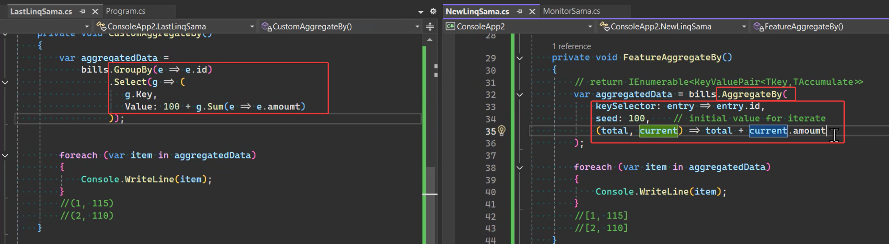
  - CountBy
   

- Index
   

### C# 13

- Lock object
  - 更高效而且可以用using
   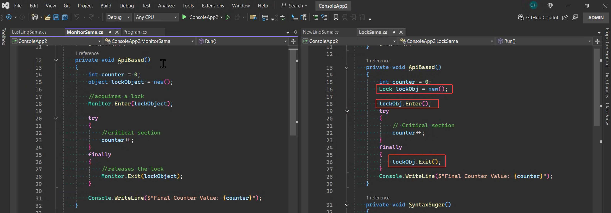
   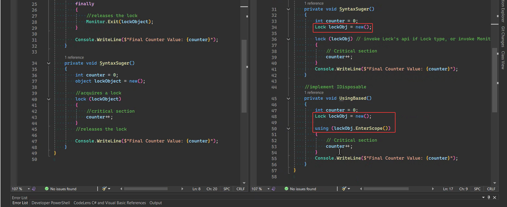

- params
  - 可以用Generic型別定義input
   

### Libraries
- Diagnostics
  - Develop debug的時候才會跑的東西，方便驗證 (更新可不輸入meesage)
   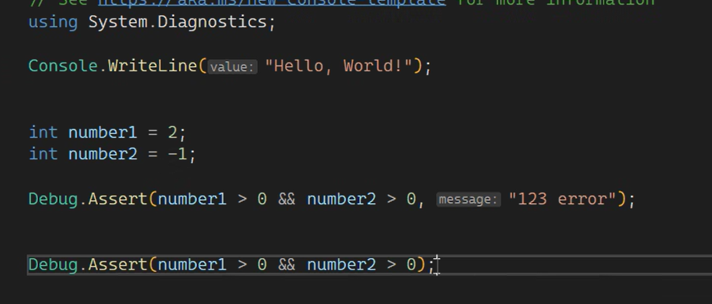
   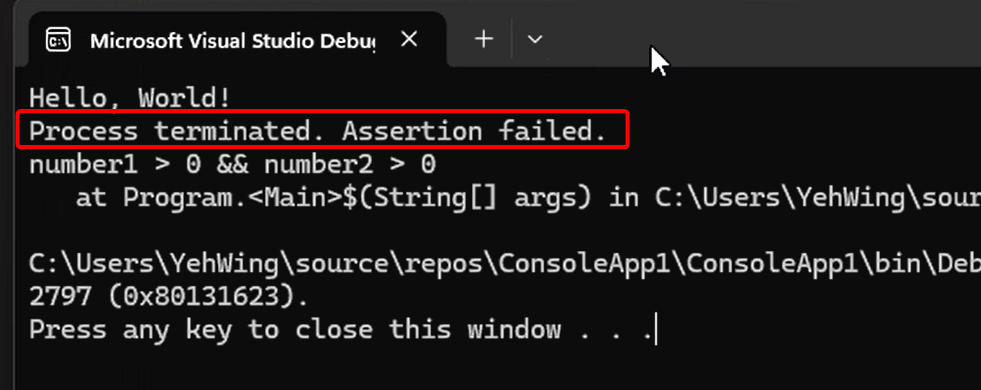

- OpenTelemetry
   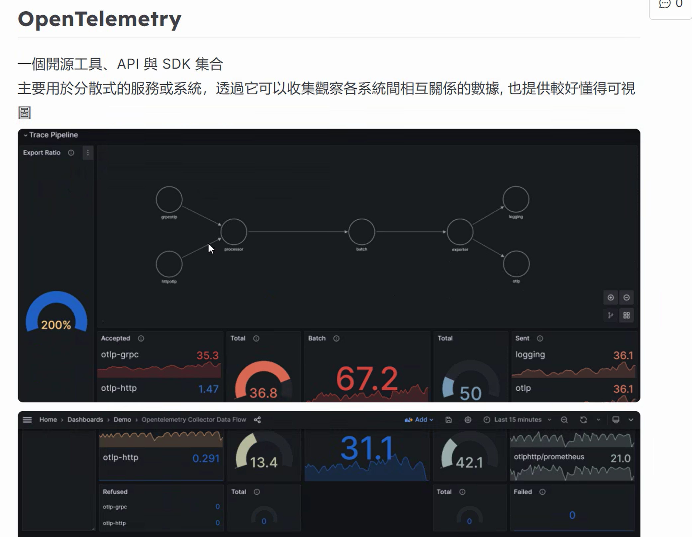
  - Activity.AddLink
    - 可以在事後把Trace掛在一起，而非原本的child/parent關係
    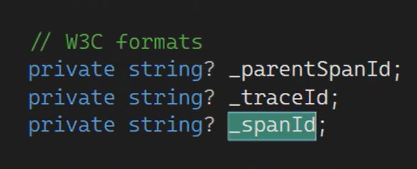
    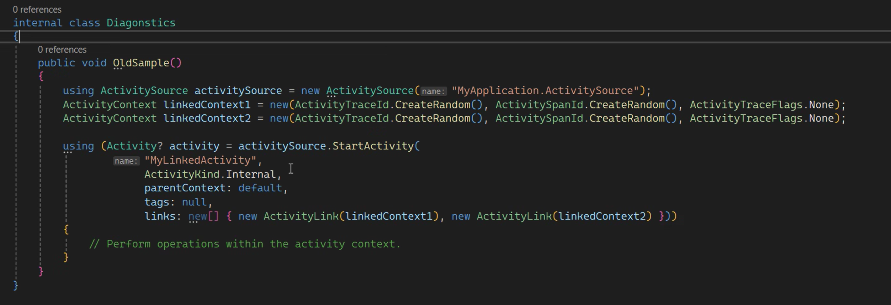
    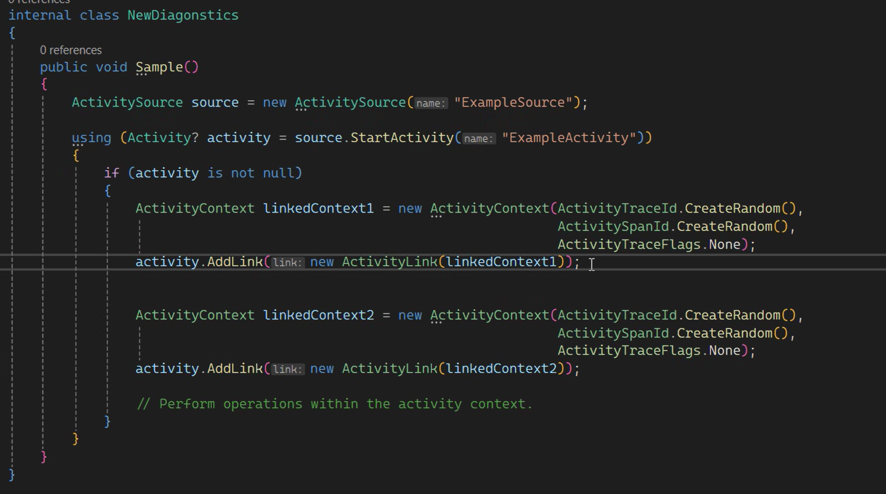
  - Gauge
    - 資料收集器型別，可以給OpenTelemetry顯示不同圖表
    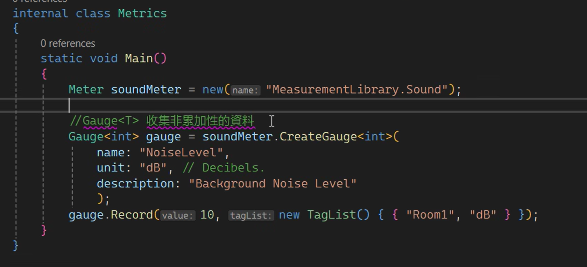
  - Out-of-proc Meter wildcard listening
    - Out-of-proc: 不共用記憶體資源的Prcoesses (Redis / Micro service)流程
    - 新增*用法，可以模糊比對
    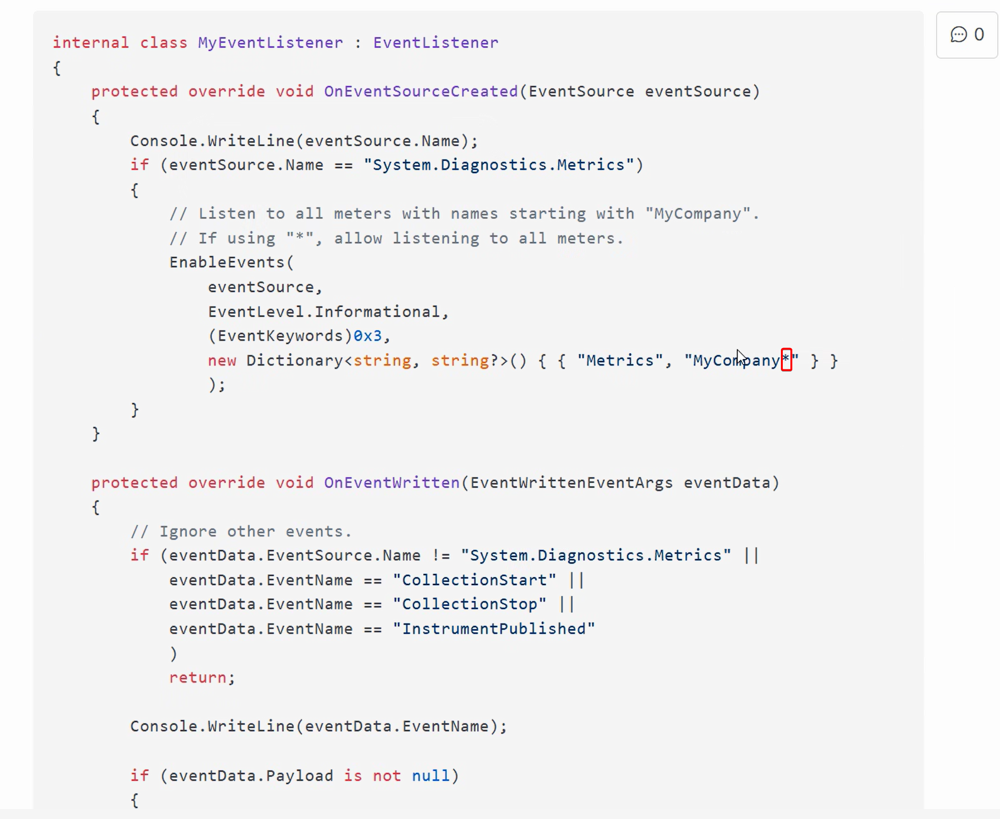

- Base64Url
  - 加入URL友善的設定，把"+"、"/"等符號替換掉

    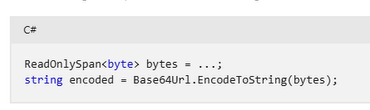

- Collection lookups with spans
  - 提供Span type對於Dictionary的支援
    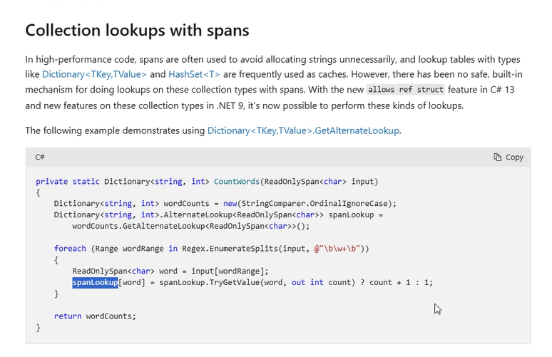

- OrderedDictionary
  - 提供可排序的Dictionary
    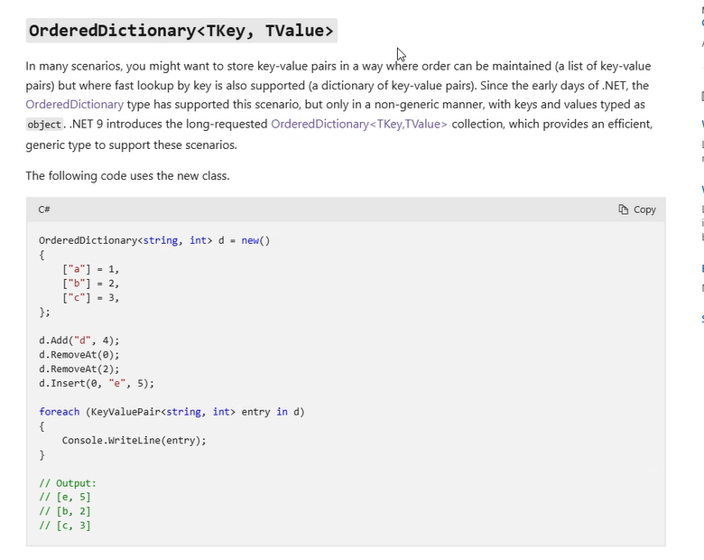

- PriorityQueue
  - 提供Remove新方法，以O(n)進行運作
    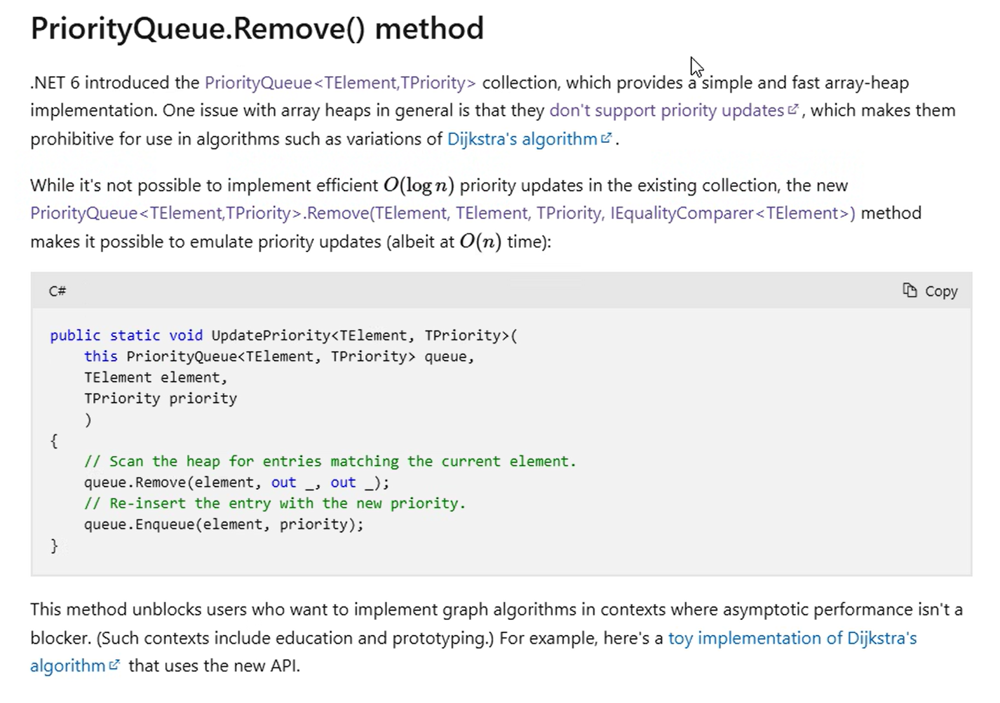

- CryptographicOperations
  - 提供輸入HashAlgorithmName(演算法名稱)的方式建立Hash code
    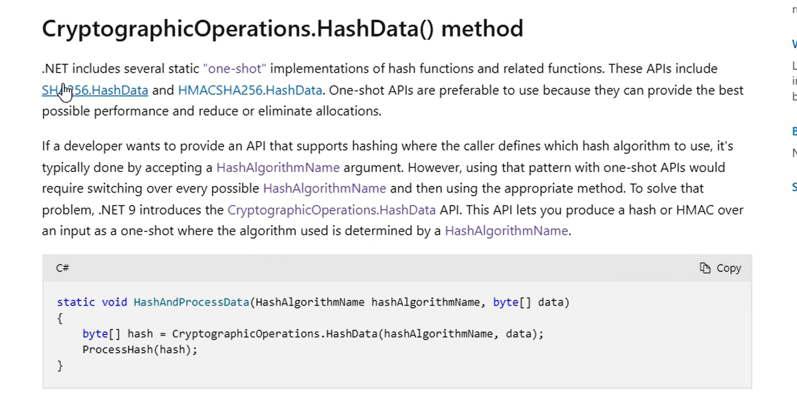

- TimeSpan.From
  - 提供"From" function更模糊的Parse方式 (如FromDays)
    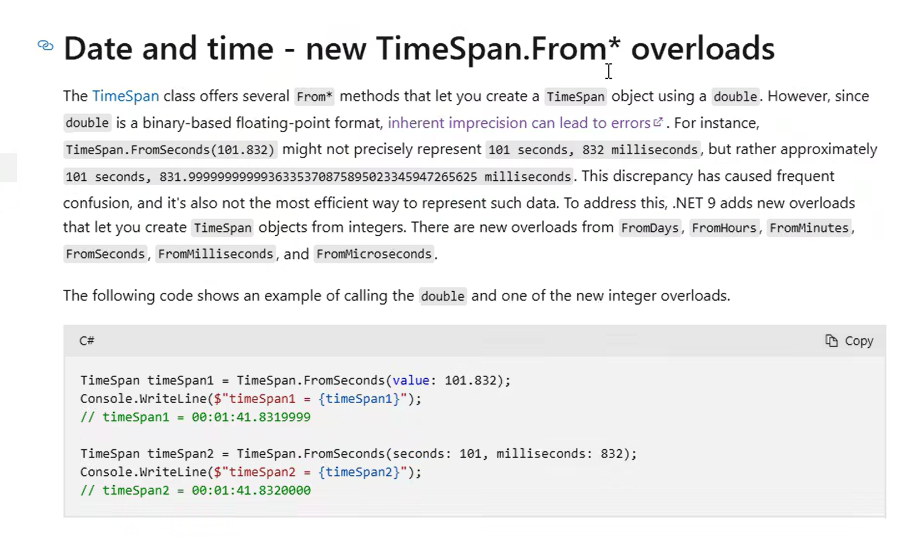

- DI - ActivatorUtilities.CreateInstance
  - 改變"ActivatorUtilitiesConstrcuctorAttribute"的邏輯，目前可以Constructor parameter不照順序仍然可以create instance
    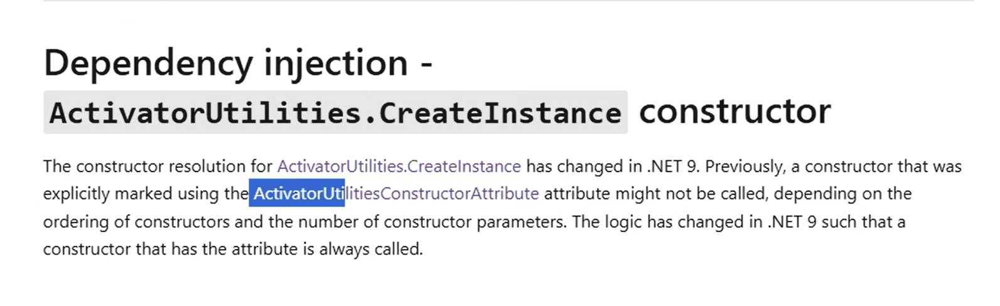

- ### [Dotnet Fiddle](https://dotnetfiddle.net/9oOABG)

#### [Reflection](https://learn.microsoft.com/en-us/dotnet/core/whats-new/dotnet-9/libraries#reflection)

- Type-name parsing
  - TypeName: 類似於System.Type，提供一些用法如`IsArray`, `IsByRef`, `IsNested`, `GetElementType`, `AssemblyName`等等
  - .Net 9新增TryParse方法

    ```C#
    TypeName? GetType(ReadOnlySpan<char> untrustedInput)
    {
        if (!TypeName.TryParse(untrustedInput, out TypeName? parsed))
        {
            throw new InvalidOperationException($"Invalid type name: '{untrustedInput.ToString()}'");
        }
        return parsed;
    }
    ```


#### [Regular expressions](https://learn.microsoft.com/en-us/dotnet/core/whats-new/dotnet-9/libraries#regular-expressions)
  
- [GeneratedRegex] on properties
  - Property開始支援Regex attribute (.Net 7支援Function)

    ```C#
    [GeneratedRegex(@"\b\w{5}\b")]
    private static partial Regex FiveCharWordProperty { get; }
    ```

- Regex.EnumerateSplits
  - 如同`Regex.Split`，開始支援`ReadOnlySpan<char>`的使用 (更高效)

    ```C#
    ReadOnlySpan<char> input = "Hello, world! How are you?";
    foreach (Range r in Regex.EnumerateSplits(input, "[aeiou]"))
    {
        Console.WriteLine($"Split: \"{input[r]}\"");
    }
    //Split: "H"  "ll"  ", w"  "rld! H"  "w "  "r"  " y"  ""  "?"
    ```

#### [Serialization (System.Text.Json)](https://learn.microsoft.com/en-us/dotnet/core/whats-new/dotnet-9/libraries#serialization-systemtextjson)

- Respect nullable annotations
  - 允許JSON properties出現NULL (set to `true`)

    ```C#
    public static void RunIt()
    {
        JsonSerializerOptions options = new() { RespectNullableAnnotations = true };

        // Throws exception: System.Text.Json.JsonException: The property or field
        // 'Title' on type 'Serialization+Book' doesn't allow getting null values.
        // Consider updating its nullability annotation.
        JsonSerializer.Serialize(new Book { Title = null! }, options);

        // Throws exception: System.Text.Json.JsonException: The property or field
        // 'Title' on type 'Serialization+Book' doesn't allow setting null values.
        // Consider updating its nullability annotation.
        JsonSerializer.Deserialize<Book>("""{ "Title" : null }""", options);
    }

    public class Book
    {
        public required string Title { get; set; }
        public string? Author { get; set; }
        public int PublishYear { get; set; }
    }
    ```

- Require non-optional constructor parameters
  - 不允許JSON出現不符constructor的property (`true`)

    ```C#
    JsonSerializerOptions options = new() { RespectRequiredConstructorParameters = true };

    // Throws exception: System.Text.Json.JsonException: JSON deserialization
    // for type 'Serialization+MyPoco' was missing required properties including: 'Value'.
    JsonSerializer.Deserialize<MyPoco>("""{}""", options);
    ```

- Customize enum member names
  - 可直接在Serialize/Parse時，直接取Attribute value (而非property name)

    ```C#
    public static void Sample()
    {
      MyEnumClass enumClass = new() { EnumProp = MyEnum.Value1, EnumProp2 = MyEnum.Value2 };
      Console.WriteLine(JsonSerializer.Serialize(enumClass)); // {"EnumProp1":"Value1","EnumProp2":"Custom enum value"}
      
      MyEnumClass parsed = JsonSerializer.Deserialize<MyEnumClass>("{\"EnumProp2\": \"Custom enum value\"}");
      Console.WriteLine(parsed.EnumProp2); // Value2
    }

    [Serializable]
    public class MyEnumClass
    {
      public MyEnum EnumProp1 { get; set; }
      public MyEnum EnumProp2 { get; set; }
    }

    [Flags, JsonConverter(typeof(JsonStringEnumConverter))]
    public enum MyEnum
    {
        Value1 = 1,
        [JsonStringEnumMemberName("Custom enum value")]
        Value2 = 2,
    }
    ```

#### [Spans](https://learn.microsoft.com/en-us/dotnet/core/whats-new/dotnet-9/libraries#spans)

- Introduction ★
  - 屬於ref struct的memory view型別 (存於stack)
  - 優點: 不浪費RAM(不須GC)、高效率
  - 限制: 不可擴大、直接修改原始memory
- File helpers
  - 提供一些Span Char的支援性

    ```C#
    ReadOnlySpan<char> text = "some arbitrary text";
    // 1
    File.WriteAllText(filePath, text);
    // 2
    return text.StartsWith('"') && text.EndsWith('"'); // false
    ````

- params ReadOnlySpan<T> overloads ★
  - string.Format更簡便

    ```C#
    // old
    string result = string.Join(", ", new string[3] { "a", "b", "c" });
    // new
    string result = string.Join(", ", "a", "b", "c");
    ```

- Enumerate over ReadOnlySpan<char>.Split() segments
  - 新增Split方法，為Span split後的Range用法
  - Range: [型別與運算子說明](https://mmiooimm.github.io/2020/07/18/2020-07-18-csharp-index-range/)
    ```C#
    public static bool ListContainsItem(ReadOnlySpan<char> span, string item)
    {
        foreach (Range segment in span.Split(','))
        {
            if (span[segment].SequenceEquals(item))
            {
                return true;
            }
        }

        return false;
    }
    ```

#### [System](https://learn.microsoft.com/en-us/dotnet/core/whats-new/dotnet-9/libraries#systemformats)

- System.Guid
  - 提供可隨時間排序的GUID `Guid.CreateVersion7()` ★
  - 可參考[RFC 9562](https://www.rfc-editor.org/rfc/rfc9562.html#name-uuid-version-7)
  - 介紹文章[Goodbye integers. Hello UUIDv7!
](https://buildkite.com/resources/blog/goodbye-integers-hello-uuids/)
  - 注意事項: 毫秒為最低單位，同一台機器能保證排序、但不同機器會有不同的亂數，不保證順序

      ```C#
      Guid guid1 =  Guid.CreateVersion7();
      Console.WriteLine(guid1);
      Guid guid2 =  Guid.CreateVersion7();
      Console.WriteLine(guid2);
      Guid guid3 =  Guid.CreateVersion7();
      Console.WriteLine(guid3);
      // output: 
      // 0193708e-1a00-78cc-ad9b-d04bc9234e25
      // 0193708e-1a0d-7d7e-906b-4cf110aebabc
      // 0193708e-1a0d-7d96-931d-0078141fbd87

      Console.WriteLine(guid2 > guid1); // true
      Console.WriteLine(guid2 < guid1); // false
      ```

- System.Numerics
  - BigInteger upper limit ★
    - 限制BigInt的最大值為`(2^31) - 1`，避免RAM耗盡

#### [Threading](https://learn.microsoft.com/en-us/dotnet/core/whats-new/dotnet-9/libraries#threading)

- Task.WhenEach ★
  - 新增Task.WhenEach在Task結束時直接處理
  - 優點: 相比於Task.WhenAll，能優先處理結束的Task

    ```C#
    using HttpClient http = new();

    Task<string> dotnet = http.GetStringAsync("http://dot.net");
    Task<string> bing = http.GetStringAsync("http://www.bing.com");
    Task<string> ms = http.GetStringAsync("http://microsoft.com");

    await foreach (Task<string> t in Task.WhenEach(bing, dotnet, ms))
    {
        Console.WriteLine(t.Result);
    }
    ```

- Prioritized unbounded channel ★
  - 提供Channel佇列功能的優先級概念

    ```C#
    Channel<int> c = Channel.CreateUnboundedPrioritized<int>();

    await c.Writer.WriteAsync(1);
    await c.Writer.WriteAsync(5);
    await c.Writer.WriteAsync(2);
    await c.Writer.WriteAsync(4);
    await c.Writer.WriteAsync(3);
    c.Writer.Complete();

    while (await c.Reader.WaitToReadAsync())
    {
        while (c.Reader.TryRead(out int item))
        {
            Console.Write($"{item} ");
        }
    }

    // Output: 1 2 3 4 5
    ```