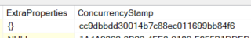

# ABP Framework

- 一個現有的架構套件，可直接使用許多做好的模組，不用再手刻整個架構
  - IoC Container: Dependency injection內建，簡單繼承interface就不用註冊implementation
  - ORM & Unit of work: 整合Entity framework，可利用Unit of work操作DB scope
    - Audit Log: 內建Entity Log，不用再自己寫DB Table來存取資料更改紀錄
  - Domain Driver Development: 內建領域驅動物件 (如AggregateRoot, Entity)，可方便套用架構
  
## 安裝


## Entity Framework

- ABP為DB實作了一套包含Unit of work、Audit log、Soft delete、常用欄位(如作者、時間)等等功能的架構，可以很方便套用

### AggregateRoot

- AggregateRoot會實作以下必要columns
  - ConcurrencyStamp: 作為Save依據，避免重複Save衝突 (此欄位注意DB不可以為NULL! 沒有值的話至少為`GETID()`)
  - ExtraProperties: 儲存額外serialize string資訊 (此欄位注意DB不可以為NULL! 沒有值的話必至少為`'{}'`)
  
  
- 可自行選擇Implement不同等級的Interface (有implement到的欄位DB必須要有對應的Column，一個也不能少!)
  - FullAuditedAggregateRoot
  - AuditedAggregateRoot
  - CreationAuditedAggregateRoot
  - AggregateRoot
- 也可以選擇性只apply部分欄位
  - IFullAuditedObject (可以從這邊看各種interface)
  - ISoftDelete
  - IMayHaveCreator


## Audit log

- 為內建方法自動將Property改動存成Log到DB
- 預設不支援Enum轉型 (Enum只會存成int)，客製化需求(比如顯示Enum description or value)需做覆寫
- 範例

    ```C#
    // nuget
    dotnet add package Volo.Abp.AuditLogging
    dotnet add package Volo.Abp.EntityFrameworkCore
    dotnet add package Volo.Abp.EntityFrameworkCore.SqlServer
    ```

    ```C#
    // setup DB & AutditLogging modules
    using Volo.Abp.AuditLogging;
    using Volo.Abp.EntityFrameworkCore;
    using Volo.Abp.Modularity;

    [DependsOn(
        typeof(AbpAuditLoggingModule),
        typeof(AbpEntityFrameworkCoreModule),
        typeof(AbpEntityFrameworkCoreSqlServerModule)
    )]
    public class MyAuditLoggingModule : AbpModule
    {
        public override void ConfigureServices(ServiceConfigurationContext context)
        {
            Configure<AbpDbContextOptions>(options =>
            {
                options.UseSqlServer();
            });
        }
    }

    ```C#
    // setup DB connection
    using Microsoft.EntityFrameworkCore;
    using Volo.Abp.AuditLogging.EntityFrameworkCore;
    using Volo.Abp.EntityFrameworkCore;

    public class MyDbContext : AbpDbContext<MyDbContext>
    {
        public DbSet<AuditLog> AuditLogs { get; set; }

        public MyDbContext(DbContextOptions<MyDbContext> options)
            : base(options)
        {
        }

        protected override void OnModelCreating(ModelBuilder modelBuilder)
        {
            base.OnModelCreating(modelBuilder);
            modelBuilder.ConfigureAuditLogging();
        }
    }
    ```

    ```C#
    {
        "ConnectionStrings": {
            "Default": "Server=localhost;Database=MyDb;Trusted_Connection=True;"
        }
    }
    ```

    ```C#
    // Register module
    public class Startup
    {
        public void ConfigureServices(IServiceCollection services)
        {
            services.AddApplication<MyAuditLoggingModule>();

            services.Configure<AbpAuditLoggingOptions>(options =>
            {
                options.IsEnabledForAnonymousUsers = true; // 設定是否啟用對匿名用戶的審計
            });
        }

        public void Configure(IApplicationBuilder app, IWebHostEnvironment env)
        {
            app.InitializeApplication();
        }
    }

    ```

- 擴充方法
  - 在Auditing前後進行自定義操作 (如Log或欄位名稱修改、新增其他log等)
  - EntityHistoryHelper

    ```C#
    public class CustomEntityHistoryHelper : EntityHistoryHelper
    {
        public CustomEntityHistoryHelper(
            IAbpSession abpSession,
            IEntityHistoryStore entityHistoryStore,
            IEntityHistoryConfiguration entityHistoryConfiguration,
            IAuditLogScope auditLogScope)
            : base(abpSession, entityHistoryStore, entityHistoryConfiguration, auditLogScope)
        {
        }

        protected override EntityChangeSet CreateEntityChangeSet(ICollection<IEntityChange> entityChanges)
        {
            var changeSet = base.CreateEntityChangeSet(entityChanges);
            // 在這裡添加自定義行為，例如記錄額外的訊息或操作
            foreach (var entityChange in changeSet.EntityChanges)
            {
                entityChange.ChangeType += " - Custom Behavior Applied";
            }

            return changeSet;
        }
    }
    ```