# ABP Implementing Domain Driven Design

- [ABP Implementing Domain Driven Design](#abp-implementing-domain-driven-design)
  - [Introduction](#introduction)
    - [Goal](#goal)
  - [What is the Domian Driven Design?](#what-is-the-domian-driven-design)
    - [OOP \& SOLID](#oop--solid)
    - [DDD Layers \& Clean Architecture](#ddd-layers--clean-architecture)
    - [Core Building Blocks](#core-building-blocks)
  - [Implementation: The Big Picture](#implementation-the-big-picture)
    - [Layering of a .Net Solution](#layering-of-a-net-solution)
    - [Dependencies of the Projects in the Solution](#dependencies-of-the-projects-in-the-solution)
    - [Execution Flow of a DDD Based Application](#execution-flow-of-a-ddd-based-application)
    - [Common Principles](#common-principles)
  - [Implementation: The Building Blocks](#implementation-the-building-blocks)
    - [The Example Domain](#the-example-domain)
    - [Aggregate / Aggregate Root Principles](#aggregate--aggregate-root-principles)
    - [Repositories](#repositories)
    - [Specifications](#specifications)
    - [Domain Services](#domain-services)
    - [Application Services](#application-services)
    - [Data transfer Objects](#data-transfer-objects)
  - [Example Use Cases](#example-use-cases)
    - [Entity Creation](#entity-creation)
    - [Updating / Manipulating An Entity](#updating--manipulating-an-entity)
  - [Domain Logic \& Application Logic](#domain-logic--application-logic)
    - [Multiple Application Layers](#multiple-application-layers)
  - [Reference Books](#reference-books)

## Introduction

### Goal

1. 解釋DDD架構、概念與原則
2. 解釋ABP分層與專案架構
3. 應用DDD的精確規則範例
4. 展示ABP做為DDD基礎建設的適用方法
5. 提供軟體開發的最佳實踐與建立良好維護系統的經驗

## What is the Domian Driven Design?

- 適合**複雜且大範圍**的的撰寫方法、專注於核心領域(Core Domain)邏輯而不是基礎建設細節，目標建立"彈性"、"模組化(Modular)"與"可維護"的Code

### OOP & SOLID

- DDD大量引用OOP與SOLID原則，並且實踐與擴充這些原則

### DDD Layers & Clean Architecture

- Business Layer再分成Domain & Application Layer

\<Infrastructure Layer\>  
Presentation Layer  
 → Application Layer (User interaction on UI based on the domain) 
 → Domain Layer (Core、Use-case independent business logic) 
    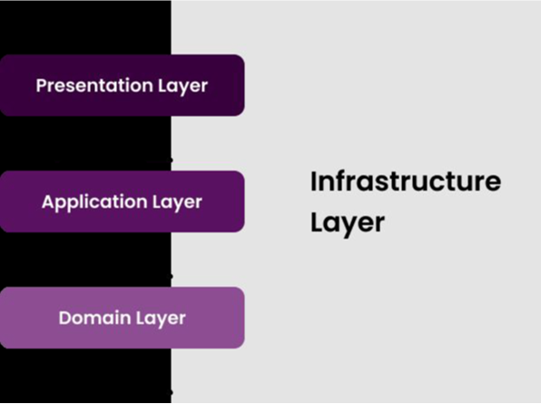

### Core Building Blocks

- DDD專注在Domain & Application Layer的部分

- #### Domain Layer Building Blocks

  - **Entity**: 包含Properties(state, data)與方法來實踐Business logic，且有Id做識別
  - **Value Object**: 簡易版Entity，並無Id
  - **Aggregate & Aggregate Root**: Entities & Value objects的集合，並有一些額外的職責
  - **Repository**: 給予Domain & Application Layer的data system介面，並且隱藏了DBMS的細節
  - **Domain Service**: Stateless service，並且適合基於"多個Aggregate"或外部Service的商業邏輯實現
  - **Specification**: 給予商業物件(如Entity)的命名、可重複使用、整合性的Filter
  - **Domain Event**: 當某種Domain的事件發生時(loosely coupled manner)，用於通知其他Service的方法

- #### Application Layer Building Blocks

  - **Application Service**: Stateless service，基於Use case of app，Gets & Returns DTOs，為Unit of work單位
  - **Data Transfer Object (DTO)**: 無任何商業邏輯的物件，僅為了用於Application & Presentation Layer的傳遞
  - **Unit of Work (UOW)**: 基於一個Transaction的單位，並且整批操作必須為全數成功或失敗且rolled back

## Implementation: The Big Picture

### Layering of a .Net Solution

- 以下為專案命名範例

- IssueTracking
  - src
    - **IssueTracking.Application**
    - **IssueTracking.Application.Contracts**
      - 包含Interfaces & DTOs，可給其他Client App引用
    - 
    - **IssueTracking.Domain**
      - 所有Building blocks - entites, value objects, etc.
    - **IssueTracking.Domain.Shared**
      - 給其他Domain共用的物件，如enums
    - 
    - **IssueTracking.DbMigrator**
      - Console App，負責Migrage DB Schema與Seed initial data
    - **IssueTracking.EntityFrameworkCore**
      - DbContext, database mappings, Repository的實作與其他EF設定
    - **IssueTracking.EntityFrameworkCore.DbMigrations**
      - 獨立的DbContext去作Code first的DB Migration (一般程式撰寫不須引用)
    - 
    - **IssueTracking.HttpApi**
      - Presentation -  API
    - **IssueTracking.HttpApi.Client**
      - Consume HTTP APIs，可利用ABP Dynamic C# Client API Proxies System實現
    - **IssueTracking.Web**
      - Presentation - MVC Web
  - test

### Dependencies of the Projects in the Solution

  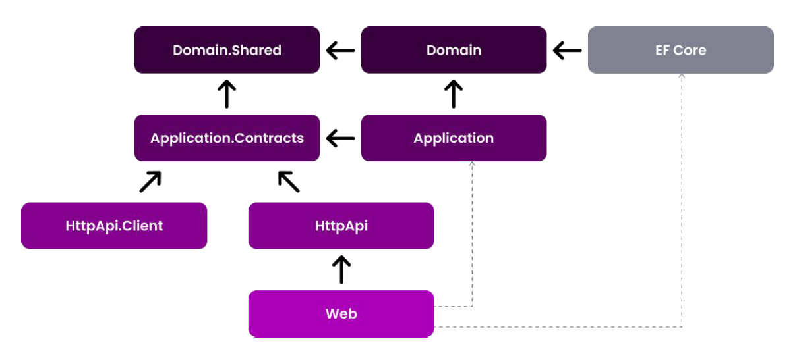

- Domain.Shared → `All`
- Domain → `Domain.Shared`
- Application.Contracts → `Domain.Shared` (e.g. DTO可重複相依一些Domain Enum)
- Application → `Application.Contracts` & `Domain`
- EntityFrameworkCore → `Domain` (Maps domain objects to db tables、Implement repository interfaces)
- HttpApi → `Application.Contracts`
- HttpApi.Client → `Application.Contracts`
- Web → `Application.Contracts`

- #### Dashed Dependencies

  - Web直接相依於Application & EF Core
    - 因為Host需要Application與EF Core的實作
    - 為了避免Presentation Layer直接用到Application & EF Core，建議以下Work around
      - 第一種: 建立`Web.Host`專案(純Host用)，並且相依Web(改為純前端專案)、Application & EF Core
      - 第二種: 移除Web的兩個虛線相依，改使用ABP Plug-In Modules

### Execution Flow of a DDD Based Application

  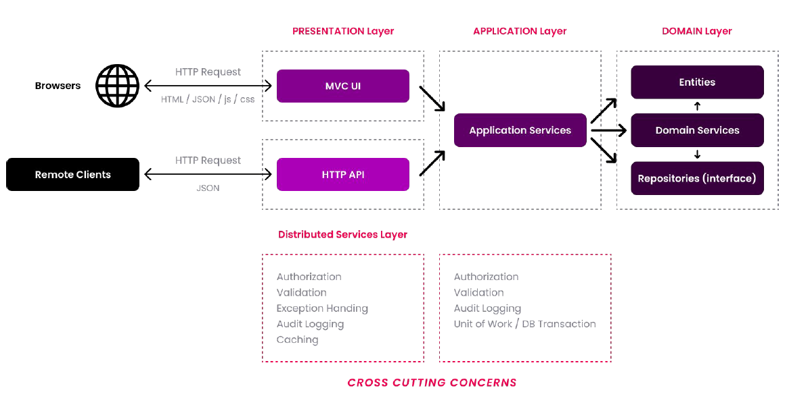

- Reqiest從UI User interaction開始
- MVC Controller or Razor Page Handler屬於Pensentiation Layer (Or Distributed Services Layer)
  - 處理Cross cutting concerns (Authorization, Validation, Exception Handling)
  - Inject application services & 使用DTOs與Functions傳遞資訊
- Application Service
  - 使用Domain Objects (Entities, Repository interfaces, Domain Services, etc.)來實作Use case
  - 處理Cross cutting concerns (Authorization, Validationㄝ, etc.)
  - Function為Unit of work

※ 大部分Cross cutting concerns可由ABP Framework自動且常規性地實作  (不需要自行撰寫實作)

### Common Principles

- #### Database Provider / ORM Independence

  - Domain & Application layer不可知道ORM/Database provider為何，僅能依賴Repository
  - Repository interfaces不需要使用任何ORM特定的物件
  - 原因:
    1. Domain & Application layer獨立於infrastructure (其變動性大)
    2. Domain & Application layer專注於Business code (Repository專注於infrastructure)
    3. 讓自動化測試更簡單，因為可以偽造Repositories

  ※ 因此除了Startup project外，無任何Project會Reference到EF Core專案  

  ※ 基於ABP如果用EF Core以外的ORM如MangoDB，會失去許多Usefull features  

  - Change Tracking
  - Navigation Properties (or Collections)

- #### Presentation Technology Agnostic

  - 將Domain & Application Layer與Presentation Layer完全脫鉤，有助於實作ABP template
  - 一些情況下需要將Presentation & Application Layer建立重複的邏輯 (如Validation & Authorization))，前者注重UX體驗、後者注重安全性與資料完整性

- #### Focus on the State Changes, Not Reporting

  - DDD注重Domain objects的變動與互動 (如何建立Entity與Update時保持資料的完整性與有效性等)、以及實作Business rules
  - DDD忽略Reporting與Mass querying (產報表與複雜資料)，但不代表其不重要
    - 可利用SQL Server或是ElasticSearch等方式自行做報表，因為其可發揮如Index、Stored procedures等強項，只要其不會影響到Business Logic即可

## Implementation: The Building Blocks

### The Example Domain

  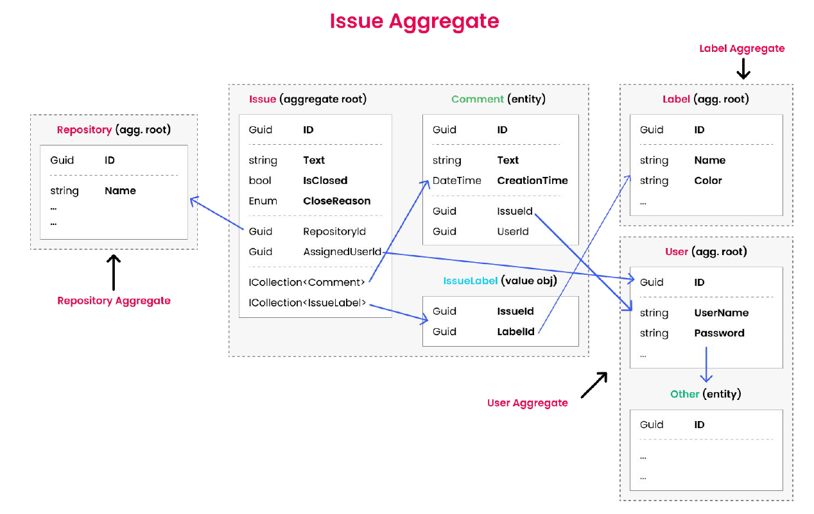

### Aggregate / Aggregate Root Principles

- #### Business Rules

  - Aggregate需要維護自己的完整性與有效性，需要有方法實作Domain rules & Constraints\

- #### Single Unit

  - Aggregate以單一單位來取得/儲存，並且包含子集合與Properties
  - 以`Comment` Add to `Issue`為例:
    - Get `Issue` from DB並包含子集合(`Comments` & `IssueLabels`)
    - 利用方法加入新的`comment` (如`Issue.AddComment`)
    - 儲存`Issue`包含所有子集合到DB並且以單一動作進行
  - Developer可能會覺得奇怪，為何要取得`Issue`的所有細節而不是用SQL Insert來達成就好?
    - 與EF Core及關連式資料庫的先前用法有很大的差異
    - 原因: 需要實作Business Rules、並確保資料的一致性與完整性
    - 舉例: Business Rule為"Users不可以`Comment`在Locked `Issue`上" -> 需要Locked資訊
    - 題外話: MongoDB原理與其類似，都可以直接取得Aggregate object的所有細節
  - 範例: Add `comment`到`issue`
      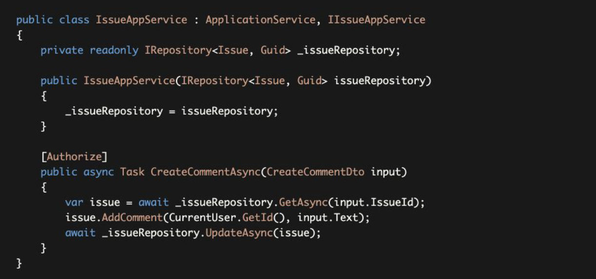
    1. `_issueRepository.GetAsync`取得`Issue`的一次性所有細節 (由Repository設定好一次處理)
    2. `Issue.AddComment`時做了必要的Business Rules，並將`Comment`加入
    3. `_issueRepository.UpdateAsync`將資訊存在DB

  ※ EF Core有Change Tracking功能，所以`_issueRepository.UpdateAsync`不是必要的 (如MangoDB就需要)，因此只有DB Provider需要獨立操作就需要呼叫UpdateAsync

- #### Transaction Boundary

  - 一般Aggregate被視為是一個Transaction Boundary
  - 有時一個Use case需要多於1次更改Aggregate instances，ABP會使用Explicita(明確) DB transaction來處理

- #### Serializability

  - Aggregate應該是Serializable且transferrable的 (特別是如MongoDB會使用JSON格式儲存)

- #### Aggregate / Aggregate Root Rules & Best Practices

  - ##### Reference Other Aggregates Only by ID

    - Aggregate必須要由`Id`去相依其他Aggregates (Navigation properties不可以加到其他Aggregates)
      - 此規則讓Serializability可行
      - 可避免Aggregates互相操控，並洩漏Business Logic

      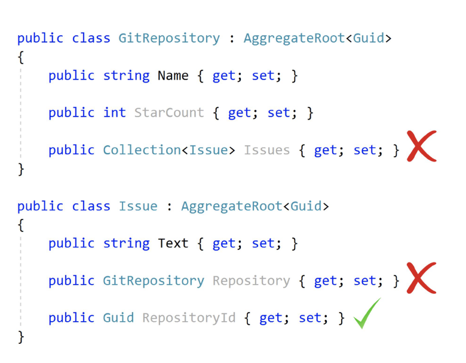

  - ##### For EF Core & Relational Databases

    - MongoDB會將Navigation properties/collections進行Serialize to JSON，導致重複aggragate資訊產生
    - EF Core & 關聯式資料庫可幫助減少domain complexity

  - ##### Keep Aggregate Small

    - Aggregate越簡單與輕巧越好
    - 原因: 為讀取的單一單位，太大會導致效能問題
    - 舉例: 
      - Role可能會被大量Users引用，導致問題；應只要User Navigate to Roles即可
      - 非關聯資料庫的雙向關聯關係，會變成Add User.Roles以外、還要Add Role.Users

      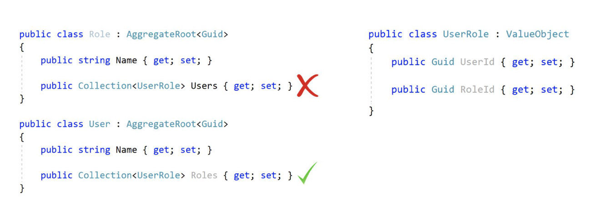

    - 結論考慮Aggregate符合以下情境:
      - Objects使用在一起時
      - Query效能與Memory使用
      - 資料完整性、有效性與一致性
    - 實務上: 
      - 大部分Aggregate roots不需要有Sub-collections
      - Sub-collections的數量最好不要超過100-150筆

- #### Primary Key on the Aggregate Roots / Entities

  - Aggregate Root基本上需要有`Id` property作為PK (建議使用`Guid`)
  - Aggregate下的Entity可以用Composite PK (必要時再使用單一PK的`Id`、或是為非關聯資料庫時)

    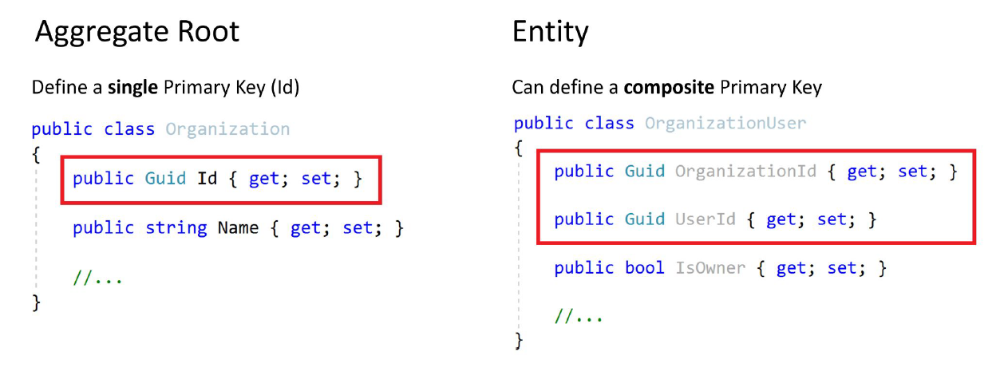

- #### Constructors of the Aggregate Roots / Entities

  - Constructor parameters包含必須的Properties，非必要的則不需要
  - 必須檢查Parameters的有效性 (如`NotNullorWhiteSpace`...)
  - 初始化Sub-collections (避免Null)
  - Id不建議在Constructor裡面建立
  - Private empty constructor作為ORM或Serialize用

    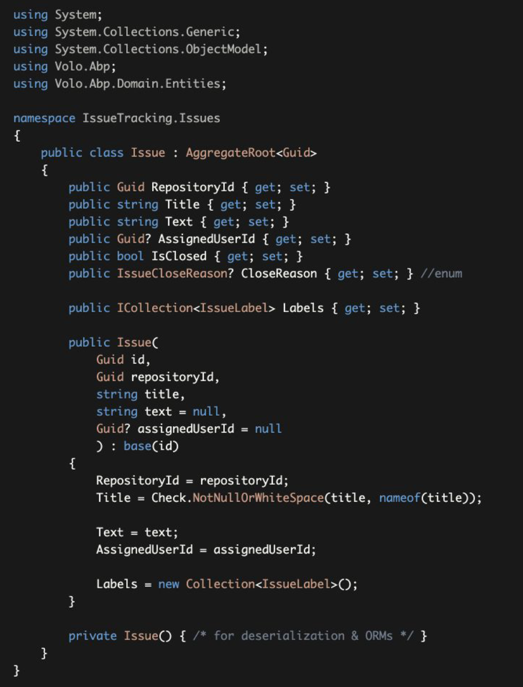

- #### Entity Property Accessors & Methods

  - 使用Private Setter給予要執行Logic的Property
  - 建立Public method去操作這種Property

    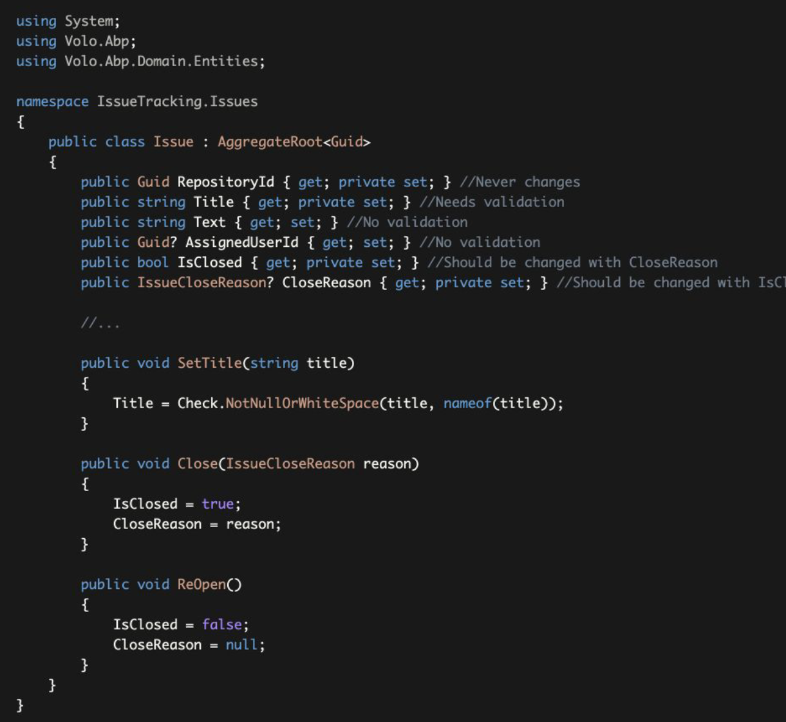

- #### Business Logic & Excpetions in the Entities

  - 當驗證與Business logic實作在Entities，就有可能需要Exceptions處理
  - 建立Domain specific exceptions，必要時丟出

    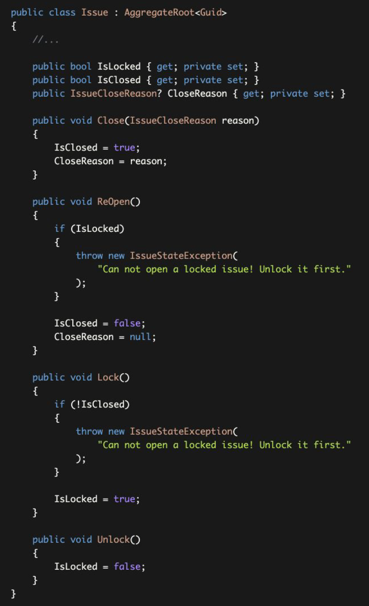
    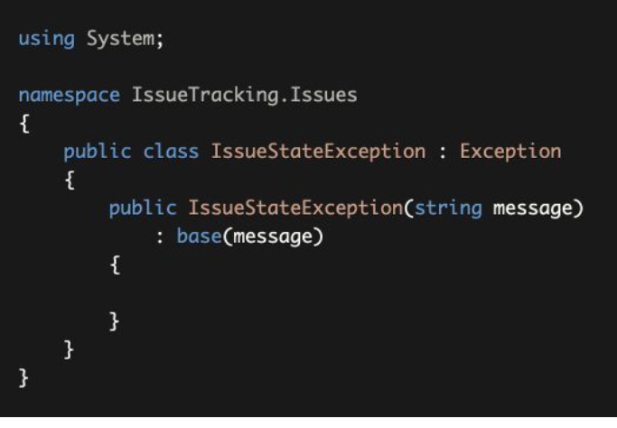

  - 以上Exception丟出可能會有一些潛在問題:
    1. End User需要看到Error message嗎? 如何將Exception message進行在地化?
    2. HTTP API，哪種HTTP Status Code應該Return給Client?

  - ABP Exception Handling可以解決這些問題
    - `IssueStateException`會Return 403 (forbidden)、基本的`BusinessException`則為 500 (Internal Server Error)
    - 參數`code`則為Localization resource file當中定義內容的Key，也會給User看到 (如下圖二，請用constants而不要用magic strings傳入!)
    - ABP會直接使用該Localization的檔案訊息給User看 (如下圖三)

       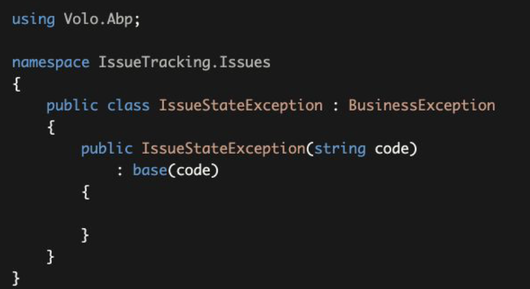
       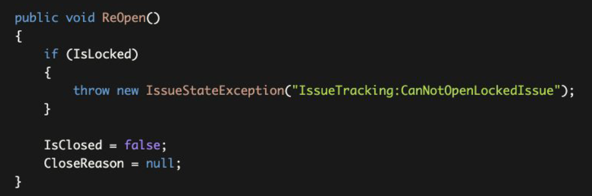
       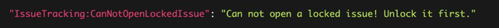

- #### Business Logic in Entities Requiring External Services

  - Entity不可以Inject services!
  - 解法:
    - 定義Entity method並且由外部傳入Parameter
      - 以下範例會使Entity變複雜且出現必要的Dependency

         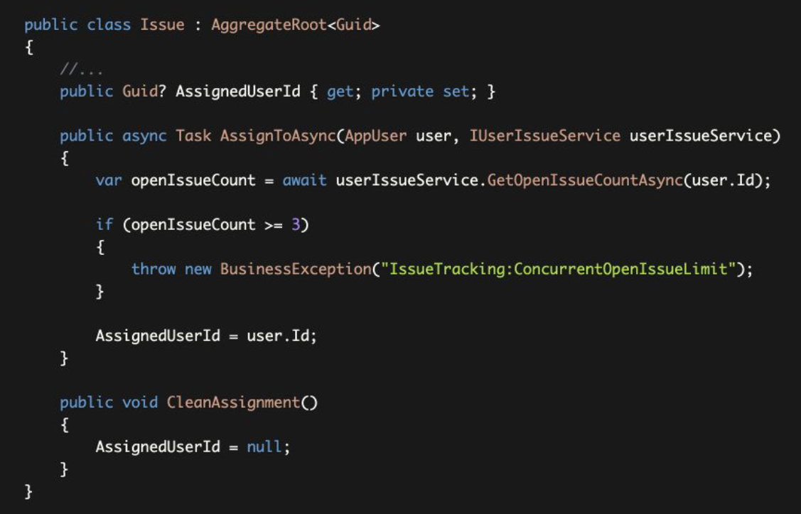

    - 建立一個Domain Service

### Repositories

- Repository代表Interface的類集合，給Domain & Application Layer取得(如DB)資料物件使用(Business Object，一般為Aggregates)
- 一般準則
  - 定義在Domain Layer上、實作在Infrastructor Layer (如EF Core在Startup template中)
  - 不可以包含Business Logic
  - Repository interface須為DB提供者/從ORM獨立 (比如不可以Return DbSet)
  - 為Aggregate roots建立Repository (不應該包含全部Entities，因為有些事要從Aggregate root當中一起取得) 

- #### Dot Not Include Domain Logic in Repositories

  - 範例: 如何定義Inactive issue? → 這就是Business Rule
  - 如果寫Business logic在Repository，有一點這邏輯要寫在Domain Service，就會有需重複更新的狀況
    - 解法: 將邏輯寫在Specifications，給Repository給引用

    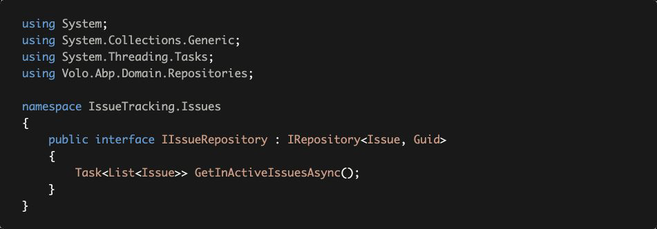
    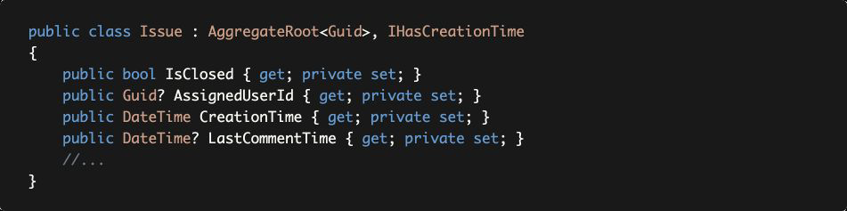
    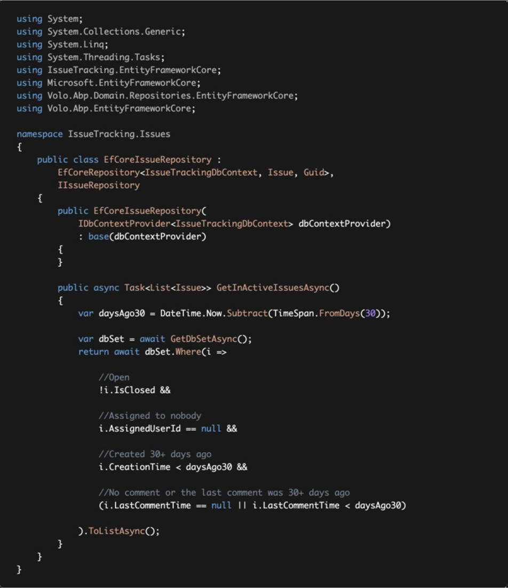

### Specifications

- Specification是指"經過命名、可重複使用、可合併、可測試"的Class，用於套用Business Rule來過濾Domain objects
- ABP提供必要的基礎架構，只要繼承Specification<T> class來實作Filter邏輯
  - 範例: 可以將Specification給`Issue` & `EfCoreIssueRepository`來引用

    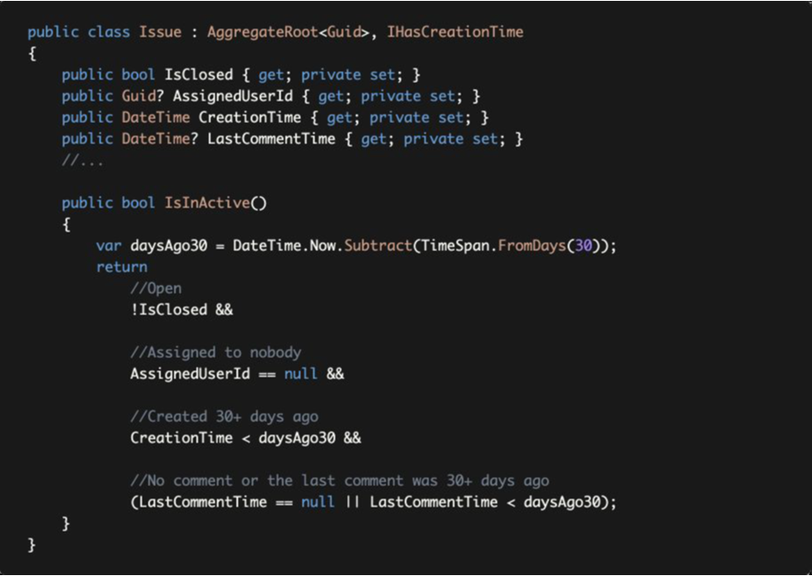

- #### Using within the Entity

  - `IsSatisfiedBy`: Specification class提供，將執行自行覆寫的Expression
    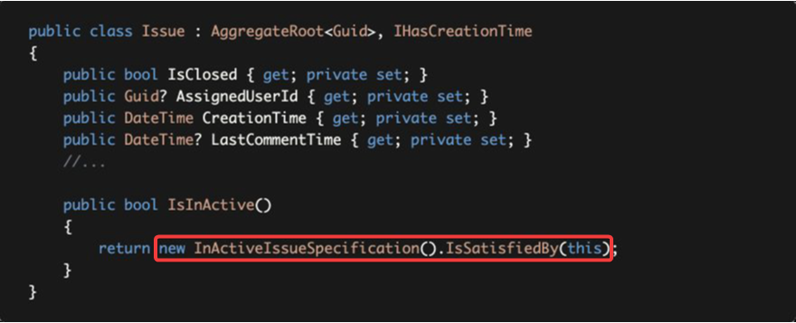
  
- #### Using with the Repositories

  - Interface定義方法，由外部丟入ISpecification
  - `ToExpression`: Specification class提供，可用於Where過濾
    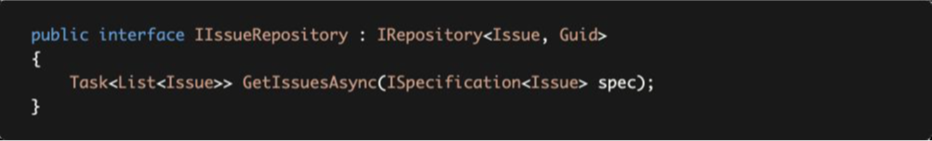
    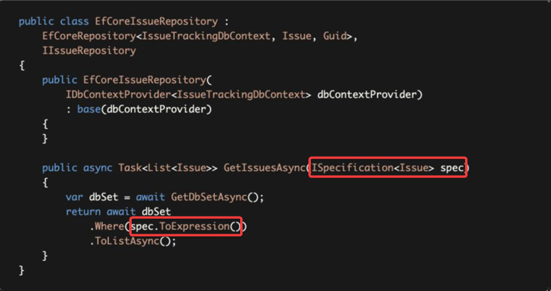
    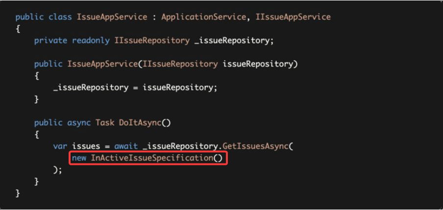

- #### With Default Repositories

  - 不需自行客製Repository，僅需取得IQueryable (`GetQueryableAsync`)並丟入Specification即可
    - ABP已有提供AsyncExecuter (如`ToListAsync`)，可不直接依賴於EF Core的方法
    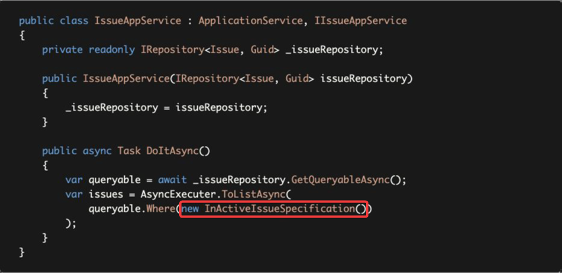

- #### Combining the specifications

  - 可使用`And`、`Or`、`AndNot`方法用於合併多個Specification
    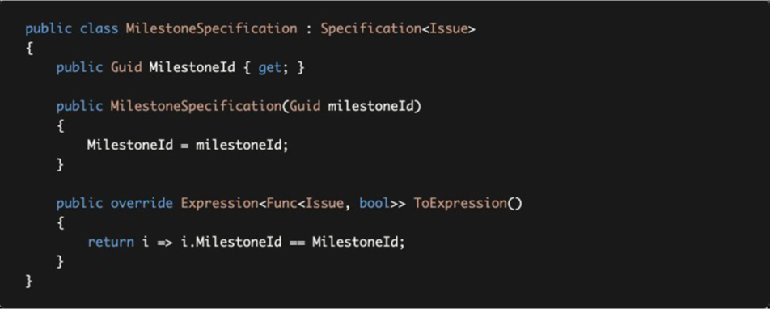
    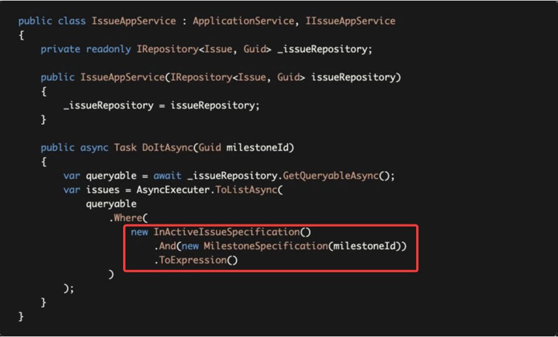

### Domain Services

- Domain service實作Domain Logic:
  - 依賴於Services & Repositories
  - 需要處理Multiple aggregates時
- 方法可get/return entities, value objects, primitive types...
  - **不處理DTOs** (屬於Application Layer範疇)
- 命名慣例為`xxxManager`
- 不需要為Domain Service建立Interface
- 範例:
  - Before
    - 邏輯與Service使用寫在AggregateRoot上

       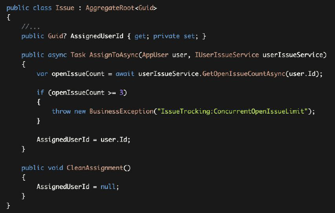

  - After
    - Property改為`internal set`，並將商業邏輯移到`IssueManager` (domain service)
      - `internal set`將可限制操作於同一個Assembly當中，而非`public`，ABP團隊認為合理
    - Domain Layer開發者已知道Domain rules因此使用IssueManager
    - Application Layer開發者無法直接set，因此被限制僅能使用Domain Service做操作

       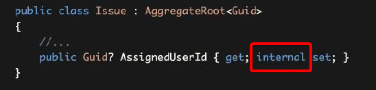
       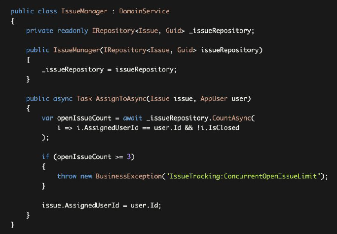

### Application Services

- 實作應用程式之Use cases，並使用與協作Domain Objects (Entities, repositories)
- Get / Return DTOs
- 被Presentation Layer使用
- 原則
  - 不要實作核心Business Logic! (會與Domain logic產生差異)
  - 不要Get / Return entities! (會破壞Domain layer的封裝)
  - EF Core因有Change Tracking可不需要做Repository Save
       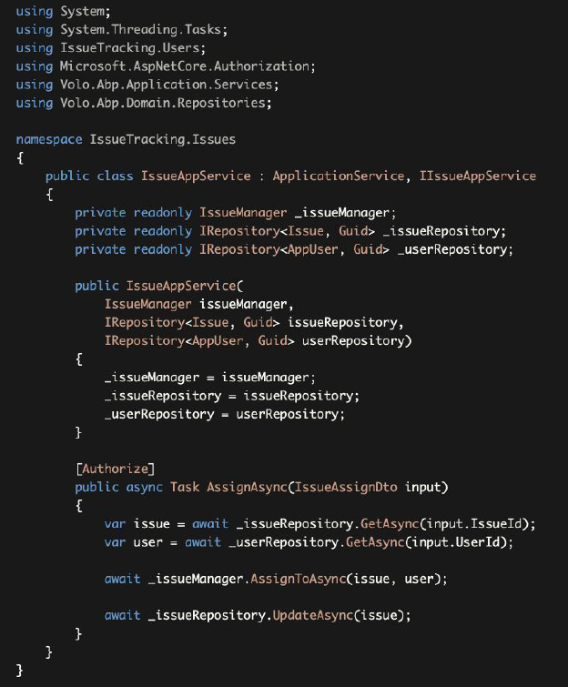

### Data transfer Objects

- 用於Application & Presentation Layer的轉換物件
- Common特性:
  - Serializable且為parameterless constructor
  - 不含Business logic
  - 絕不**繼承**或**相依**於entities
- Input DTOs 與 Output DTOs擁有不同性質，應分開使用

- #### Input DTO Best Practices

  - ##### Do not Define Unused Properties for Input DTOs

    - 只定義"Use case有需要使用"的properties

  - ##### Do not Re-Use Input DTOs

    - 每一個Use case都專門用一個input DTO (Application Service methods)
    - 就算兩個Use case幾乎一樣，也難保未來不變或遇到相同狀況，仍需要分開
    - 有時候Code duplication會比耦合多個use cases要好些
    - 也有共用的方法如"繼承"DTO，但大部分情境皆要避免
    - 範例:
      - 錯誤

         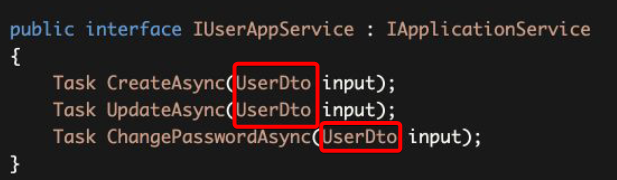
         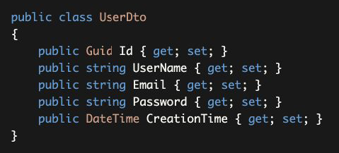

      - 正確

         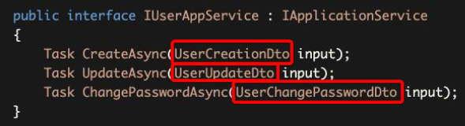
         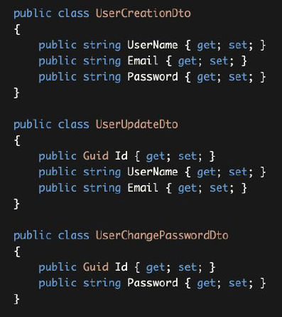

      ※ 例外情況: 有許多**平行方法**需要共用DTO(如Report system有多種Export file types，需要共用Filter DTO)，這時可能就需要耦合User cases使用同一個DTO來確保一致性

  - ##### Input DTO Velidation Logic

    - 只在DTO裡面做[正式驗證](https://abp.io/docs/latest/framework/fundamentals/validation)(Formal validation)
      - Data Annotation Validation Attributes / 實作IValidatablerObject
      - ABP會自動拋出`AbpValidationException`，並回傳HTTP Statsu 400給Client端
      - ABP團隊建議Data Annotation方法比較實際，但也支援Fluent API ([FluentValidation integration](https://abp.io/docs/latest/framework/fundamentals/fluent-validation))
         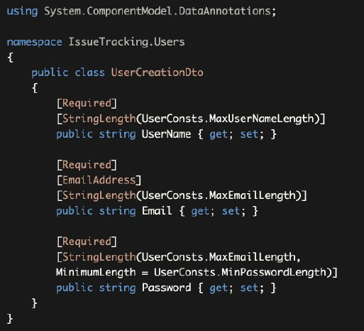
    - 不要做Domain驗證! (比如Username不可重複這種)

- #### Output DTO Best Practices

  - Output DTO越少越好，能Reuse就Reuse
    - 但不要將Input DTOs跟Output DTOs互相共用!
  - Output DTO可以包含比Client code更多的資訊
  - 就算是Create & Update也要Return Entity DTO
  - 目標:
    - Client side code要易於開發與擴充
      - 對Client code來說，相似但有些微差異的DTO是問題所在
      - UI可能未來會需要額外Property，多給Property未來有高機會不用改Backend code
      - 如果API是給第三方Client使用，你不會知道那些Client需要甚麼資訊
    - Server side code要易於開發與擴充
      - 越少Class就越少需要理解與維護
      - 可以重複使用Entity->Dto的Mapping設定
      - Return相同型別DTO對新增不同的method更簡單與清晰
  - 範例:
    - 錯誤
      - 範例只為了呈現清晰，平常還是要用async!
      - 此例會讓Query多很多重複的code出現且還都要做mapping entities!
       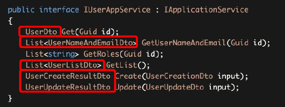

    - 正確
      - 此例可以讓Update後繼續再做Update，不用重複Get一次
       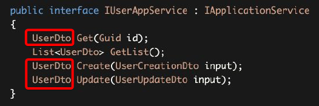
  - 討論:
    - 以上原則在有些情境下不適用: 高併發或大量資料集的應用程式
    - 當維護codebase比損失微小的效能相比更重要時，可能會建立特殊的"Minimal information Output DTO"來處理類似狀況
  - Object to Object Mapping
    - 自動化object to object mapping當如很相似的DTO與Entity時很實用
    - ABP [object to object mapping system](https://abp.io/docs/latest/framework/infrastructure/object-to-object-mapping)整合AutoMapper讓Mapping設定更加簡單
    - 限制:
      - 只將AutoMapper用在Entity to output DTO上
      - 不要將AutoMapper用在Input DTO to Entity上!
        - Entity一般會有Parameterized Constructor，但AutoMapper一般會需要空的constructor
        - 大部分Entity property會有private setters，但AutoMapper無法使用
        - 你必須小心地驗證與處理User/Client input，而不是用AutoMapper
      - 雖然以上限制可用Configurations繞過，但將會導致隱藏且高耦合的狀況發生

## Example Use Cases

### Entity Creation

1. Primary constructor + Parameters (`text` optional)
2. Private constrctor (For ORMs)
3. Buniness Function: `SetTitle` for private set `Title`
4. Property Access Modifiers: 建立`IssueManager`來撰寫更複雜的Business Rules
  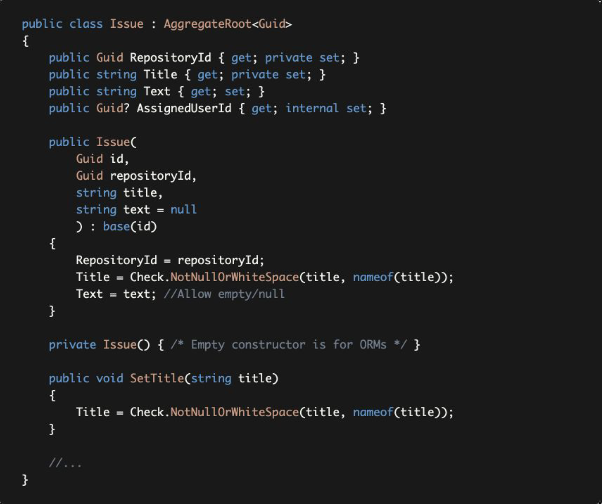
5. AppService
   1. 利用Constructor建立`Issue` entity instance
   2. 呼叫`IssueManager`做必要檢查
   3. 儲存Entity到DB
   4. 使用`IObjectMapper`來Mapping Issue到DTO `IssueDto`做Return
  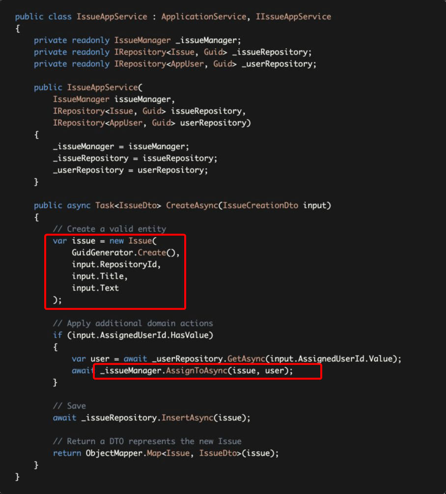

- #### Applying Domain Rules on Entity Creation

  1. 舉例: 建立`Title`時不行重複建立，則此規則屬於核心Business rule，適合放在Domain Service `IssueManager`、不適合放在Application Service
  2. 必須規範Application Layer要Create `Issue` 必須使用`IssueManager`
  3. 讓Entity Constructor改為Internal
  4. Domain service建立`CreateAsync`，執行檢查拋出異常、建立Entity instance返回
    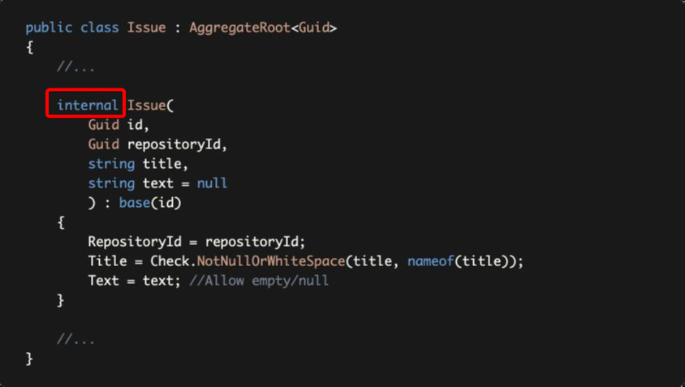
    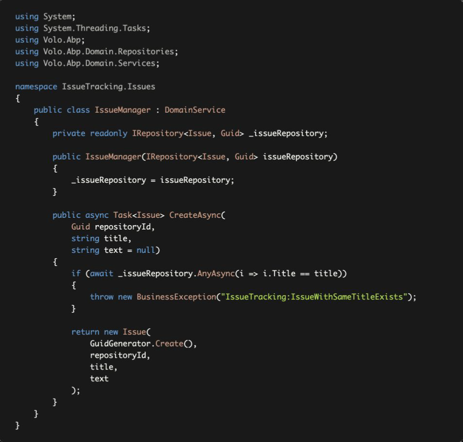
  5. AppService: 改為使用Domain Service建立Instance
    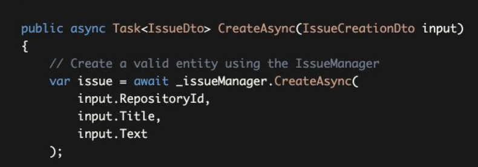

  - 討論1: 為何`Issue` save不用`IssueManager`來達到?
    - ABP團隊認為，**Save職責應該是"Application Service"來做**，因為Save前可能會有額外的Change/Operations，Domain Service來做，可能會造成重複
      - Double DB round trip
      - Explicit DB transaction需要包含兩個動作
      - Transaction在取消動作必須要能Rollback
  - 討論2: 為何`Title`檢查沒有實作在Application Service?
    - 因為Title檢查屬於`核心Domain Logic`
    - 如何決定Logic是屬於Business還是Application?
      - 如果有其他Use case出來，這個Rule還會一樣嗎? -> 會的話，就是`核心Domain Logic` (且不應該重複)
      - 舉例: Use cases - Standard UI / Back office app / 3rd-party client / Background worker service

### Updating / Manipulating An Entity

- `IssueCreationDto`不含`RepositoryId`，為`Issue`不可以轉移Repository的邏輯
- `Title`為Update必要Property，其他則不為必須
- `Id`不含在DTO當中，為讓ABP自動(Auto expose)作為API HTTP route所用，與DDD無關
- 呼叫`IssueManager.ChangeTileAsync`是為強制執行檢查重複的Domain logic
- `issue.Text`直接更改Entity property，如有Domain logic需要實作到時候可以再重構
  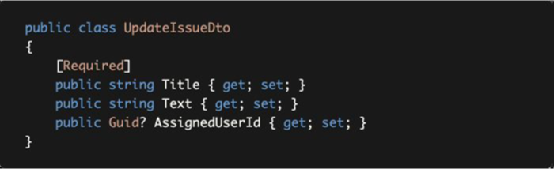
  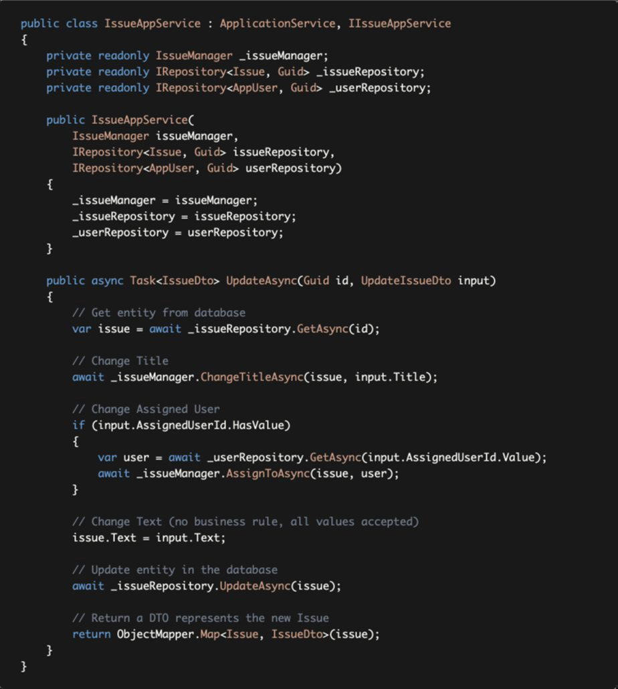

## Domain Logic & Application Logic

### Multiple Application Layers

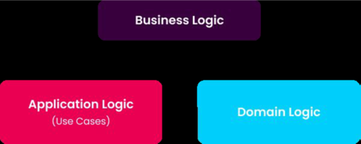
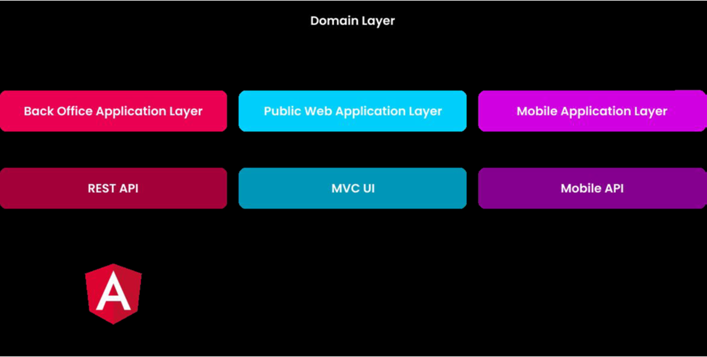

- DDD擅長處理大型系統的複雜姓，尤其有複數個Applications被發展在"單一Domain"
  - 如Public Webstie (.Net MVC) + Back office (Augular UI) + Mobile (REST APIs / TCP sockets)
  - 每個Application都有不同的需求、Use cases、DTOs & 驗證與授權規則等
  - 如果混和這些邏輯，會有太多IF、過於複雜的Business logic，難以開發、維運與測試
- 解法:
  - 只使用一個Domain layer
  - 為各自Application建立不同的Application layers
    - 建立不同的projects (`.csproj`)
      - `IssueTracker.Admin.Application` & `IssueTracker.Admin.Application.Contracts`
      - `IssueTracker.Public.Application` & `IssueTracker.Public.Application.Contracts`
      - `IssueTracker.Mobile.Application` & `IssueTracker.Mobile.Application.Contracts`

- #### 範例1: 於Domain service建立Organization

  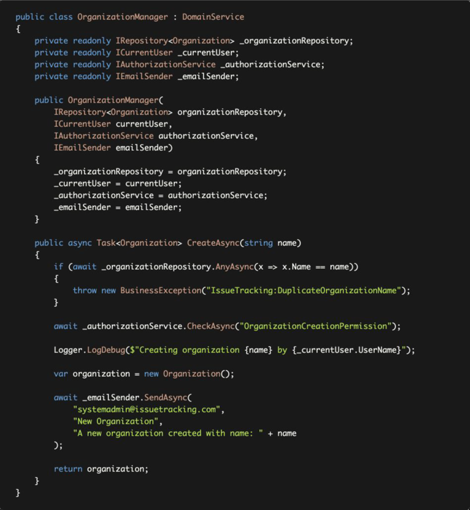

  - 正確: 檢查重覆與Throw excpetion
  - 錯誤:
    - 不可以在Domain service做驗證 (Application service的職責)
    - 不可以相依在其他Service (此類為`_currentUser.UserName`)
    - 不包含特定Use case的商業邏輯: 範例中寄信的部分，應屬於Use case，有可能會在不同情況有不同的類型或根本不需要寄信

- #### - 範例2: Application service建立Organization

  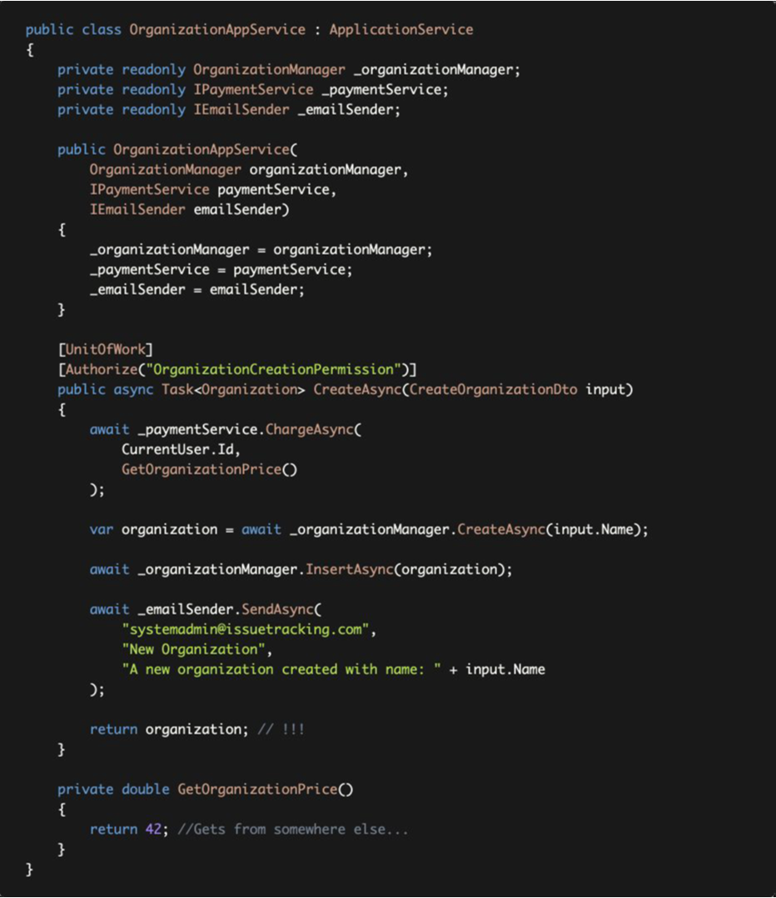

  - 正確:
    - Unit of work有標示，為一次Transaction變更
    - Authorization屬於Application layer職責
    - 呼叫外部Service(`IPaymentService`、`SendEmail`)執行商業邏輯
    - Save change to DB屬於Application layer職責
  - 錯誤:
    - 不可以直接Return Domain entities，Application layer請以DTO替代
  - 思考:
    - 為何Payment logic雖然很重要，但還是不屬於Organization的Domain logic?
      - "重要"不足以成為Core Business Logic的存在要件
      - 考慮例外:
        - 如Admin user可能會使用Back office application跳過Payment流程
        - 如背景程式也會建立Organization而不做Payment流程
        - 此例可知，Payment屬於特定Use case的Application logic

- #### 範例3: CRUD操作

  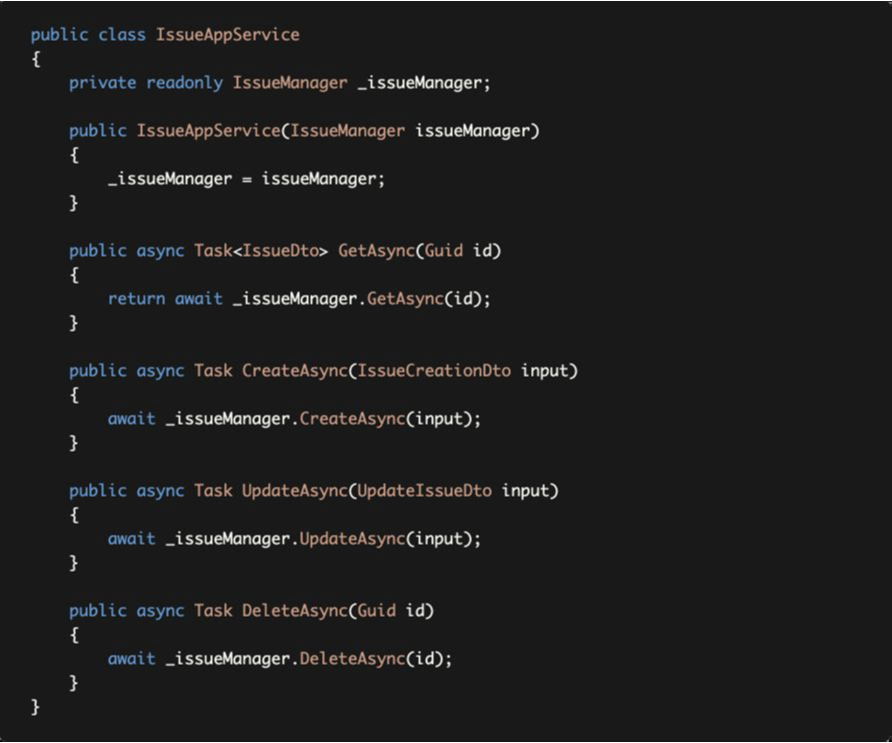

  - 錯誤:
    - 不可以建立Domain service僅提供CRUD操作而沒有任何Domain logic
    - Application serivce不可以直接把DTO傳給Domain service
  - 只需要建立"目前需要"的Domain service methods即可
  - 僅更改Domain service的話，未來UI Layer & Client會因為Application layer的關係而不受影響

## Reference Books

- "Domain Driven Design" by Eric Evans
- "Implementing Domain Driven Design" by Vaughn
Vernon
- "Clean Architecture" by Robert C. Martin