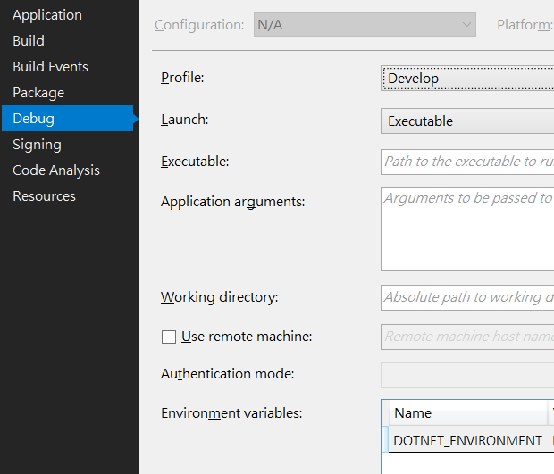
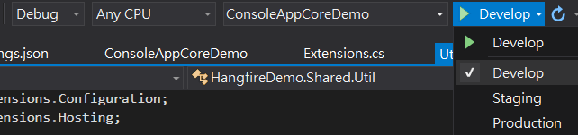
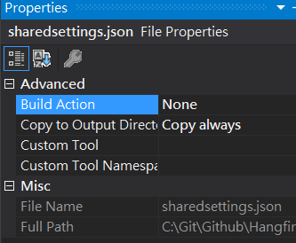
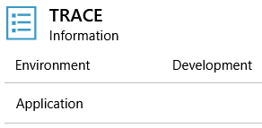
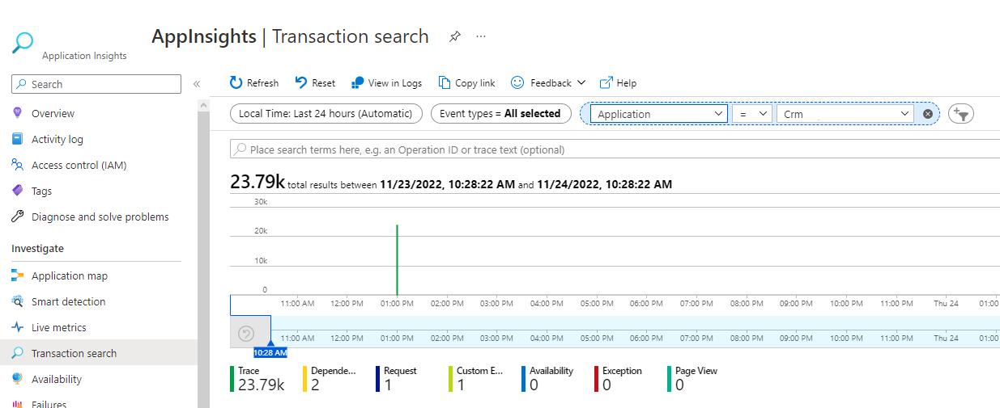
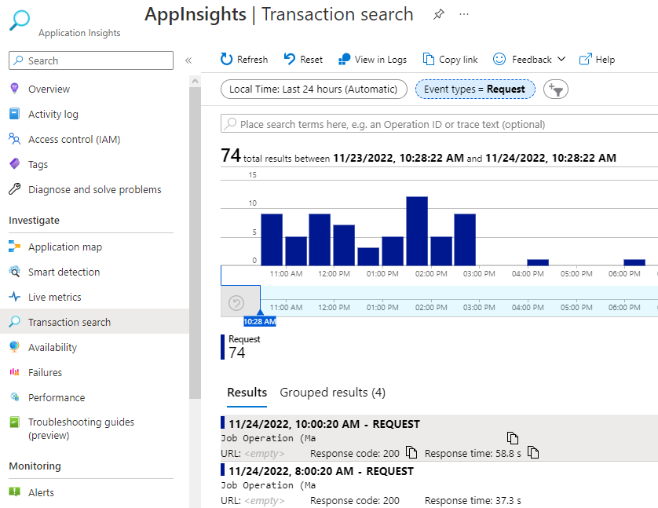

# Console Job優化管理 (Generic Host)

#### 目的

* 整合Environment，允許Job根據環境變數切換行為，並可於Debug時隨時切換
* 集中App Config，便於統一更新與佈署
* 整合Logger，便於紀錄Event
* 整合相依性注入，提升程式維護性
* 集中跨專案邏輯，便於管理

#### 原始碼

[Demo Repository](https://github.com/timmchentw/HangfireDemo)</br></br>

#### 方法

1. 使用與.Net Core Website相同之HostingBuilder建置 </br>

    ```C#
    class Program
    {
        static void Main(string[] args)
        {
            Host.CreateDefaultBuilder(args);
        }
    }
    ```

2. 設定Environment </br>
  2-1. **[Job]** 設定launchSettings.json，可在Debug時快速切換環境 </br>
    (可使用右鍵 → Properties → Debug 當中設定) </br>
  
      ```json
      {
      "profiles": {
        "Develop": {
          "commandName": "Project",
          "environmentVariables": {
            "DOTNET_ENVIRONMENT": "Develop"
          }
        },
        "Staging": {
          "commandName": "Project",
          "environmentVariables": {
            "DOTNET_ENVIRONMENT": "Staging"
          }
        },
        "Production": {
          "commandName": "Project",
          "environmentVariables": {
            "DOTNET_ENVIRONMENT": "Production"
          }
        }
      }
    }
    ```
  
     </br>
     </br>
  
    2-2. **[Builder]** 指定Environment Variables Prefix </br>
    (.Net Core 3.1預設由NETCORE_ENVIRONMENT改為DOTNET_ENVIRONMENT)
  
    ```C#
    class Program
    {
        static void Main(string[] args)
        {
            Host.CreateDefaultBuilder(args)
                .ConfigureHostConfiguration(configurationBuilder =>
                {
                    configurationBuilder.AddEnvironmentVariables(prefix: "DOTNET_");
                });
        }
    }
    ```
  
    2-3. **[Server]** 設定Deploy環境變數 </br>
    (a) IIS須手動設定Environment Variables </br>
      (Configuration Editor → system.webServer/aspNetCore → Environment Variables)， </br>
      或於Pipeline中指定(參考以下語法) </br>

    ```powershell
    # Add Environment Variable for This Website
    Add-WebConfigurationProperty -pspath 'MACHINE/WEBROOT/APPHOST/$(SiteName)'  -filter "system.webServer/aspNetCore/environmentVariables" -name "." -value @{name='$(EnvironmentVariableKey)';value='$(EnvironmentName)'}
    ```

    (b) Web App則需設定Environment Variable </br>

3. 設定Shared Config (參考[出處](https://andrewlock.net/sharing-appsettings-json-configuration-files-between-projects-in-asp-net-core/)) </br>
  3-1. **[Shared Project]** 建立sharedsettings.json </br>
     </br>
  3-2. **[Shared Project]** 設定Always Copy (將檔案複製到Job Assembly Directory) </br>
   </br>
  
    ```xml
    <Project Sdk="Microsoft.NET.Sdk">
    <!--...-->

      <ItemGroup>
        <None Update="sharedsettings.json">
          <CopyToOutputDirectory>Always</CopyToOutputDirectory>
        </None>
        <None Update="sharedsettings.Production.json">
          <CopyToOutputDirectory>Always</CopyToOutputDirectory>
        </None>
        <None Update="sharedsettings.Staging.json">
          <CopyToOutputDirectory>Always</CopyToOutputDirectory>
        </None>
      </ItemGroup>

    <!--...-->
    </Project>
    ```

    3-3. **[Builder]** 設定config json讀取順序 (後讀覆蓋前讀) </br>
  ※ 由於保留仍可讀取appsettings.json，如有客製化設定仍可設定於job project當中的appsettings.json
  
    ```C#
    class Program
    {
        static void Main(string[] args)
        {
            Host.CreateDefaultBuilder(args)
                /*...*/
                .ConfigureAppConfiguration((hostContext, config) =>
                {
                    var env = hostContext.HostingEnvironment;
                    string assemblyDirectory = Path.GetDirectoryName(Assembly.GetExecutingAssembly().Location);
                    config = config.SetBasePath(assemblyDirectory)
                                    .AddJsonFile("sharedsettings.json", optional: false, reloadOnChange: true)
                                    .AddJsonFile($"sharedsettings.{env.EnvironmentName}.json", optional: true, reloadOnChange: true)
                                    .AddJsonFile($"appsettings.json", optional: true, reloadOnChange: true)
                                    .AddJsonFile($"appsettings.{env.EnvironmentName}.json", optional: true, reloadOnChange: true);
                });
        }
    }
    ```
  
4. 設定Logger </br>
    4-1 **[Shared Project]** 安裝Serilog Package </br>
  
    ```CMD
    dotnet add package Serilog.AspNetCore
    ```
  
    4-2 **[Builder]** 設定Serilog為預設Logger </br>
    
    ```C#
    class Program
    {
        static void Main(string[] args)
        {
            Host.CreateDefaultBuilder(args)
                /*...*/
                .UseSerilog((hostContext, loggerConfig) =>
                {
                    string jobNamespace = MethodBase.GetCurrentMethod().DeclaringType.Namespace;
                    var env = hostContext.HostingEnvironment;
                    var emailSinkInfo = new EmailConnectionInfo() { /*...*/ };
        
                    loggerConfig.MinimumLevel.Information()
                    .Enrich.WithProperty("Application", jobNamespace)   // 可設定自定義參數
                    .Enrich.WithProperty("Environment", hostContext.HostingEnvironment.EnvironmentName)
                    .WriteTo.Conditional(
                        condition => !env.IsDevelopment(),  // 可設定觸發條件
                        writeTo => writeTo.Console()    // 指定Log途徑
                });
        }
    }
    ```

      * Enrich With Property輸入Job namespace與Environment，方便直接篩選
      
      
  
    4-3 **[Builder]** 依個人喜好新增Sink管道 (如App Insights, Email, ...)
  
    ```CMD
    dotnet add package Serilog.Sinks.ApplicationInsights
    dotnet add package Serilog.Sinks.Email
    dotnet add package Microsoft.ApplicationInsights
    ```
      
    ```C#
    class Program
    {
        static void Main(string[] args)
        {
            Host.CreateDefaultBuilder(args)
                /*...*/
                .UseSerilog((hostContext, loggerConfig) =>
                {
                    string jobNamespace = MethodBase.GetCurrentMethod().DeclaringType.Namespace;
                    var env = hostContext.HostingEnvironment;
                    var emailSinkInfo = new EmailConnectionInfo() { /*Assign Properties...*/ };
        
                    loggerConfig.MinimumLevel.Information()
                    .Enrich.WithProperty("Application", jobNamespace)
                    .Enrich.WithProperty("Environment", hostContext.HostingEnvironment.EnvironmentName)
                    .WriteTo.Conditional(
                        condition => !env.IsDevelopment(),
                        writeTo => writeTo.Console()
                                    // 指定各種途徑與Log Level
                                   .WriteTo.ApplicationInsights(new TelemetryConfiguration("Assign AppInsights Key..."), TelemetryConverter.Traces)
                                   .WriteTo.Email(emailSinkInfo, restrictedToMinimumLevel: LogEventLevel.Error));
                });
        }
    }
    ```

    4.4 **[Builder]** 設定Custom Application Insights Request & Property </br>

    * 這邊與上面的App Insights Custom Property算是同樣功用，但上述僅適用於呼叫"ILogger"時適用，下方的CustomTelemetryInitializer類別則是在App Insights自動進行Log時一併觸發的middleware
    * 注意ApplicationInsightsTelemetryWorkerService僅適用於Console這種類型的Program
    * AddApplicationInsightsTelemetryWorkerService後，服務中注入TelemetryClient即可使用 (見下方"5. 建立JobService區塊")

    ```C#
    // Program.cs
    class Program
    {
        static void Main(string[] args)
        {
            Host.CreateDefaultBuilder(args)
                /*...*/
                .ConfigureServices((hostingContext, services) =>
                {
                    // 取得Job Namespace並註冊
                    string jobNamespace = MethodBase.GetCurrentMethod().DeclaringType.Namespace;
                    services.AddSingleton<Parameters>(new Parameters() { ProgramNamespace = jobNamespace });
                    // 自定義App Insights Middleware
                    services.AddSingleton<ITelemetryInitializer, CustomTelemetryInitializer>();
                    // Non-Website專案專用的App Insights套件
                    services.AddApplicationInsightsTelemetryWorkerService(new ApplicationInsightsServiceOptions()
                    {
                        InstrumentationKey = loggerInfo.AppInsightsKey,
                    });
                });
        }
    }

    // CustomTelemetryInitializer
    public class CustomTelemetryInitializer : ITelemetryInitializer
    {
        private readonly Parameters _parameters;
        private readonly IHostEnvironment _environment;

        // next will point to the next TelemetryProcessor in the chain.
        public CustomTelemetryInitializer(Parameters parameters, IHostEnvironment environment)
        {
            _parameters = parameters;
            _environment = environment;
        }

        public void Initialize(ITelemetry telemetry)
        {
            // 設定Custom Property
            if (!telemetry.Context.GlobalProperties.ContainsKey("AppRunningEnviroment"))
            {
                telemetry.Context.GlobalProperties.Add("AppRunningEnviroment", _environment.EnvironmentName);
            }

            if (!telemetry.Context.GlobalProperties.ContainsKey("Application"))
            {
                telemetry.Context.GlobalProperties.Add("Application", _parameters.ProgramNamespace);
            }
        }
    }
    ```

    

  
5. 建立JobService，用於統一對Exception呼叫Logger </br>
  
   * 繼承IHostedService，可在Host Build後直接呼叫Run </br>
   * 務必注意IHostApplicationLifetime </br> 與StopApplication()是必要的，讓Console App能在跑完這個service時將Host關閉，否則Console App將因Host持續運作而不會停止 </br>
   * Console App在被執行的時候，Exit Code也會做為是否正常結束的判別，如在不拋出Exception的情況下務必標記使執行端能知道這次執行有出現問題
   * TelemetryClient為註冊ApplicationInsightsTelemetryWorkerService後所注入的服務，用於紀錄Custom Operiation (此例使用的是Request Telemetry類別)

    ```C#
    public class JobSerive : IHostedService
    {
        private readonly ILogger _logger;
        private readonly IHostApplicationLifetime _appLifetime;
        private readonly TelemetryClient _telemetryClient;

        private readonly string _executionId;
        private readonly string _jobNamespace;
        private Exception _exception = null;
    
        public JobSeriveBase(ILogger<JobSeriveBase> logger, IHostApplicationLifetime appLifetime, TelemetryClient telemetryClient)
        {
            _logger = logger;
            _appLifetime = appLifetime;
            _telemetryClient = telemetryClient; // For logging "Custom Request" in app insights

            _jobNamespace = GetType().Namespace;    // For distinguish the job
            _executionId = Guid.NewGuid().ToString("N");    // For checking which round
        }
    
        public async Task StartAsync(CancellationToken cancellationToken)
        {
            try
            {
                _logger.LogInformation($@"Job ""{_jobNamespace}"" Started.");
                // 將整個Job的運作都納管到App Insights的Log範圍 (可記錄Job Run Duration、Dependency等)
                using (_telemetryClient.StartOperation<RequestTelemetry>($@"Job Operation of ""{_jobNamespace}"""))
                {
                    await this.ExecuteAsync();
                    _telemetryClient.TrackEvent($@"Job ""{_jobNamespace}"" Completed");
                }
            }
            catch (Exception ex)
            {
                _exception = ex;
                _logger.LogError(ex, $"Job Error: {_jobNamespace} ({_executionId})");   // Make sure you have the sink "Console" to identity the error
            }
            finally
            {
                _appLifetime.StopApplication(); // Go to StopAsync
            }
    
            return Task.CompletedTask;
        }
    
        public Task StopAsync(CancellationToken cancellationToken)
        {
            int exitCode = 0;
    
            if (_exception != null)
            {
                exitCode = 1;
                throw _exception;   // If you want to terminate job with exceptions, throw it to terminate the host. (Non-gracefull termination)
                                    // (You must not use "host.RunAsync()" because the method will ignore the exeption)
                                    // Otherwise, you can stop without throwing exceptions & just call "_logger.LogError(ex)" with "WriteToConsole"
                                    // The calling program will get the console output with exception content
            }
    
            Environment.ExitCode = exitCode;    // For the calling program to identify that this job had error
            return Task.CompletedTask;
        }
    
    
        protected virtual Task ExecuteAsync()
        {
            // Write your job logic here
        }
    }
    ```

6. 註冊JobService (相依性注入)
7. 執行Host & Service </br>
  
   * 註冊JobService務必要使用".AddHostedService()"方法， </br>
   該方法是為了能夠讓IHost.Run()的時候能執行Service Instance </br>
   * ".UseConsoleLifetime()"是必須的，原因是ㄧ些暫存資源可能會保留住等一次性釋出(如Application Insights)，該方法可在Host結束的時候強制釋出資源，可避免如Log內容遺失等情況 </br>
   * ".RunAsync()"方法會忽略掉Hosted servcie exception，務必注意

    ```C#
    class Program
    {
        static void Main(string[] args)
        {
            Host.CreateDefaultBuilder(args)
                /*...*/
                .ConfigureServices((hostContext, services) =>
                {
                    services.AddHostedService<JobService>();    // Register job service
                })
                .UseConsoleLifetime()   // For flush all resources before stopping the app (e.g. App Insights)
                .Build()
                .Run();    // Run logic in job service
                           // (If you want to throw exceptions in hosted service,
                           //  do not use ".RunAsync()" because it will ignore the exception)
        }
    }
    ```

#### 注意事項

* 有跨Framework的需求時，可使用.net standard 2.0作為Shared Library的版本 (對應.net Core 2.1 & .net Framework 4.7.2)
* 注意部分功能在.Net framework需要手動跟Shared Library安裝一樣的Nuget Package，否則會在Build or Runtime時發生錯誤
* 注意Generic Host RunAsync方法並不會拋出Exception而繼續執行到結束的狀況 (即Console App即使有做到Log Exception，但結果上還是顯示安全地執行結束)，這時候務必搭配ExitCode=0來做標記 (第7步)

#### 相關資源

* [[保哥部落格] 使用 .NET Generic Host 建立 Console 主控台應用程式](https://blog.miniasp.com/post/2020/12/08/NET-Generic-Host-Build-Console-App) </br>
* [[ZZLforever] ASP.NET Core 3框架揭秘 服务承载系统](https://www.writebug.com/explore/article/3U89X9j4) </br>
* [[TheCodeBuzz] Waiting for the Host to be disposed. Ensure all IHost instances are wrapped in using block](https://www.thecodebuzz.com/waiting-for-host-disposed-ensure-ihost-instances-wrapped-in-using-blocks/) </br>
* [[StackOverflow] How to Run Net Core Console App Using Generic Host Builder](https://stackoverflow.com/questions/68392429/how-to-run-net-core-console-app-using-generic-host-builder) </br>
* [[TheCodeBuzz] Dependency Injection in .NET Core Console app using Generic HostBuilder](https://www.thecodebuzz.com/dependency-injection-console-app-using-generic-hostbuilder/) </br>
* [[David's Blog] Building a Console App with .NET Generic Host](https://dfederm.com/building-a-console-app-with-.net-generic-host/) </br>
* [[MSDN] .NET Generic Host in ASP.NET Core
](https://docs.microsoft.com/en-us/aspnet/core/fundamentals/host/generic-host?view=aspnetcore-6.0) </br>
* [[MSDN] Use multiple environments in ASP.NET Core](https://docs.microsoft.com/zh-tw/aspnet/core/fundamentals/environments?view=aspnetcore-6.0) </br>
* [[MSDN] Application Insights for Worker Service applications (non-HTTP applications)](https://docs.microsoft.com/en-us/azure/azure-monitor/app/worker-service#aspnet-core-background-tasks-with-hosted-services) </br>
* [[Peter Bons] Monitoring non-web apps using Azure Application Insights](https://dev.to/expecho/monitoring-non-web-apps-using-azure-application-insights-part-2-basic-instrumentation-2fcj) </br>
* [[Andrew Lock] Sharing appsettings.json configuration files between projects in ASP.NET Core](https://andrewlock.net/sharing-appsettings-json-configuration-files-between-projects-in-asp-net-core/) </br>
* [[m@rcus 學習筆記] 使用 MethodBase.GetCurrentMethod 取得執行方法資訊](https://marcus116.blogspot.com/2019/01/net-methodbasegetcurrentmethod.html)
