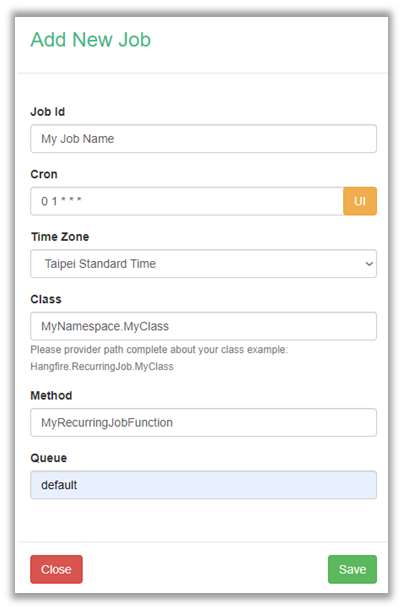
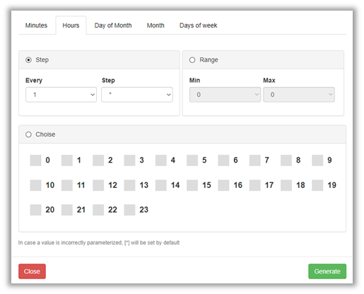
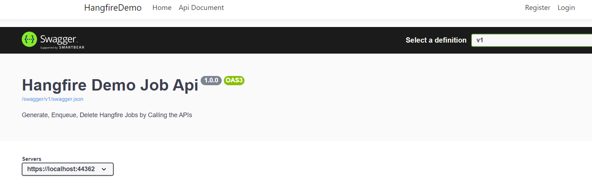
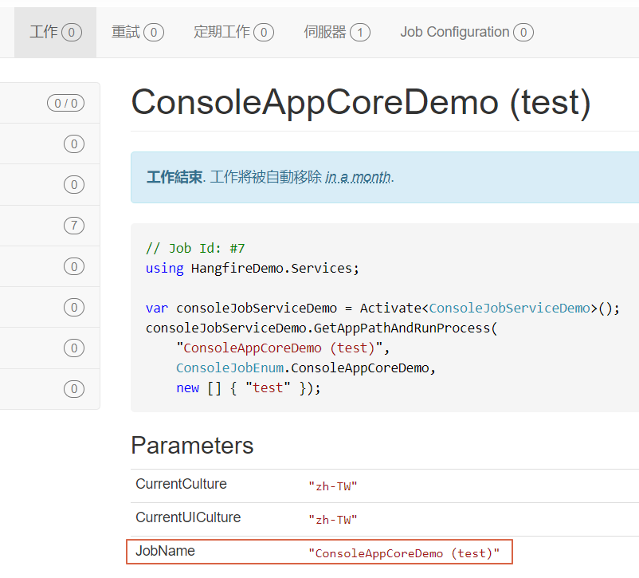
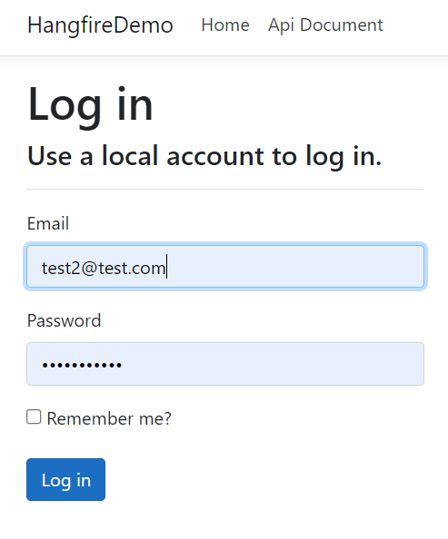
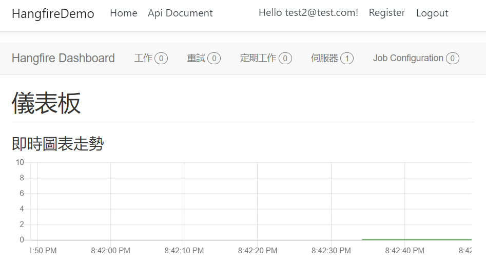
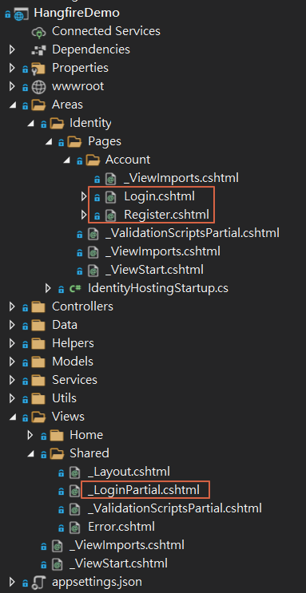
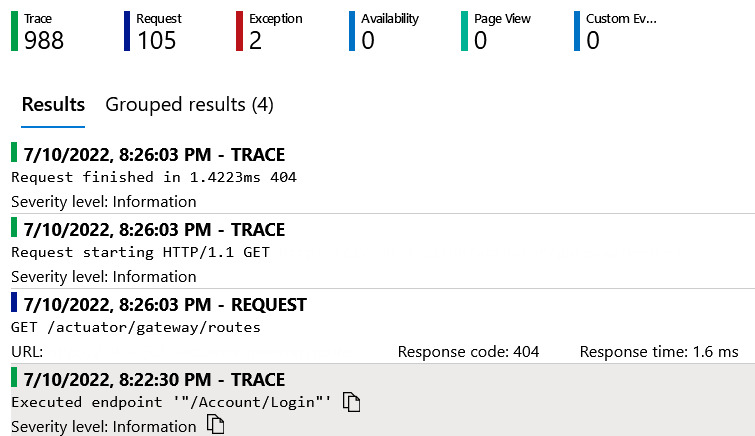

# Hangfire筆記
#### 官網: https://www.hangfire.io 

#### 簡介
以.Net為基礎的Job管理架構，輕量化、好用的Dashboard、高擴展性，讓排程佈署與監控更簡單


#### 使用心得
* 優點
  * 以Website為基礎，搭配UI簡化Job佈署流程、個人電腦可隨時監控 (須注意設定Always On避免背景執行中斷)
  * Dashboard簡單明瞭，易於監控；可使用UI查詢Job Exception內容
  * 資料儲存於Database，較不受Server影響、便於備份、可多伺服器執行
  * 可客製的自動Retry機制、自動刪除紀錄等，搭配Logger更便於監控
  * 可搭配Controller，由程式端自動生成Job
* 缺點
  * 須理解Cron排程格式 (可藉由UI Extension生成)
  * 無Disable功能，僅能刪除Job，需安裝Extension或自行客製
  * Job與站台的相依性共用，如有Library更新將影響所有排程
  * 須注意站台須Always On，避免排程無法執行
  * 客製化較花時間，需花上較多心力建置站台

#### 設定環境
* **Website**: .net Core 5, 3.1
* **Hangfire**: 1.7.30
* **Shared Library**: .net Standard 2.0
* **Console Application**: .net Core 5, 3.1, .net framework 4.7.2
* **原始碼**: [Demo Repository](https://github.com/timmchentw/HangfireDemo)

#### 目錄
* [安裝筆記](#安裝筆記)
    * [客製化設定](#客製化設定)
* [應用範例](#應用範例)
    * 建立與呼叫Job (Expression)
    * Job Name顯示在Dashboard
    * Controller搭配Swagger允許程式自動建立Job
    * 使用Job Enum作為API參數
* [進階擴充](#進階擴充)
    * Job Parameters (客製化參數)
* [自定義擴充](#自定義擴充)
    * [整合Identity](#整合Identity)
    * [執行Console App](#%E5%9F%B7%E8%A1%8Cconsole-app)
    * [整合Application Insights & Logger](#%E6%95%B4%E5%90%88application-insights--logger)
* [注意事項](#注意事項)
* [相關資源](#相關資源)

#### 安裝筆記
1. 安裝Nuget Packages

    ```CMD
    dotnet add package Hangfire.Core
    dotnet add package Hangfire.SqlServer
    ```

2. 註冊服務與Configuration (參考官網[文件](https://docs.hangfire.io/en/latest/getting-started/aspnet-core-applications.html#registering-services))

    ```C#
    public class Startup
    {
        public void ConfigureServices(IServiceCollection services)
        {
            // Add Hangfire services.
            services.AddHangfire(configuration => configuration
                .SetDataCompatibilityLevel(CompatibilityLevel.Version_170)
                .UseSimpleAssemblyNameTypeSerializer()
                .UseRecommendedSerializerSettings()
                .UseSqlServerStorage(Configuration.GetConnectionString("HangfireConnection"), new SqlServerStorageOptions
                {
                    CommandBatchMaxTimeout = TimeSpan.FromMinutes(5),
                    SlidingInvisibilityTimeout = TimeSpan.FromMinutes(5),
                    QueuePollInterval = TimeSpan.Zero,
                    UseRecommendedIsolationLevel = true,
                    DisableGlobalLocks = true
                }));
        
            // Add the processing server as IHostedService
            services.AddHangfireServer();
        
            // Add framework services.
            services.AddMvc();
        }
    }
    ```
    
    ```C#
    public class Startup
    {
        public void Configure(IApplicationBuilder app, IBackgroundJobClient backgroundJobs, IHostingEnvironment env)
        {
            // ...
            app.UseHangfireDashboard();
            backgroundJobs.Enqueue(() => Console.WriteLine("Hello world from Hangfire!"));
        
            app.UseMvc(routes =>
            {
                routes.MapRoute(
                    name: "default",
                    template: "{controller=Home}/{action=Index}/{id?}");
            });
            // ...
        }
    }
    ```
3. 進入Dashboard<br>
    * https://yourhangfire.websitehost/hangfire

#### 客製化設定
  * 延長Log封存期限

    ```C#
    public class Startup
    {
        public void Configure(IApplicationBuilder app, IWebHostEnvironment env)
        {
            // ...
            GlobalJobFilters.Filters.Add(new ProlongExpirationTimeAttribute(new TimeSpan(180, 0, 0, 0)));
            // ...
        }
    }
    
    public class ProlongExpirationTimeAttribute : JobFilterAttribute, IApplyStateFilter
    {
        private readonly TimeSpan _expirationTime;
    
        public ProlongExpirationTimeAttribute(TimeSpan expirationTime)
        {
            _expirationTime = expirationTime;
        }
    
        public void OnStateApplied(ApplyStateContext context, IWriteOnlyTransaction transaction)
        {
            context.JobExpirationTimeout = _expirationTime; // Set to custom expiration timeout
        }
    
        public void OnStateUnapplied(ApplyStateContext context, IWriteOnlyTransaction transaction)
        {
            context.JobExpirationTimeout = _expirationTime; // Set to custom expiration timeout
        }
    }
    ```

  * 更改Retry次數與間隔

    ```C#
    public class Startup
    {
        public void Configure(IApplicationBuilder app, IWebHostEnvironment env)
        {
            // ...
            GlobalJobFilters.Filters.Add(new AutomaticRetryAttribute()
            {
                 Attempts = 3,  // Default is 10
                 DelaysInSeconds = new int[] {15, 30, 60}
            });
            // ...
        }
    }
    ```

  * 安裝RecurringJobAdmin擴充套件，可使用UI添加新排程、Disable排程等

    ```C#
    services.AddHangfire(configuration =>
                configuration
                /*...*/
                .UseRecurringJobAdmin(typeof(Startup).Assembly));
    ```

    
    
    

#### 應用範例
* 建立與呼叫Job (Expression)

    ```C#
    // General Job
    var jobId = BackgroundJob.Enqueue(
        () => Console.WriteLine("Fire-and-forget!"));
        
    var jobId = BackgroundJob.Schedule(
        () => Console.WriteLine("Delayed!"),
        new DateTimeOffset(2022, 7, 11, 12, 0, 0));
    ```
    
    ```C#
    // Recurring Job
    RecurringJob.AddOrUpdate(
        "myrecurringjob",
        () => Console.WriteLine("Recurring!"),
        Cron.Daily(12, 0)));
    ```

* Job Name顯示在Dashboard <br>
    * 利用DisplayName attribute指定顯示的Parameter Index (該Function必須是Expression當中的Action最外層呼叫者)

    ```C#
    using Hangfire;
    
    static void Prgram(string input)
    {
        string jobId = BackgroundJob.Enqueue(() => RunJobWithNameAndInput("This is custom job name", input));
    }
    ```
    
    ```C#
    [DisplayName("{0}")]    // For displaying job name in dashboard (1st parameter)
    public static void RunJobWithNameAndInput(string jobName, string input)
    {
        Console.WriteLine("Website job demo. Input: " + input);
    }
    ```

* Controller搭配Swagger允許程式自動建立Job <br>
    * 使用NSwag.AspNetCore建立Swagger頁面
    * 搭配Microsoft.AspNetCore.Mvc.NewtonsoftJson，允許Body含有Nullable參數
    
    ```C#
    // Startup.cs
    public class Startup
    {
        public void ConfigureServices(IServiceCollection services)
        {
            /*...*/
            services.AddControllersWithViews()
                    .AddNewtonsoftJson()    // This package can parse enum, nullable object of parameter
                    
            services.AddOpenApiDocument(configure =>
            {
                configure.Title = "Hangfire Demo Job Api";
                configure.Description = @"Generate, Enqueue, Delete Hangfire Jobs by Calling the APIs";
            });
        }
        
        public void Configure(IApplicationBuilder app, IWebHostEnvironment env)
        {
            /*...*/
            // Add OpenAPI v3 document (Swagger)
            app.UseOpenApi();
            app.UseSwaggerUi3();
        }
    }
    ```
    
    ```C#
    // Controller
    [Route("api/[controller]")]
    [ApiController]
    public class JobController : Controller
    {
        [HttpPost]
        [Route("[action]")]
        public IActionResult ScheduleBackgroundJob(DateTimeOffset scheduledTime)
        {
            string jobId = BackgroundJob.Schedule(
                            () => WebsiteJobService.RunJobDemo(),
                            scheduledTime);
            return new JsonResult(jobId);
        }
        
        [HttpPost]
        [Route("[action]")]
        public IActionResult UpsertRecurringJobDaily(int hour, int minute)
        {
            string recurringJobName = nameof(IWebsiteJobService.RunJobDemo1);
            RecurringJob.AddOrUpdate(recurringJobName, () => _websiteJob.RunJobDemo1(), Cron.Daily(hour, minute));
            return new JsonResult("Created: " + recurringJobName);
        }
    }
    ```
    
    * 可將Swagger連結整合到iframe與Banner，讓站台更趨完整
    
    

* 使用Job Enum作為API參數
    * 利用Switch case切換執行邏輯(Expression<Task>)，送入Hangfire執行

    ```C#
    // Enum
    public enum WebsiteJobEnum
    {
        JobDemo1,
        JobDemo2,
        JobDemo3,
    }
    ```
    
    ```C#
    // Controller
    [Route("api/[controller]")]
    [ApiController]
    public class JobController : Controller
    {
        [HttpPost]
        [Route("[action]")]
        public IActionResult EnqueueJobWithEnum(BackgroundJobEnqueueJobWithEnumBody body)
        {
            string jobId = WebsiteJobService.EnqueueJobWithEnum(body.jobEnum, body.args);
            return new JsonResult(jobId);
        }
    }
    ```
    ``` C#
    // JobService
    public class WebsiteJobService
    {     
        public static string ScheduleJobWithEnum(DateTimeOffset scheduleDate, WebsiteJobEnum jobEnum, string[] args = null)
        {
            var jobAction = this.GetJobAction(jobEnum, args);
            string jobid = BackgroundJob.Schedule(jobAction, scheduleDate);
            return jobid;
        }
        
        private static Expression<Action> GetJobAction(WebsiteJobEnum jobEnum, string[] args)
        {
            switch (jobEnum)
            {
                case WebsiteJobEnum.JobDemo1:
                    return () => Job1.RunJob();
        
                case WebsiteJobEnum.JobDemo2:
                    return () => Job2.RunJobWithInput(args[0]);
        
                case WebsiteJobEnum.JobDemo3:
                    return () => Job3.RunJobWithNameAndInput("This is custom job name", args[0]);
        
                default:
                    throw new ArgumentOutOfRangeException("This job enum is not set");
            }
        }
    }
    ```

#### 進階擴充
* Job Parameters (客製化參數) <br>
    * 使用Hangfire靜態方法取得Connection，利用GetJobParameter、SetJobParameter，指定Parameter name進行存取
    * 文字需自行加入雙引號、數字及Boolean則可直接填入
    * 適合用於存放欄位供Job執行前後做判別 (如存放Job Name以取得Job ID)
    ```C#
    public static string GetParameterJobName(string jobId, IStorageConnection connection = null)
    {
        using (var jobConnection = JobStorage.Current.GetConnection()) {
            string parameter = jobConnection.GetJobParameter(jobId, "JobName").Replace(@"""", "");
        }
        return parameter;
    }

    public static void SetParameterJobName(string jobId, string jobName, IStorageConnection connection = null)
    {
        using (var jobConnection = JobStorage.Current.GetConnection()) {
            jobConnection.SetJobParameter(jobId, "JobName", $@"""{jobName}""");
        }
    }
    ```
    
    
    
* State Filter (切換狀態動作)
* Custom State (客製化狀態)
* Custom Page (客製化列表)
    * 可進一步客製化操作Job運作流程之順序、顯示內容等等，詳細內容可參考[Emre Teoman的文章](https://medium.com/borda-technology/custom-state-management-in-hangfire-1695a08b1be1)


#### 自定義擴充
##### 整合Identity
* 使用.net Core內建Identity，進行登入驗證
* 將Hangfire使用iframe嵌入到Index page，配合登入驗證(Controller當中加入[Authorize])達到自動導轉到Login page

    ```html
    <style>
        body > .container {
            margin: 0;
        }
    
        iframe {
            display: block; /* iframes are inline by default */
            background: #000;
            border: none; /* Reset default border */
            height: 100vh; /* Viewport-relative units */
            width: 100vw;
        }
    </style>
    
    <div class="text-center">
        <iframe src="/hangfire" />
    </div>
    ```

    ```C#
    // HomeController.cs
    public class HomeController : Controller
    {
        /*...*/
        [Authorize]
        public IActionResult Index()
        {
            return View();
        }
        /*...*/
    }
    ```
    
    <br>
    

* 可客製化Scaffolded Items，進行前後端檔案客製，限制Register權限等等 (如未登入隱藏與限制Register、登入後才能註冊新User等等) <br>


    ```C#
    // Register.cshtml.cs
    public async Task<IActionResult> OnPostAsync(string returnUrl = null)
    {
        // Only development or logged in user can add new user
        if (!_env.IsDevelopment() && !_signInManager.IsSignedIn(User))
        {
            return new UnauthorizedResult();
        }
        /*...*/
    }
    ```

##### 執行Console App
* 優點: 允許各自Job有獨立的執行環境
* 缺點: 執行檔(.exe)路徑處理較為麻煩

* 步驟:
    1. 建立Enum儲存Prject name <br>
        * Enum設定Description為Project name (可包含符號)
        ```C#
        // Enum
        public enum ConsoleJobEnum
        {
            [Description("ConsoleAppCoreDemo.1")]
            ConsoleAppCoreDemo1,
            [Description("ConsoleAppCoreDemo.2")]
            ConsoleAppCoreDemo2,
        }
        ```
    2. 建立Controller & Service <br>
        2-1. Controller設定Enum & Args為參數
        
        ```C#
        // Controller
        [Route("api/[controller]")]
        [ApiController]
        public class JobController : Controller
        {
            [HttpPost]
            [Route("[action]")]
            public IActionResult Enqueue(ConsoleJobEnqueueBody body)
            {
                string jobId = _consoleJobService.EnqueueConsoleJob(body.jobEnum, body.args);
                return new JsonResult(jobId);
            }
        }
        ```
        
        2-2. Service包含轉換Enum為Job name、取得Assembly位置(.exe)、Run console app等邏輯<br>
        * 藉由Enum轉為Job Name，供Dashboard顯示
        ```C#
        // Job Service
        public class ConsoleJobService
        {
            public string EnqueueConsoleJob(ConsoleJobEnum jobEnum, string[] args = null)
            {
                string jobName = this.GetJobName(jobEnum, args);
                string jobId = BackgroundJob.Enqueue(() => this.GetAppPathAndRunProcess(jobName, jobEnum, args));
                return jobId;
            }
            
            private string GetJobName(ConsoleJobEnum jobEnum, string[] args = null)
            {
                string jobProjectName = jobEnum.GetDescription();
                if (args != null && args.Length > 0)
                {
                    return $"{jobProjectName} ({string.Join(',',args)})";
                }
                return jobProjectName;
            }
            
            [DisplayName("{0}")]    // For displaying job name in dashboard (1st parameter)
            public void GetAppPathAndRunProcess(string jobName, ConsoleJobEnum jobEnum, string[] args = null)
            {
                string appPath = this.GetConsoleAppPath(jobEnum);
                Util.RunProcess(_env.EnvironmentName, appPath, args);
            }
        }
        ```
    3. 建立方法讀取Assembly路徑 <br>
        3-1. 切換不同環境所需讀取的路徑設定 <br>
        * Root路徑是藉由Hangfire站台的Namespace (即Main Project Name)為搜尋目標 <br>
        * 切換環境建議使用DI的IHostEnvironment作為判別
         ```C#
        // Job Service
        public class ConsoleJobService
        {
            private string GetConsoleAppPath(ConsoleJobEnum jobEnum)
            {
                string consoleAppDirectory;
        
                string jobProjectName = jobEnum.GetDescription();
        
                if (_env.IsDevelopment())
                {
                    consoleAppDirectory = this.GetDevProjectAssemblyDirectory(jobProjectName);
                }
                else
                {
                    consoleAppDirectory = this.GetProjectAssemblyDirectory(jobProjectName);
                }
                return $@"{consoleAppDirectory}\{jobProjectName}.exe";
            }
            
            private string GetSolutionRootDirectory(string searchSubDirectory)
            {
                var currentAssembly = Assembly.GetExecutingAssembly();
                var currentDirectory = new DirectoryInfo(currentAssembly.Location).Parent;
        
                // Search for root directory
                int searchAttempts = 0;
                var searchDirectory = currentDirectory.Parent;
                while (searchAttempts < 10)
                {
                    var searchSubDirectories = searchDirectory.GetDirectories();
                    if (searchSubDirectories.Any(x => x.Name == searchSubDirectory))
                    {
                        return searchDirectory.FullName;
                    }
                    else
                    {
                        searchDirectory = searchDirectory.Parent;   // Search parent directory
                    }
                }
                throw new DirectoryNotFoundException("Cannot find program root direcotory");
            }
        }
        ```
        3-2. 處理Development路徑 <br>
        * 直接讀取各Console Program的Debug資料夾Assembly
        ```C#
        // Job Service
        public class ConsoleJobService
        {
            private string GetDevProjectAssemblyDirectory(string jobProjectName)
            {
                string devAssemblyDirectory = "";
        
                //  - root/project/bin/env/...
                string rootDirectory = this.GetSolutionRootDirectory(_programNamespace);
                var assemblyDirectoryCandidate = $@"{rootDirectory}\{jobProjectName}\bin\Debug";
                var subDirectories = Directory.GetDirectories(assemblyDirectoryCandidate);
                if (subDirectories.Length == 0)
                {
                    devAssemblyDirectory = assemblyDirectoryCandidate;
                }
                else
                {
                    foreach (string subDirectory in subDirectories)
                    {
                        var fileNames = Directory.GetFiles($"{subDirectory}");
                        if (fileNames.Any(x => new FileInfo(x).Name.Contains(jobProjectName)))
                        {
                            devAssemblyDirectory = subDirectory;
                            break;
                        }
                    }
                    if (string.IsNullOrEmpty(devAssemblyDirectory))
                    {
                        throw new FileNotFoundException("No dev assembly directory was found");
                    }
                }
                return devAssemblyDirectory;
            }
        }
        ```
        
        3-3. 處理Staging & Production路徑 <br>
        * 考量資安，避免Hangfire被當作任意程式執行器，因此已事先定義好路徑的相對關係與格式
        * 此範例是抓取版本資料夾的最大者(如最新日期)，可搭配Pipeline控管佈版的流程與紀錄
        * 路徑的版本存取方法也可以自行將資料夾版本資訊存於Database，在網頁中自行切換
        
        ```C#
        // Job Service
        public class ConsoleJobService
        {
            private static string GetProjectAssemblyDirectory(string jobProjectName)
            {
                string assemblyDirectory = "";
        
                // - env/root/project/yyyyMMdd.N/...
                string rootDirectory = this.GetSolutionRootDirectory(_programNamespace);
                var assemblyDirectoryCandidate = $@"{rootDirectory}\{jobProjectName}";
                var subVersionDirectories = Directory.GetDirectories(assemblyDirectoryCandidate);
                if (subVersionDirectories.Length > 0)
                {
                    assemblyDirectory = subVersionDirectories.OrderByDescending(x => x).First();  // Get the lastest version of job project
        
                    var fileNames = Directory.GetFiles($"{assemblyDirectory}");
                    if (fileNames.Any(x => new FileInfo(x).Name.Contains(jobProjectName)))
                    {
                        return assemblyDirectory;
                    }
                }
                throw new FileNotFoundException("No assembly directory is found");
            }
        }
        ```

    4. 建立方法使用Process運行Job <br>
        4-1. 設定input arguments <br>
        4-2. 設定catch job exception <br>
        * args需要join成"空白分隔"，送入Process當中執行 <br>
        * 須留意exit code與error output，有錯誤時直接拋出反映job實際執行狀況

        ```C#
        public class Util
        {
            public static void RunProcess(string environmentName, string filePath, string[] args = null)
            {
                var process = new Process();
                process.StartInfo.FileName = filePath;
                process.StartInfo.Arguments = string.Join(@""" """, args ?? new string[] { });
                process.StartInfo.EnvironmentVariables["DOTNET_ENVIRONMENT"] = environmentName;
                process.StartInfo.CreateNoWindow = true;
                process.StartInfo.UseShellExecute = false;  // Set UseShellExecute to false for redirection.
                process.StartInfo.RedirectStandardInput = true;
                process.StartInfo.RedirectStandardOutput = true;    // Redirect the standard output of the net command. This stream is read asynchronously using an event handler.
                process.StartInfo.RedirectStandardError= true;
                process.EnableRaisingEvents = true; // Raise an event when done.
    
                string output = "";
                process.OutputDataReceived += new DataReceivedEventHandler((sender, e) =>
                {
                    if (!String.IsNullOrEmpty(e.Data))
                    {
                        output += e.Data + Environment.NewLine;
                    }
                });
    
                string error = "";
                process.ErrorDataReceived += new DataReceivedEventHandler((sender, e) =>
                {
                    if (!String.IsNullOrEmpty(e.Data))
                    {
                        error += e.Data + Environment.NewLine;
                    }
                });
    
                process.Start();
    
                // Asynchronously read the standard output of the spawned process.
                // This raises OutputDataReceived events for each line of output.
                process.BeginOutputReadLine();
                process.BeginErrorReadLine();
    
                process.WaitForExit();
    
    
                int exitCode = process.ExitCode;
                process.Dispose();
                if (exitCode != 0 || !string.IsNullOrEmpty(error))
                {
                    throw new ApplicationException($@"The process ""{filePath}"" with args ""{string.Join(',', args)}"" exit and exit code ""{process.ExitCode}"".
                    Output: {output}
                    Error: {error}");
                }
            }
        }
        ```

#####  整合Application Insights & Logger
* 安裝Application Insights Package，於Startup.cs註冊<br>
    * 安裝套件 Microsoft.ApplicationInsights.AspNetCore (Website)
    * 允許Application Insights紀錄Requests、Dependency等細部資訊
    * 可搭配實作ITelemetryInitializer、ITelemetryProcessor，達到寫入客製propert、過濾資訊等 (尤其Hangfire有不少request js的log可以排除掉)
    ```C#
    // Startup.cs
    public class Startup
    {
        public void ConfigureServices(IServiceCollection services)
        {
            /*...*/
            if (!_env.IsDevelopment())
            {
                // Enable Azure App Insights
                services.AddSingleton<ITelemetryInitializer, CustomTelemetryInitializer>();
                services.AddApplicationInsightsTelemetry("instrumental key");
                services.AddApplicationInsightsTelemetryProcessor<CustomTelemetryProcessor>();
            }
        }
    }
    ```

* 安裝Serilog Package，於Program.cs註冊 <br>
    * 允許透過Information、Warning、Exception等類別進行Log紀錄(如寄信、DB、App Insights等)
    * getLoggerInfo屬於委派功能，意思是拋出hostContext(內涵Environment、AppSettings等等)由Job Program.cs進行存取，提供appSettings.json & job namespace等資訊
    * 這邊也將Application Insights加入到Logger當中，允我們自訂Logger.LogError的時候也會傳送到Azure紀錄
    * Property可自定義參數，這邊寫入Environment與Job namespace，供Azure Application Insights進行細部篩選
    * Serilog允許Conditional log，這邊可在getLoggerInfo的委派當中進行定義 (如Development時不進行Log)
    
    
    
    ```C#
    // Extensions
    public static class Extensions
    {
        public static IHostBuilder ConfigureSerilog(this IHostBuilder builder, Func<HostBuilderContext, LoggerInfo> getLoggerInfo)
        {
            return builder.UseSerilog((hostContext, loggerConfig) =>
            {
                var loggerInfo = getLoggerInfo(hostContext);

                loggerConfig.MinimumLevel.Information()
                .Enrich.WithProperty("Application", loggerInfo.ProgramNamespace)
                .Enrich.WithProperty("Environment", hostContext.HostingEnvironment.EnvironmentName)
                .WriteTo.Console()
                .WriteTo.Conditional(
                    condition => loggerInfo.CanLog,
                    writeTo => writeTo.ApplicationInsights(new TelemetryConfiguration(loggerInfo.AppInsightsIntrumentalKey), TelemetryConverter.Traces)
                               .WriteTo.Email(loggerInfo.EmailSinkInfo, restrictedToMinimumLevel: LogEventLevel.Error));
            });
        }
    }
    ```

    * 於Website當中的Program.cs當中設定剛才寫好的Extension
    
    ```C#
    // Program.cs
    public class Program
    {
        public static void Main(string[] args)
        {
            CreateHostBuilder(args).Build().Run();
        }

        public static IHostBuilder CreateHostBuilder(string[] args) =>
            Host.CreateDefaultBuilder(args)
                .ConfigureSerilog(LoggerInfoAccessor.GetInfo(MethodBase.GetCurrentMethod().DeclaringType.Namespace))    // Get logger info from config & Set to logger
                .ConfigureWebHostDefaults(webBuilder =>
                {
                    webBuilder.UseStartup<Startup>();
                });
    }
    ```
    
    * 委派當中是存取appsettings.json的值、設定email參數、key等等
    
    ```C#
    public class LoggerInfoAccessor
    {
        /// <summary>
        /// For getting logger values from configuration
        /// </summary>
        /// <param name="programNamespace">Recommend to use "MethodBase.GetCurrentMethod().DeclaringType.Namespace" to get the namespace from your program/param>
        /// <returns></returns>
        public static Func<HostBuilderContext, LoggerInfo> GetInfo(string programNamespace)
        {
            return (hostContext) =>
            {
                var appInsightsConfig = hostContext.Configuration.GetSection(nameof(Config.ApplicationInsights))
                                            .Get<Config.ApplicationInsights>();
                var emailConfig = hostContext.Configuration.GetSection(nameof(Config.SystemEmailConfig))
                                    .Get<Config.SystemEmailConfig>();

                return new LoggerInfo()
                {
                    AppInsightsIntrumentalKey = appInsightsConfig.InstrumentalKey,
                    EmailSinkInfo = new EmailConnectionInfo()
                    {
                        FromEmail = emailConfig.FromEmail,
                        ToEmail = emailConfig.ToEmail,
                        EmailSubject = $"Log from: {programNamespace}",
                        MailServer = emailConfig.Host,
                        Port = emailConfig.Port,
                        NetworkCredentials = (!string.IsNullOrEmpty(emailConfig.Username) && !string.IsNullOrEmpty(emailConfig.Password)) ?
                        new NetworkCredential()
                        {
                            UserName = emailConfig.Username,
                            Password = emailConfig.Password
                        } : null,
                    },
                    ProgramNamespace = programNamespace,
                    //CanLog = !hostContext.HostingEnvironment.IsDevelopment()  // Not log when "Develop"
                    CanLog = false
                };
            };
        }
    }
    ```

#### 注意事項
* Database建議各個環境都需分開，避免Development時、Staging website同時會執行到Job的情況
* 務必整合Program(Website) Logger，當資料庫或機器出現問題時有辦法釐清
* 不同Job如放置在各自的Class Library時，務必注意Nuget Package版本需一致，避免DLL Hell的狀況
* 如要避免改一個Job的套件、邏輯而影響其他Job，推薦將各Job以Console App的形式建立，配合Hangfire使用Process.Run的流程，使執行環境分離
* 如佈署後出現403錯誤，可能是IP Restriction Policy設定太嚴格，稍微放寬Request頻率的限制可減少此問題出現
* 推薦整合Identity、API Authentication等方式建立站台驗證機制


#### 可優化內容
* 擴充之State、Page等製作成Nuget Package增加可用性
* 須注意在客製化越多Hangfire功能時，可能會有更不容易維護的情況

#### 相關資源
* [[Emre Teoman] Custom State Management in Hangfire](https://medium.com/borda-technology/custom-state-management-in-hangfire-1695a08b1be1)
* [[MSDN] Process.OutputDataReceived Event](https://docs.microsoft.com/en-us/dotnet/api/system.diagnostics.process.outputdatareceived?view=net-6.0)
* [[MSDN] Process.ErrorDataReceived Event](https://docs.microsoft.com/en-us/dotnet/api/system.diagnostics.process.errordatareceived?view=net-6.0)
* [[StackOverflow] ProcessStartInfo hanging on "WaitForExit"? Why?](https://stackoverflow.com/questions/139593/processstartinfo-hanging-on-waitforexit-why?lq=1)
* [[m@rcus 學習筆記] 如何取得 Enum 的 Description 描述字串 ](https://marcus116.blogspot.com/2018/12/how-to-get-enum-description-attribute.html)
* [[Poy Chang] 在 ASP.NET Core 專案中改用 JSON.NET 做資料繫結 ](https://blog.poychang.net/using-newtonsoft-json-in-asp-net-core-projects/)