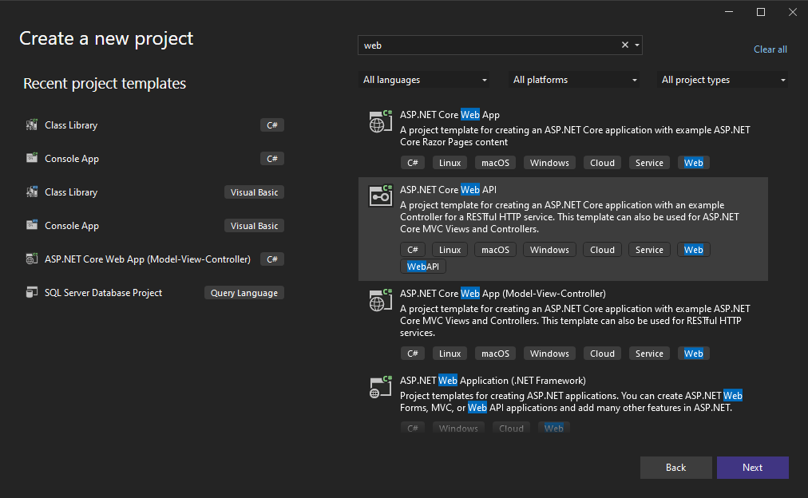
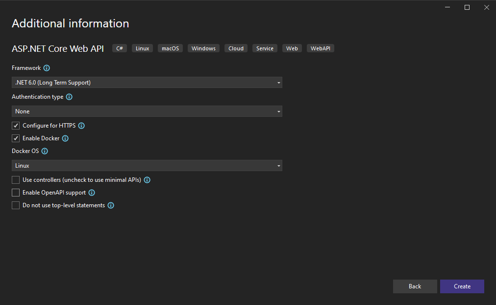
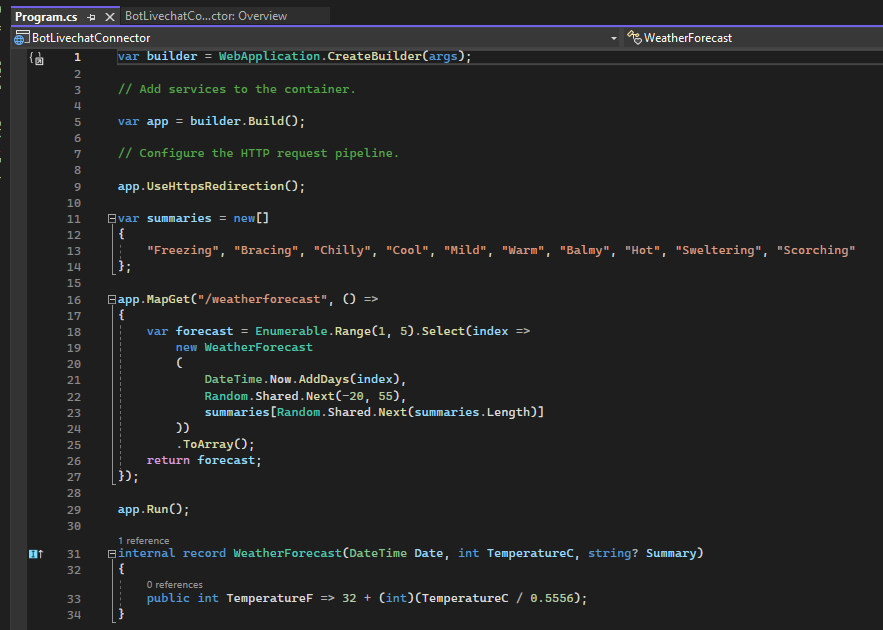

# Minimal API

## 建立專案

1. 新增Project
   
2. 取消勾選Use Controllers
   
3. Program.cs當中可以做相關設定
   

## 相關語法

* Map: 處理Http Request
  * MapGet
  * MapPost
* Response: Results可傳回不同型別Response
   * Content: 直接回傳內容
   * File: 檔案下載
   * Redirect: 轉址
 * Binds: 參數輸入 (參考[官方文件](https://learn.microsoft.com/en-us/aspnet/core/fundamentals/minimal-apis/parameter-binding?view=aspnetcore-7.0))
   * RouteValues: 取出Route當中的參數

```C#
app.MapGet("/home/{id}}", (HttpRequest request) =>
{
   var id = request.RouteValues["id"];
   return Results.Content("html...", "text/html", Encoding.UTF8);
});
```

## 相關資源

* [官方教學](https://learn.microsoft.com/zh-tw/aspnet/core/fundamentals/minimal-apis?view=aspnetcore-7.0)
* [黑暗執行緒-ASP.NET Core 極簡風 - Minimal API](https://blog.darkthread.net/blog/minimal-api/)
* [官方文件-Response](https://learn.microsoft.com/en-us/aspnet/core/fundamentals/minimal-apis/responses?view=aspnetcore-7.0)
* [官方文件-Binds](https://learn.microsoft.com/en-us/aspnet/core/fundamentals/minimal-apis/parameter-binding?view=aspnetcore-7.0)