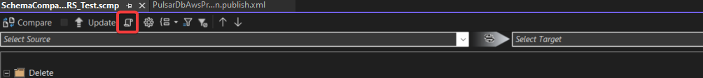
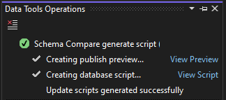

# SQL Project

- [SQL Project](#sql-project)
  - [初始化](#初始化)
    - [1. 新增Sql Server Database Project](#1-新增sql-server-database-project)
    - [2. 匯入Database設定 (Database)](#2-匯入database設定-database)
    - [3. 新增Comparer檔案 (日後快速更新)](#3-新增comparer檔案-日後快速更新)
    - [Ps. 輸出並匯入Database檔案(dacpac)](#ps-輸出並匯入database檔案dacpac)
  - [Deployment](#deployment)
    - [Deployment Plan](#deployment-plan)
    - [Pre/Post deployment](#prepost-deployment)
    - [Pipeline](#pipeline)


## 初始化

### 1. 新增Sql Server Database Project

 </br>

### 2. 匯入Database設定 (Database)

 </br>
 </br>

* 注意：DB權限會影響是否能夠Extract設定、勾選Import Settings會影響匯出的SQL檔案內容(注意機敏資訊)

### 3. 新增Comparer檔案 (日後快速更新)

3-1 對著現有的.sqlproj右鍵 → Schema Compare...
     </br>
3-2 Source直接選擇Database Connection，驗證後可使用
     </br>
3-3 Target選擇目標的SQL Server Database Project (sqlproj) </br>
3-4 儲存Comparer檔案在Proejct當中 </br>
3-5 按下Compare & Update即可更新當前的sqlproj專案

### Ps. 輸出並匯入Database檔案(dacpac)

此方法從DB匯出成dacpac檔案，再到VS匯入Sql Server Database Project

1. 開啟Visual Studio or SSMS
2. 連線到目標DB，右鍵Extract Data-tier Application
3. 選擇輸出dacpac檔案位置 (VS可以跳過Validation，強制生成檔案)

     </br>
     </br>

4. 在VS新增Sql Server Database Project，匯入dacpac檔案為.sqlproj專案
     </br>

## Deployment

### Deployment Plan

- 與上述Database compare方法一致(但方向相反)，可檢視Deployment預計要改動的部分

1. 左邊選當前SQL project、右邊選預計比較的DB connection
2. 點選Compare
3. 選取要預覽的DB object，點選Generate script，即可檢視屆時Pipeline deployment的內容

     </br>
     </br>


### Pre/Post deployment

- 適合在Deployment前/後進行一些資料庫操作的邏輯
  - Pre: 如Deployment前的Schema調整與資料處理等
  - Post: 如DB資料移轉/調整等等

1. 於Script/PreDeployment或Script/PostDeployment資料夾中新增.sql script
    - 建議EXISTS判斷，避免重複run

    ```SQL
    -- pre-script1.sql / post-script1.sql
    IF NOT EXISTS (
        SELECT TOP 1
        FROM [Target]
        WHERE [Id] = 1
    )
    BEGIN
        INSERT INTO [Target] (Id, Name)
        VALUES (1, 'Sample')
    END
    ```

2. 確保這些Script include in project，但不需要build
   - 需要包含真正的PreDeploy/PostDeploy檔案

    ```xml
    <!-- .sqlproj -->
    <ItemGroup>
        <PreDeploy Include="Script.PreDeployment.sql" />
        <PostDeploy Include="Script.PostDeployment.sql" /> 
    </ItemGroup>
    <ItemGroup>
        <None Include="Scripts\PreDeployment\pre-script1.sql" />
        <None Include="Scripts\PreDeployment\post-script1.sql" />
    </ItemGroup>
    ```

3. 設定SQLCMD，將真正的PreDeploy/PostDeploy檔案導到各自script

    ```sql
    -- Script.PreDeployment.sql
    :r ".\pre-script1.sql"

    -- Script.PostDeployment.sql 
    :r ".\post-script1.sql"
    ```

### Pipeline
