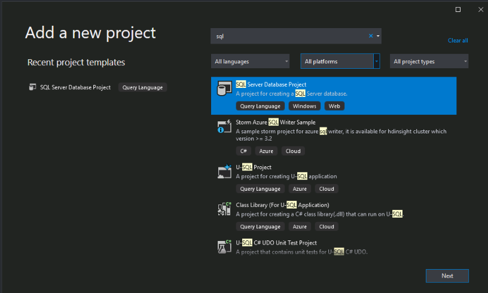
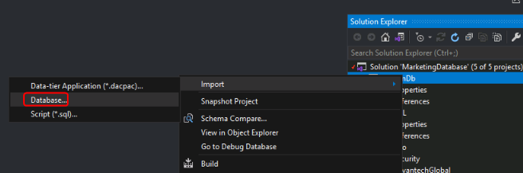
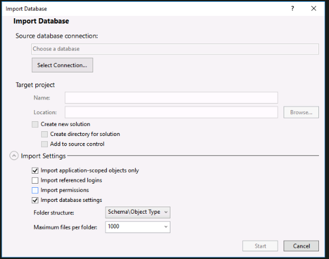
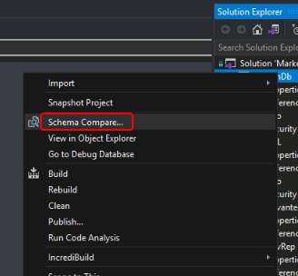
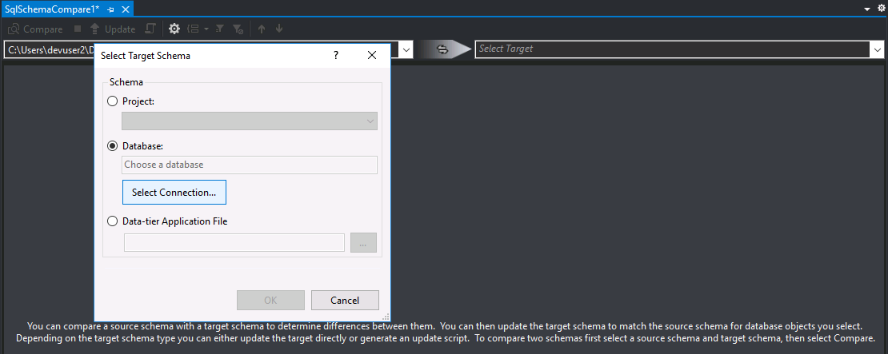
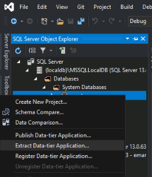
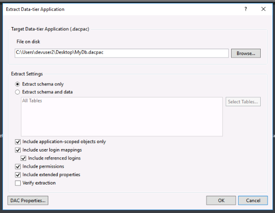
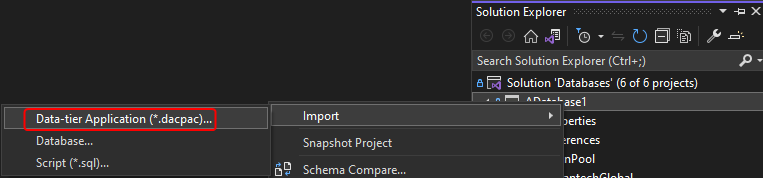

# SQL Project

## 初始化

### 1. 新增Sql Server Database Project

  

### 2. 匯入Database設定 (Database)

  
  

* 注意：DB權限會影響是否能夠Extract設定、勾選Import Settings會影響匯出的SQL檔案內容(注意機敏資訊)

### 3. 新增Comparer檔案 (日後快速更新)

3-1 對著現有的.sqlproj右鍵 → Schema Compare...
      
3-2 Source直接選擇Database Connection，驗證後可使用
      
3-3 Target選擇目標的SQL Server Database Project (sqlproj)  
3-4 儲存Comparer檔案在Proejct當中  
3-5 按下Compare & Update即可更新當前的sqlproj專案

### Ps. 輸出並匯入Database檔案(dacpac)

此方法從DB匯出成dacpac檔案，再到VS匯入Sql Server Database Project

1. 開啟Visual Studio or SSMS
2. 連線到目標DB，右鍵Extract Data-tier Application
3. 選擇輸出dacpac檔案位置 (VS可以跳過Validation，強制生成檔案)

      
      

4. 在VS新增Sql Server Database Project，匯入dacpac檔案為.sqlproj專案
      
