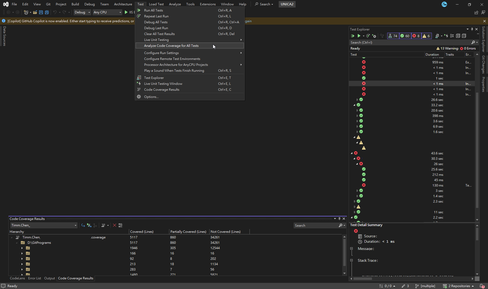
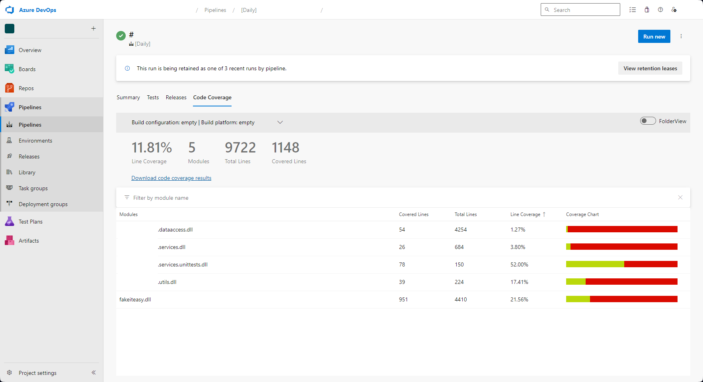
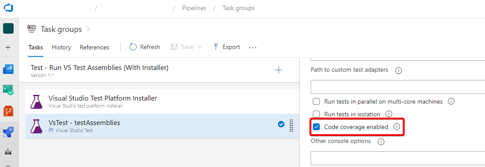
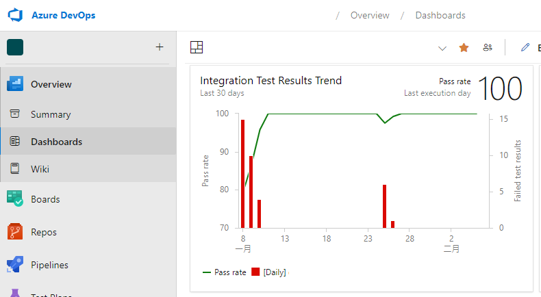

# 自動化測試

## Test Framework

* 測試架構，包含基本Class與Test維度的Setup、Teardown方法，可集中在每批、每次Test時觸發特定邏輯 (通常是註冊相依性、偽造Fake物件等使用)
* 有專門維護Tests的Explorer、可輕鬆整合Pipeline的資源更好

### MSTest (V2)

* 與Visual studio (Test explorer & 右鍵快速Create tests) 與Azure Pipeline內建整合，非常易用
* V2能搭配Static property實現Test cases (DataTestMethod)，維護性比上一版好，不過可讀性稍差一點
* Class initialize沒辦法做為繼承使用，使用上需客製化 (如使用Template Pattern造一個UnitTestServiceBase，則要額外用Static class做singleton呼叫來取代ClassInitialize，見下方範例)
* 當測試Case Input沒有可顯示的型別做辨別，則Test Explorer不會跳出Cases (如巢狀class)

#### Lifecycle

* ClassInitialize (Static): 整個class測試開始前只跑一次
* TestInitialize (Non-Static): 每次測試前跑
* TestMethod (Non-Static): 測試內容
* TestCleanup (Non-Static): 每次測試後跑
* ClassCleanup (Static): 整個class測試結束後只跑一次

#### Test methods

* TestMethod: 預設
* DataTestMethod: 有跟Test case有關時使用
* DataRow (僅限Constant參數): 簡單Test case
* DynamicData (僅限Static參數): 複雜Test case

#### Attributes

* Ignore: 跳過這個測試 (可設定文字備註)
* Priority: 順序設定 (也可改用test命名來做排序)
* TestCategory: 分類用 (比如正式站不能跑寫入，可參考以下Azure Pipelines設定)


#### Assertions

* MsTest有內建Assertions方法，但功能與可讀性皆略差，建議用其他套件代替

#### 其他設定

* 將名為`.runsettings`的檔案放置在".sln"層級的資料夾當中，即可讓整個solution套用該檔案的設定 (如environment variables、參數等)
* Visual studio跑mstest時，預設應該開啟"Auto detect runsettings files"設定 (Tools→Options→Test→General→Configure Run Settings)

```XML
<?xml version="1.0" encoding="utf-8" ?>
<RunSettings>
  <TestRunParameters>
    <Parameter name="TestEnvironment" value="Development" />
  </TestRunParameters>
  <EnvironmentVariables>
    <VARIABLE_NAME>VARIABLE_VALUE</VARIABLE_NAME>
  </EnvironmentVariables>
</RunSettings>
```

* Pipeline方面的設定，分為VS Test與.Net core CLI test:
  * VS Test:
    
  * .Net Core CLI test: 
    * 參考[官方文件指令列表](https://learn.microsoft.com/en-us/dotnet/core/tools/dotnet-test)

    ```YAML
    steps:
    - task: UseDotNet@2
      displayName: 'Use .NET Core sdk 3.1.x'
      inputs:
        version: '3.1.x'

    - task: DotNetCoreCLI@2
      displayName: 'dotnet test'
      inputs:
        command: test
        projects: '**/THE_TEST_PROJECT.csproj'
        arguments: '--no-build --collect "XPlat Code Coverage"'
        publishTestResults: false

    - task: PublishCodeCoverageResults@2
      displayName: 'Publish code coverage results'
      inputs:
        summaryFileLocation: '$(Build.SourcesDirectory)/**/coverage.cobertura.xml'
    ```

    * 如果不是最新版的.net framework，需要直接指定版本否則會失效
    * `--no-build`參數視情況使用，如前面task已有build sln/proj的話就可以設定
    * publish code publish需要設置才能讓Azure pipelines顯示資訊
  

* Pipeline設定

#### 範例

* 搭配DI註冊 (參考[黑大文章](https://blog.darkthread.net/blog/aspnetcore-efcore-unitest/))
* .Net 6範例

```C#
[TestClass]
public class MyTests
{
    private static IHost _host;
    private static IServiceScope _serviceScope;
    private static IService _service;

    // 在所有Test之前 (必須為Static)
    [ClassInitialize]
    public static void Initialize(TestContext testContext)
    {
        // Set Environment
        string environmentName = testContext?.Properties["TestEnvironment"]?.ToString() ?? Environments.Staging;

        // Dependency Injection
        var builder = WebApplication.CreateBuilder()
            .UseEnvironment(environmentName);
        builder.Services.AddSingleton(builder.Configuration.GetSection("MyConfig").Get<MyConfig>());    // Configuration in appsettings.json
        builder.Services.AddScoped<IService, MyService>();
        _host = builder.Build();
    }

    // 在每次Test之前
    [TestInitialize]
    public void TestInit()
    {
        _serviceScope = _host.Services.CreateScope();   // Create scope for each test
        _service = _serviceScope.ServiceProvider.GetRequiredService<IService>();    // Get service of testing
    }

    // 簡單Cases (僅限Const參數)
    [DataTestMethod]
    [DataRow(true)]
    [DataRow(false)]
    public void MyMethod1Test(bool isChecked)
    {
        var result = _testClass.MyMethod1();
        Assert.IsTrue(result);
    }

    // 複雜Cases (非Const參數)
    private static IEnumerable<object[]> MyMethod2TestCases
    {
        get
        {
            yield return new object[] { "2021", "output1" }; 
            yield return new object[] { "2022", "output2" }; 
        }
    }
    [DataTestMethod]
    [DynamicData(nameof(MyTest1Cases), DynamicDataSourceType.Property)]
    public void MyMethod2Test(string input, string expect)
    {
        var result = _testClass.MyMethod2(input);
        Assert.AreEqual(result, expect);
    }

    // 在每次Test之後
    [TestCleanup]
    public void Cleanup()
    {
        _serviceScope.Dispose();    // Clear service scope of current test
    }

    // 在所有Test結束之後 (必須為Static)
    [ClassCleanup]
    public static void Clean()
    {
        _host.Dispose();   // Clear app host
    }
}
```

* .Net Core 301範例

```C#
[TestClass]
public class MyTests
{
    private IWebHost _webHost;
    private T GetService<T>()
    {
        var scope = _webHost.Services.CreateScope();
        return scope.ServiceProvider.GetRequiredService<T>();
    }

    [ClassInitialize]
    public static void Init(TestContext testContext)
    {
        _webHost = WebHost.CreateDefaultBuilder()
            .UseStartup<Startup>()
            .Build();
    }

    [TestInitialize]
    public void Initialize()
    {
        
    }
}
```

#### 以Test Base (Template)與Factory method簡化

* 優點: 之後測試Class僅需要繼承該Base class，許多設定都不用再重複撰寫
* 缺點: Base class僅需要負責固定且common的部分，其他方面要避免測試class的可讀性降低 (比如太簡略、不知為何這樣跑)
* 客製內容: 當中應用abstract function - GetTargetInstance，強迫inherit class實作factory method，確保把new instance的功能集中在裡面

```C#
public abstract class IntegrationTestBase<TargetClass>
    where TargetClass : class
{
    // 這個Property會自動抓取.runsettings檔案的設定進來(不可更改prop name，否則會變成Null)
    public TestContext TestContext { get; set; }
    // 給inherit class使用 (如envionment name, appsettings.json裡面的東西)
    protected IHostEnvironment _environment;
    protected IConfiguration _configuration;
    protected IServiceScope _serviceScope;

    // 不同生命週期的擴充(給inherit class客製)
    // 沒有ClassCleanup的原因: 因為要跨測試共用IHost，沒辦法在特定test當中把IHost給關閉 (會有順序性問題)
    protected abstract void ClassInitializeAddition(IHostBuilder builder);
    protected abstract void TestInitializeAddition(IServiceProvider services);
    protected abstract void TestCleanupAddition();

    // 給inherit class實作new instance的邏輯
    protected abstract TargetClass GetTargetInstance();

    [TestInitialize]
    public void TestInitialize()
    {
        // 由於MsTest會在各個不同的test method當中都new test class instance，
        // 需要透過另外一個singleon class將前一個test產生的class instance存起來，
        // 後面就可以直接使用 (特別適合用於cloud configuration manager，全部測試只要呼叫一次的意思)
        var host = SingletonHost.GetInstance(this, GetHost);
        var registeredServices = host.Services;
        // Scope pattern可確保每次test case都建立一個暫時的實體環境，結束後直接清空
        _serviceScope = registeredServices.CreateScope();
        // 可以在裡面註冊服務 (也可改用factory method會比較直觀)
        TestInitializeAddition(_serviceScope.ServiceProvider);
    }

    private IHost GetHost()
    {
        // 這邊可抓取.runsettings資訊(Properties或可由overrideTestrunParameters取得)
        string environmentName = TestContext?.Properties["TestEnvironment"]?.ToString() ?? Environments.Staging;

        // 這邊使用.net core內建的Generic Host架構，.net framework 4.6以上也適用 (需安裝套件)
        var builder = Host.CreateDefaultBuilder()
            .UseEnvironment(environmentName)
            .ConfigureServices((context, services) =>
            {
                _env = context.HostingEnvironment;
                _config = context.Configuration;
            });
        // 可以在這邊對builder做一些客製操作(如強制更改環境變數、設定config等等)
        ClassInitializeAddition(builder);

        return builder.Build();
    }

    [TestCleanup]
    public void TestCleanup()
    {
        // Scope結束前可客製一些操作(如關閉其他需要dispose的東西)
        TestCleanupAddition();
        _serviceScope.Dispose();
    }
}

// 公用的單例實體儲存庫 (以下IHost亦可改為T泛型)
public static class SingletonHost
{
    private static Dictionary<string, IHost> dict = new new Dictionary<string, IHost>();
    public static IHost GetInstance(object whoCalls, Func<IHost> getInstanceDelegate)
    {
        // 利用來源class name作為識別，同樣的class取得相同的singleon instance
        var whoType = whoCalls.GetType();
        string whoClassName = whoType.Name;
        if (!dict.ContainsKey(whoClassName))
        {
            dict[whoClassName] = getInstanceDelegate();
        }

        return dict[whoClassName];
    }
}
```

* 以下為繼承泛例

```C#
using FluentAssertions;
using Microsoft.Extensions.Hosting;
using Microsoft.VisualStudio.TestTools.UnitTesting;
using System;
using System.Collections.Generic;
using System.Threading.Tasks;

namespace MyProject.Tests
{
    [TestClass]
    public class MyClassTests : IntegrationTestBase<MyClass>
    {
        protected override void ClassInitializeAddition(IHostBuilder builder)
        {
            // 這邊可以操作builder，比如註冊cloud config等等
        }
        protected override void TestInitializeAddition(IServiceProvider services) { }
        protected override void TestCleanupAddition() { }

        // 實作取得實體方法 (如需要擴充此方法，可彈性自行新增，比如parameter可傳入fake instance作為unit test使用)
        protected override MyClass GetTargetInstance()
        {
            var target = new MyClass(_configuration["ConnectionString:MyDb"]);
            return target;
        }

        [DataTestMethod]
        [DataRow("ValidID_1")]
        public async Task MyMethod1Test_ValidId_HaveResult(string id)
        {
            // Arrange時直接呼叫factory方法最直觀
            var target = GetTargetInstance();
            
            var result = await target.MyMethod1(id);

            result.Should().NotBeNull();
        }
    }
}
```

## Assertions Framework

* 作為驗證回傳物件的架構，可讀性與錯誤時顯示問題的詳細度非常重要
* 可讀性較好的話，會較快能理解測試案例在驗證什麼

### FluentAssertions

* Should
  * `HaveCountGreaterThan`
  * `NotNull`
  * `Contains`
  * `ThrowException<>().WithMessage("whatever");`
  * `And`
  * `BeEquavalentTo`
  * `Match` 客製化條件
* `AssertionScope` 用於多個Assertions全都要驗證的情境

```C#
using (new AssertionScope())
{
    result.Should()...;
}
```

```C#
using (new AssertionScope())
{
    result.Property1.Should().Be("expect1");
    result.Property2.Should().Be("expect2");
}
```

## Fake Framework

* 用於製造假物件，可抽換測試Class的相依來源
* 通常Interface可輕鬆抽換、但實體Class則需要將公開方法註記Virtual才能做操作
* 可針對Stub物件Override方法、針對Mock物件驗證其執行狀況 (如參數必須包含特定內容、囔方法必須被呼叫到等等)

### FakeItEasy

* 非常易於使用的Fake架構，可讀性非常好，用A開頭的方法即可使用

* `CallTo` 驗證、造假呼叫方法
  * `A<object>` 指定造假的Parameter型別、內容等
    * `A<int>._` 不限內容
    * `A<string>.That.Contains`
    * `A<bool>.That.Not.Is(false)`
    * `A<bool>.That.Matches(s => s.XXX)`
  * `MustHappened` 指定
  * `Invokes` 在呼叫時額外呼叫功能

    ```C#
    A.CallTo(() => fakeService.GetById(A<string>._))
    .Invoke((string id) =>
    {
        Console.Writeline(id);
    });
    ```

  * `Returns` Override回傳內容
  * `ReturnsLazily` Override回傳內容(等到目標runtime時才觸發)

    ```C#
    A.CallTo(() => fakeService.Get(A<Func<Task<string>>>._))
    .ReturnsLazily(async (Func<Task<string>> func) =>
    {
        return await func.Invoke(); // 此例為將return結果改為"輸入的func"直接執行後的結果
    });
    ```

  * `Throws(() => new XXXException("..."))` 要噴Exception

### Moq

* 經典Fake架構套件，但是部分語法會較為冗長，且可能混淆Mock與Stub的概念，可讀性不如FakeItEasy
* 參考[官方github說明](https://github.com/Moq/moq4/wiki/Quickstart)

    #### Methods

    * Setup
    * It.Is... → 指定Parameter型別、內容等
    * Return → 指定回傳內容 (非同步用ReturnAsync)
    * CallBack → 
    * Throws → 噴Exception
    * Verify → 驗證被呼叫的狀況 (如有無被觸發)

    ```C#
    services.AddScoped<IMyService>((services) => 
    {
        var mockService = new Mock<IMyService>();
        moqService.Setup(x => x.GetBoolResult().Returns(true));  // 同步方法
        moqService.Setup(x => x.GetBoolResultAsync().Returns(Task.FromResult(true));  // 非同步方法
        moqService.Setup(x => x.GetStringResult(It.IsAny<string>()).Returns("..."));  // 有Input的Function
        return moqService.Object;
    });
    ```

    #### Partial Mock

    可將Instance進行Mock，使部分Function回傳指定結果

    * Mock Implement Class
    * As 目標Interface
    * CallBase必須為True
    * 目標方法套用Virtual修飾

    ```C#
    // Startup.cs
    services.AddScoped<IBasicService, BasicService>();
    services.AddScoped<IMyService>((services) => 
    {
        var realService = new Mock<MyService>(services.GetRequiredService<IBasicService>());    // 遵照Constructor
        var moqService = realService.As<IMyService>();  // 轉成目標Interface
        moqService.Setup(x => x.CanGetData().Returns(true));    // Mock其中一個Function
        moqService.CallBase = true; // 開啟才能Call base class
        return moqService.Object;
    });

    // MyService.cs
    public class MyService : IMyService
    {
        private IBasicService _basicService
        public MyService(IBasicService basicService)
        {
            _basicService = basicService;
        }
        public virtual Task<bool> CanGetData()
        {
            // 必須使用virtual才能讓Mock Override
            return false;
        }
    }

    ```

    #### Mock Logger

    * Mock目標Class的ILogger
    * 使用Verify驗證Function被呼叫的次數、內容等

    ```C#
    [TestClass]
    public class Tests
    {
        [TestMethod]
        public async Task MockLoggerTest()
        {
            Mock<ILogger<MyService>> mockLogger = new Mock<ILogger<MyService>>();
            var service = new MyService(mockLogger.Object);
            
            service.Run();

            mockLogger.Verify(x => x.Log(
                    LogLevel.Error,
                    It.IsAny<EventId>(),
                    //It.Is<It.IsAnyType>((o, t) => string.Equals("Index page say hello", o.ToString(), StringComparison.InvariantCultureIgnoreCase)),  // 可比較輸入內容
                    It.Is<It.IsAnyType>((o, t) => true),    // 所有內容都接受
                    It.IsAny<Exception>(),
                    It.IsAny<Func<It.IsAnyType, Exception?, string>>()),
                Times.Never);   //可設定檢查被觸發幾次
        }
    }

    // MyService.cs
    public class MyService
    {
        private ILogger<MyService> _logger;

        public MyService(ILogger<MyService> logger)
        {
            _logger = logger;
        }

        public void Run()
        {
            _logger.LogError("Some error message");
        }
    }
    ```


#### InternalsVisibleToAttribute

* 可以讓Internal方法在特定namespace下可以access到，適合給予測試專案的內部方法套用

```C#
[assembly: InternalsVisibleTo("InternalsVisibleToAttribute.Tests")]
public class ProductCode
{

}
```

## 文件化與制度化

### Code Coverage

  * Visual studio內建Code coverage analysis
  
  * Pipeline可整合Code Coverage Report
  
  


### Dashboard

* Azure DevOps Dashboard可針對VS Test Pipeline內建Test Report
  