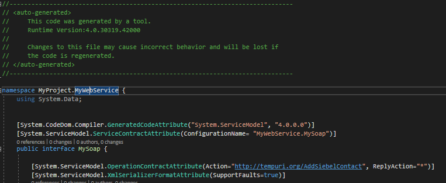
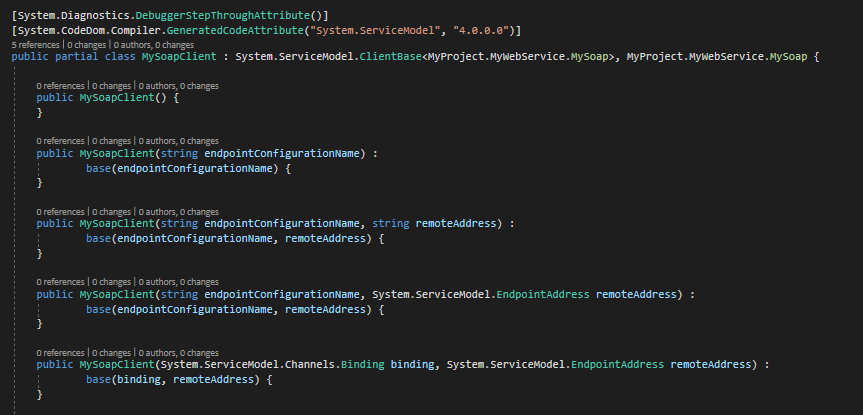

# VB & Webform

## 版本升級

### 4.5 -> 4.7.2

  * Website project重建，再把code移過去
  * aspx, ascx, ashx, asmx, master檔案全數重建，VB & HTML全面分離
    * CodeBehind語法有更新
    * Page_Load功能加上Handles Me.Load
    * Page_PreRender功能加上Handles Me.PreLoad
  * xsd & dbml檔案移到C#專案並重新Run
  * 全面引用Imports作為reference方法
  * 部分套件改用Nuget下載
  * webconfig僅保留部分Config (如appsettings, connection strings, pages)，其餘以新版為主
  * 確認aspx的自定義套件能運作 (有問題的話aspx.designer.vb會噴錯)
  * 把App_Code的檔案移到Class Library作為Reference來源，簡化Website專案相依性
  * Webform語法更新:
    * MY_GRID_VIEW.DataBind()功能，改為識別是否資料為空，為空的話則設定`MY_GRID_VIEW.ShowHeaderWhenEmpty = True`避免整個表格不見 (參考[資源](https://dotblogs.com.tw/mis2000lab/2011/04/29/databinding_expression_concept_20110429))
    * AjaxControlToolKit更新套件 (HtmlEditor改用AjaxControlToolKit.HtmlEditorExtender)
    * ajaxToolkit:ToolkitScriptManager改用asp:ScriptManager (參考[資源](https://stackoverflow.com/questions/41279346/ajaxcontroltoolkit-toolkitscriptmanager-is-not-available-in-version-16-1-1-0))
  * 前端圖片reference路徑注意 (e.g. "../Images/XXX" 改成 "<%= ResolveUrl("~/Images/XXX") %>") -> 參考[這篇文章](https://dotblogs.com.tw/supershowwei/2018/09/17/124506)，須注意Virtual path的問題
  * CI/CD Pipelines改為正規的Publish方式，使用MSBuild solution達到 (原本要一個個reference project分別Build)

## aspx

* Webform主體，分為前端(.aspx)、自動產生的元件Models(.aspx.designer.vb)與後端邏輯(.aspx.vb)
* .designer.vb檔案會在save aspx檔案時自動更新 (刪除的話，需要手動建立同名檔案並重新開啟專案)
* 亂動web.config當中的configuration/system.web/pages/control參數，可能會導致designer.vb檔案更新失敗
* .cs檔案算後端邏輯，需要在有.designer.vb有的前端物件才能操作 (務必確認.aspx頭綴的inherits的class name與.aspx.vb檔案的class name一致，否則會對應不到)

## ascx

* webform user control
* 用於共用在不同webforms上，也會有畫面與後端邏輯，類似於aspx

## ashx

* generic handler
* 無畫面，回應快速

## asmx

* 作為SOAP通訊協定使用 (Web service)
* 類似aspx，可前後端分離

## xsd

* Run custom tool可以重新建立.designer.cs檔案
* 在VB專案上Run可能會有assembly reference的問題，建議可放到C#專案當中

## dbml

* 需要在Visual studio installer當中安裝LINQ to SQL套件才能使用
* Run custom tool可以重新建立.designer.cs檔案

## App_Code

* Reference class必須放在此資料夾，並且到Property頁面設定Compiled才能被Reference到
* 建議這類files還是移到另一個Class library作為reference，以取代這種方法

## Workflow

## Web Service

* .Net Framework 新增方式： </br>
    Project file </br>
    →Add Service Reference </br>
    →Advanteced... </br>
    →Add Web Reference... </br>
    →輸入WS URL 或是 .wsdl檔案實體路徑 </br>
    →Go & 輸入namespace </br>
    →點Add Reference... </br>

* .Net Core新增方式： </br>
    Project file </br>
    →Add a new service reference </br>
    →WCF Web Service </br>
    →輸入WS URL 或是 .wsdl檔案實體路徑 </br>
    →Go & 輸入namespace </br>
    →點Next到底，如為非async app，勾選Generate Synchronous Operations，再按Finish </br>
* Web.Config綁定

  * 需要設定bindings，才能用configurationname & url的方式，new出soap client實體 (可用於抽換環境使用)

  ```xml
  <configuration>
    <system.serviceModel>
      <bindings>
        <basicHttpBinding>
          <binding name="INTERFACE_NAMESPACE">          
            <security mode="Transport" />        
          </binding>
        </basicHttpBinding>
      </bindings>    
      <client>
        <endpoint address="" binding="basicHttpBinding" bindingConfiguration="INTERFACE_NAMESPACE" contract="NAMESPACE.INTERFACE_NAME" name="INTERFACE_NAME" />
      </client>  
    </system.serviceModel>
  </configuration>
  ```
  
  * 自動產生的Reference檔案中的namespace為web service新增時輸入的、Interface為wsdl檔名或web service url結尾檔案名稱
  

  * 自動產生的Reference檔案中Soap Client有提供Constructor方法，可做作為抽換使用；繼承的Interface則可做為程式相依使用 ()
  

## Web.Config設定 

以下皆是在`<Configuration>` tag之下的Tag

* Feature

用於辨識特定欄位值來切換觸發邏輯

```XML
  <configSections>
    <section name="features" type="SharedComponents.Feature.FeatureConfigurationSection, SharedComponents, Version=1.0.0.0, Culture=neutral" />
  </configSections>
  <features configSource="Configuration\Feature.dev.config" />
```

* Connection Strings

可以從ConfigurationManager取得連線參數

```XML
<connectionStrings>
  <add name="MY" connectionString="" providerName="System.Data.SqlClient" />
</connectionStrings>
```

* AppSettings

可以從ConfigurationManager取得App設定

```XML
<appSettings>
  <add key="AppRunningEnviroment" value="Development" />
</appSettings>
```

* ApplicationSettings Group

可由專案的Properties當中設定強型別物件，並從這邊取得客製化參數，類似AppSettings

```XML
<configSections>
  <sectionGroup name="applicationSettings" type="System.Configuration.ApplicationSettingsGroup, System, Version=2.0.0.0, Culture=neutral, PublicKeyToken=b77a5c561934e089">
    <section name="MyLibrary.Properties.MySettings" type="System.Configuration.ClientSettingsSection, System, Version=2.0.0.0, Culture=neutral, PublicKeyToken=b77a5c561934e089" requirePermission="false" />
  </sectionGroup>
</configSections>
<MyLibrary.Properties.MySettings>
  <setting name="Name" serializeAs="String">
    <value>Timm.Chen</value>
  </setting>
</MyLibrary.Properties.MySettings>
```

* Json Serielize

設定Request/Response的Json設定

```XML
  <system.web.extensions>
    <scripting>
      <webServices>
        <jsonSerialization maxJsonLength="100000" />
      </webServices>
    </scripting>
  </system.web.extensions>
```

* Anonymous Authentication

允許部分頁面可匿名存取

```XML
  <location path="login.aspx" allowOverride="true">
    <system.web>
      <authorization>
        <allow users="*" />
      </authorization>
    </system.web>
  </location>
```

* Url rewrite

設定URL導轉

```XML
<system.webServer>
  <defaultDocument>
    <files>
      <add value="home.aspx" />
    </files>
  </defaultDocument>
  <rewrite>
  <!--Config rewrite manually-->
  <rules>
    <rule name="HTTP to HTTPS" stopProcessing="true">
      <match url="(.*)"/>
      <conditions logicalGrouping="MatchAll">
        <add input="{HTTPS}" pattern="off" ignoreCase="true"/>
        <add input="{HTTP_HOST}" matchType="Pattern" pattern="^localhost(:\d+)" negate="true"/>
      </conditions>
      <action type="Redirect" url="https://{HTTP_HOST}/{R:1}" redirectType="Permanent"/>
    </rule>
    <rule name="My Redirect" stopProcessing="true">
      <match url="^XXX.aspx" />
      <action type="Redirect" url="TARGET/ROUTE..." appendQueryString="true" redirectType="Temporary" />
    </rule>
  </rules>
  </rewrite>
</system.webServer>
```

* Web Service Binding

設定Web Service的Binding (僅適用於.Net Framework Library)

```XML
<system.serviceModel>
  <bindings>
    <basicHttpBinding>
      <binding name="MyWebService">
        <security mode="Transport" />
      </binding>
    </basicHttpBinding>
  </bindings>
  <client>
    <endpoint address="" binding="basicHttpBinding" bindingConfiguration="MyWebService" contract="MyWebServiceNamespace.MyWebService" name="MyWebService" />
    <!--上方Address可設定，也可以在程式中再指定(New MyWebServiceClient("MyWebService", "..."))-->
  </client>
</system.serviceModel>
```

## 跨世代專案注意事項

* (使用 MSBuild 建置方案檔(sln)與建置專案檔(csproj)的陷阱與注意事項)[https://blog.miniasp.com/post/2021/08/28/Build-Solution-or-Csproj-using-MSBuild]