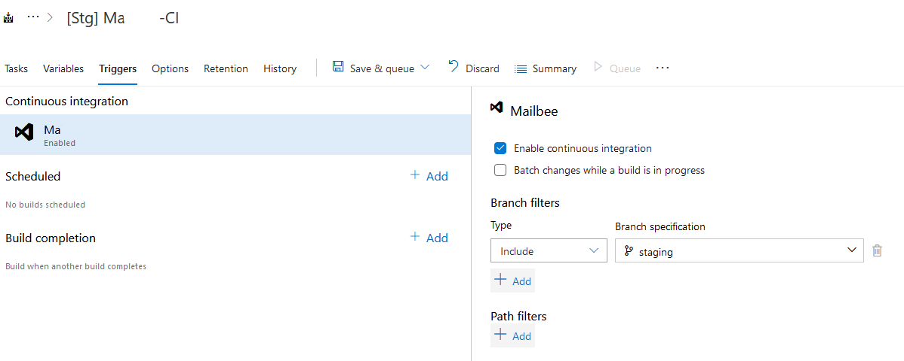
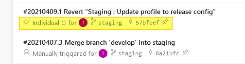
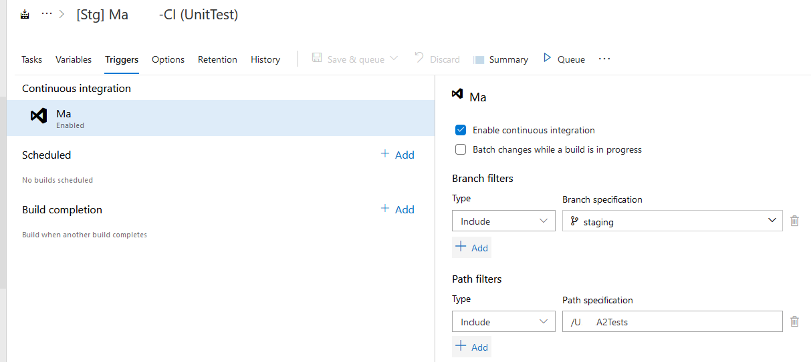
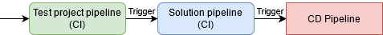
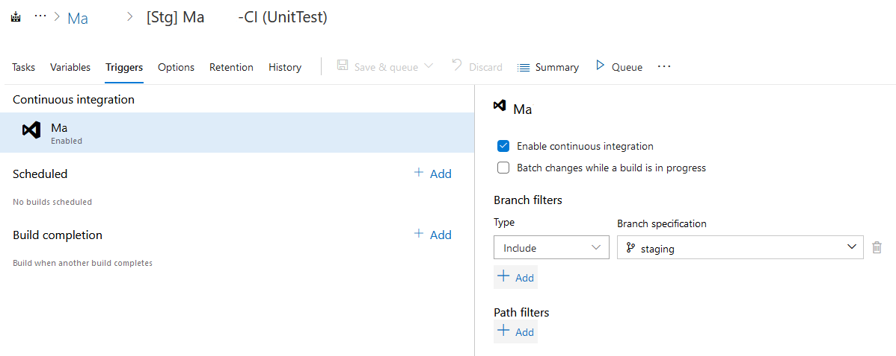
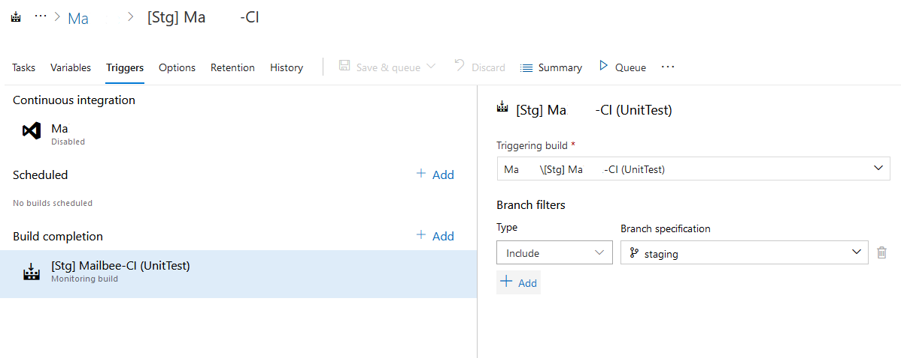
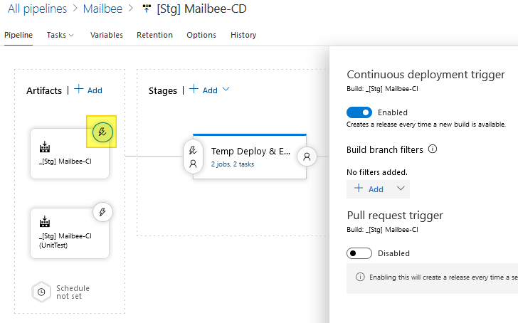

## CI/CD自動觸發 [↩](CICD%E8%A9%B3%E7%B4%B0%E6%B5%81%E7%A8%8B%E7%AD%86%E8%A8%98.md)

### ● CI自動觸發
1. 在CI Pipeline Trigger可設定Continuous intergration與綁定的Repository Branch
   

2. 當有新Commit在此Branch被Push時，會直接跑該CI
   

3. 測試專案的Pipeline可設定特定Folder的檔案改動才要進行CI
   

4. 如有CD需要同時呼叫好幾個CI Artifact，且需要等所有的CI都跑完再跑CD的話，則建議將後面的CI pipelines設定"Build complete"在特定CI pipeline後面再跑  
※這邊不推薦使用 Exclude Path filter，因為他的條件是"全部檔案都在Exclude範圍內才會做排除"，而不是"有檔案在範圍內改動就排除"，這樣如有檔案同時跨到範圍內&範圍外，它一樣還是會被觸發
   

範例：先跑Test CI再跑Main CI
  
  

### ● CD自動觸發
在Release pipeline流程圖中，點選要主動觸發的CI pipeline (Artifact)閃電圖示，可設定CD trigger
   

#### [Back to Steps](CICD%E8%A9%B3%E7%B4%B0%E6%B5%81%E7%A8%8B%E7%AD%86%E8%A8%98.md)