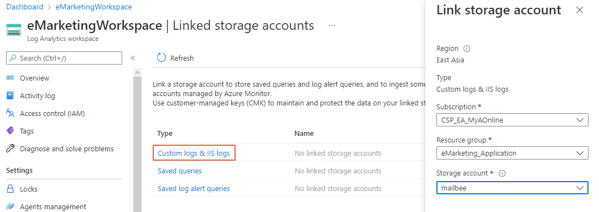

# Application Insights

### 觀念

* [When to use the different log levels](https://stackoverflow.com/questions/2031163/when-to-use-the-different-log-levels)
* [Log - SQL to Kusto Query Language (KQL) cheat sheet](https://learn.microsoft.com/en-us/azure/data-explorer/kusto/query/sqlcheatsheet)
* [Azure Log Analytics](https://ithelp.ithome.com.tw/articles/10205793)

### 服務註冊 

#### 整合Serilog

* Custom Property: 在App Insights當中作為Group by的參數，可作為Report依據

```C#
using Serilog;

// Program.cs
builder.UseSerilog((hostContext, loggerConfig) =>
{
    loggerConfig.MinimumLevel.Information()
    .Enrich.WithProperty("Application", "...")
    .Enrich.WithProperty("Environment", hostContext.HostingEnvironment.EnvironmentName)
    .WriteTo.ApplicationInsights(new TelemetryConfiguration("..."), TelemetryConverter.Traces);
});

// .Net 6以上版本改為
builder.Host.UseSerilog...
```

#### Website

* 於Startup.cs註冊

    ```C#
    // Startup.cs
    using Microsoft.ApplicationInsights.Extensibility;

    public class Startup
    {
        public void ConfigureServices(IServiceCollection services)
        {
            // ...
            services.AddApplicationInsightsTelemetry("Azure Resource Key");
        }
    }

    //.Net 6以上版本改為
    // Program.cs
    using using Microsoft.ApplicationInsights.AspNetCore;

    var builder = WebApplication.CreateBuilder(args);
    builder.Services.AddApplicationInsightsTelemetry();
    ```

#### Console App

* 於Startup.cs註冊

    ```C#
    // Startup.cs
    using Microsoft.ApplicationInsights.WorkerService;
    
    public class Startup
    {
        public void ConfigureServices(IServiceCollection services)
        {
            // ...
            services.AddApplicationInsightsTelemetryWorkerService(new ApplicationInsightsServiceOptions()
            {
                InstrumentationKey = "Azure Resource Key",
            });
        }
    }
    ```

### 使用方式 (預設ILogger)

* Custom Property + Message Template
  * Event Id: 作為Custom Property - EventId
  * Message template
    * 用{}括號起來命名，並在後面Input Values，可直接置換為Values
  * Custom Property
    * 同上，此類Format的Input Values，會在Transaction Log顯示為"Custom Properties"
    

```C#
public class LogSample
{
    private readonly _logger;
    public LogSample(ILogger<LogSample> logger)
    {
        _logger = logger;
    }

    public RunLog()
    {
        _logger.LogInformation(
            eventId: 11,
            message: "Test template. Id: {Id}, Name: {Name}", 
            "0", "timm");
    }
}
```

### Middleware

* 適用於紀錄Request body等等

    * 繼承IMiddleware
    * 務必複製Response body stream再取用，否則後面的Middleware會讀不到原本的資料
    * 藉由telemetry.Properties.Add的方式將Request/Response Body進行紀錄

    ```C#
    public class RequestBodyLoggingMiddleware : IMiddleware
    {
        public async Task InvokeAsync(HttpContext context, RequestDelegate next)
        {
            if (context.Request.Body.CanRead)
            {
                context.Request.EnableBuffering();  // Enable to read body multiple times

                MemoryStream customStream = new MemoryStream();
                await context.Request.Body.CopyToAsync(customStream);  // Stream can only be read once. Prevent from getting null body in next middleware by copying steam
                context.Request.Body.Position = 0;   // Reset stream position, enable to be read by next middleware
                customStream.Position = 0;

                string requestBody;
                using (StreamReader reader = new StreamReader(customStream))
                {
                    requestBody = await reader.ReadToEndAsync();
                }

                if (!requestBody.ToLower().Contains("password"))
                {
                    var requestTelemetry = context.Features.Get<RequestTelemetry>();
                    requestTelemetry?.Properties.Add("RequestBody", requestBody);
                }
            }

            // Call next middleware
            await next(context);
       
    ```

    ```C#
    public class ResponseBodyLoggingMiddleware : IMiddleware
    {
        private List<string> MethodsToLog { get; } = new List<string>()
        {
            HttpMethods.Post,
            HttpMethods.Put,
            HttpMethods.Patch,
            HttpMethods.Delete
        };

        public async Task InvokeAsync(HttpContext context, RequestDelegate next)
        {
            // 抽取原本的Response Body Stream
            var originalBodyStream = context.Response.Body; // This default response body cannot be read

            // 置換成自訂Stream
            var customBodyStream = new MemoryStream();
            context.Response.Body = customBodyStream;   // Replace as readable response body

            // 傳遞給後面的Middlewares
            // Wait for next middleware return (The response body will be written)
            await next(context);

            // 取得自訂Stream，並複製給原本的Response Body Stream，等結束邏輯傳回上一層Middleware
            customBodyStream.Position = 0;  // Reset stream position, enable to be read by next middleware
            await customBodyStream.CopyToAsync(originalBodyStream);  // Stream can only be read once. Prevent from getting null body in next middleware by copying steam
            context.Response.Body = originalBodyStream;

            try
            {
                if (MethodsToLog.Contains(context.Request.Method))
                {
                    // 讀取自訂Stream (不影響要回傳的Stream)
                    customBodyStream.Position = 0;  // Reset stream position to re-read again
                    string responseBody;
                    using (StreamReader reader = new StreamReader(customBodyStream))
                    {
                        responseBody = await reader.ReadToEndAsync();
                    }

                    if (!responseBody.Contains("<!DOCTYPE html>"))  // Do not log html content
                    {
                        var requestTelemetry = context.Features.Get<RequestTelemetry>();
                        requestTelemetry?.Properties.Add("ResponseBody", responseBody);
                    }
                }
            }
            finally { }
        }
    }
    ```

### Filter (Processor)

* 適用於想過濾特定Telemetry參數的情境

    ```C#
    public class CustomTelemetryProcessor : ITelemetryProcessor
    {
        private readonly ITelemetryProcessor _next;

        public CustomTelemetryProcessor(ITelemetryProcessor next)
        {
            this._next = next;
        }

        public void Process(ITelemetry item)
        {
            if (!IsOkToLog(item))
            {
                return; // Skip logging
            }

            this._next.Process(item);
        }

        private bool IsOkToLog(ITelemetry item)
        {
            if (item is RequestTelemetry)
            {
                var requestTelemetry = item as RequestTelemetry;
                if (requestTelemetry.Url.AbsoluteUri.Split('?')[0].EndsWith(".js") ||
                    requestTelemetry.Url.AbsoluteUri.Split('?')[0].EndsWith(".css") ||
                    requestTelemetry.Url.AbsoluteUri.Split('?')[0].EndsWith(".ico"))
                {
                    return false;
                }
            }

            return true;
        }
    }
    ```

### Custom Property (Initializer)

* 適用於想加入Custom Property在Log當中

    ```C#
    public class CustomTelemetryInitializer : ITelemetryInitializer
    {
        private readonly Parameters _parameters;
        private readonly IHostEnvironment _environment;

        // next will point to the next TelemetryProcessor in the chain.
        public CustomTelemetryInitializer(Parameters parameters, IHostEnvironment environment)
        {
            _parameters = parameters;
            _environment = environment;
        }

        public void Initialize(ITelemetry telemetry)
        {
            // 設定Custom Property
            if (!telemetry.Context.GlobalProperties.ContainsKey("AppRunningEnviroment"))
            {
                telemetry.Context.GlobalProperties.Add("AppRunningEnviroment", _environment.EnvironmentName);
            }

            if (!telemetry.Context.GlobalProperties.ContainsKey("Application"))
            {
                telemetry.Context.GlobalProperties.Add("Application", _parameters.ProgramNamespace);
            }

            // 預設欄位可記錄User資訊，於Monitor上面追蹤User
            var requestTelemetry = telemetry as RequestTelemetry;
            if (requestTelemetry == null) return;
            telemetry.Context.User.Id = "UserId"
        }
    }
    ```

### Log SQL

* 將EnableSqlCommandTextInstrumentation打開

```C#
// Program.cs (.Net 6)
var builder = WebApplication.CreateBuilder(args);
//...
builder.Services.ConfigureTelemetryModule<DependencyTrackingTelemetryModule>((module, o) => { module.EnableSqlCommandTextInstrumentation = true; });    // Log SQL
```


### Custom Request

## IP與Browser資訊

* 參考[官方文件](https://learn.microsoft.com/en-us/azure/azure-monitor/app/ip-collection?tabs=net#portal)，新增DisableIpMasking設為True

    * Automation > Export template > Deploy > Edit template
    * resources中，在type為microsoft.insights/components的properties當中加入`"DisableIpMasking": true`
    
    


## Ajax紀錄!
* 可以記錄Request time, ip, crountry, session...


## 減少不必要的Log

* 減少Hangfire Dependency數量
* 取消Staging Web App的Health Check (減少Request)
* 查看Front Door對Log的數量影響 (Trace偏高?)


## 相關資源
[[MSDN] Application Insights for Worker Service applications (non-HTTP applications)](https://docs.microsoft.com/en-us/azure/azure-monitor/app/worker-service#aspnet-core-background-tasks-with-hosted-services) <br>
[[Peter Bons] Monitoring non-web apps using Azure Application Insights](https://dev.to/expecho/monitoring-non-web-apps-using-azure-application-insights-part-2-basic-instrumentation-2fcj) <br>
[[TheCodeBuzz] Waiting for the Host to be disposed. Ensure all IHost instances are wrapped in using block](https://www.thecodebuzz.com/waiting-for-host-disposed-ensure-ihost-instances-wrapped-in-using-blocks/) <br>
[[stackoverflow] Application Insights Developer Mode not working in ASP.NET Core 3.1](https://stackoverflow.com/questions/62856487/application-insights-developer-mode-not-working-in-asp-net-core-3-1)
[[stackoverflow] TelemetryClient does not send any data unless Flush is called](https://stackoverflow.com/questions/30904930/telemetryclient-does-not-send-any-data-unless-flush-is-called)