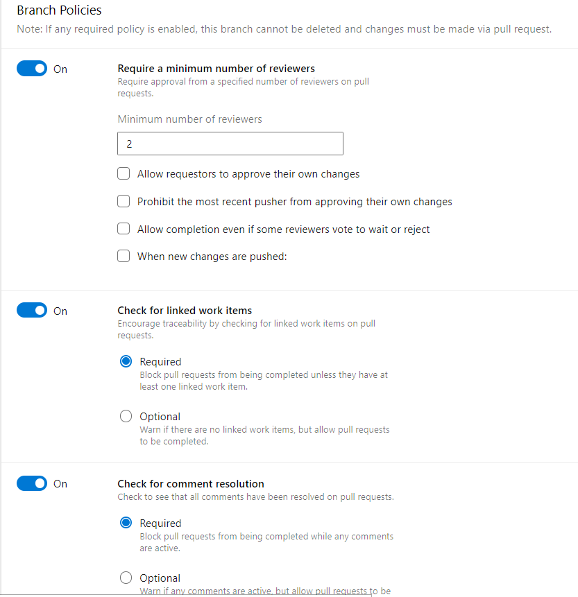
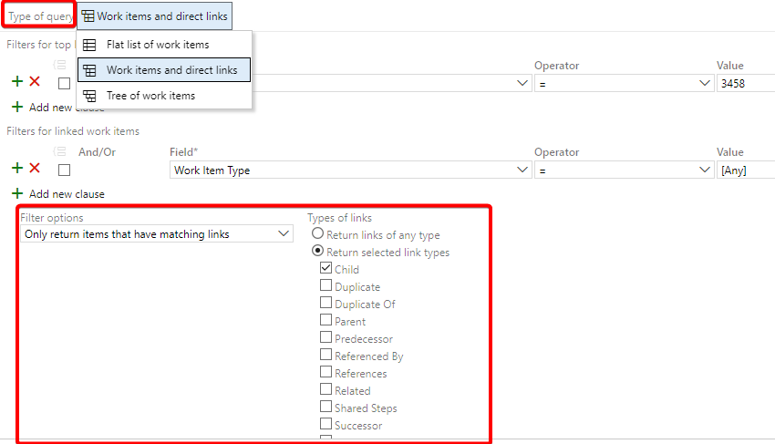

# Azure DevOps

## Board

### Charts & 燃盡圖
* [官方文件-工作概況報表繪製](https://learn.microsoft.com/en-us/azure/devops/report/dashboards/charts?view=azure-devops)
* [官方文件-燃盡圖](https://learn.microsoft.com/en-us/azure/devops/report/dashboards/configure-burndown-burnup-widgets?view=azure-devops)

## Repository

* Pull Requests
  * 設定Branch policy
    * 限制Reviewer數量
    * 限制必須Relate to workitem
    * 限制建議必須解決
    
    * 限制Build validation (即PR-CI，適合跑先測試做驗證，避免PR過了結果Pipeline失敗)

  * PR Template
    * 參考[官方文件](https://learn.microsoft.com/en-us/azure/devops/repos/git/pull-request-templates?view=azure-devops#additional-pull-request-templates)，在跟目錄新增.azuredevops/pull_request_template.md檔案，可在PR時自動帶入文字
    
  

## Pipelines

 * SonarCloud掃描軟體
 * GitHub Advanced Security → 免費源碼掃描

## Dashboard

* Queries: 可根據Board queries，畫出圖表、顯示出work item的數量等 (比如assigned to 比例、state狀態數量、周期等)
* Cumulative Flow Diagram (CFD): 可查看work item的隨時間的生命週期數量(如哪個時候特別多created item)
* Team Cycle Time: 可查看story/task等物件的從開始到完成的生命週期時長與平均值
* Sprint Overview: 可查看目前sprint的work item數量、幾天週期要結束等
* Pull Requests: 顯示assign to me、created PR的列表
* Release Pipeline Overview: 顯示特定CD的Release結果
* Test Result Trend: 顯示特定Pipelines的Test pass rate, success/fail count等

## Query

* 可設定特定條件的清單，比如特定parent物件、tag、type、state等等
* 可作為dashboard、API展出使用
* Type of query可設定跨heirachy (parent, children)等等的結果，非常適合抓取特定parent下所有類型與階層的workitems
  
