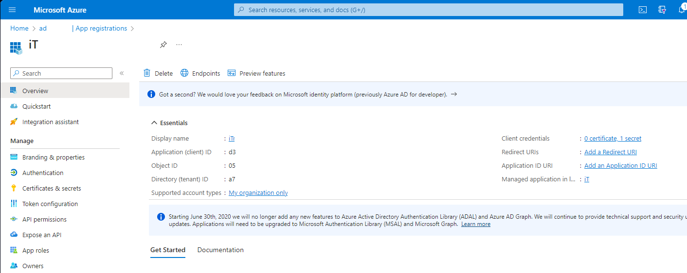
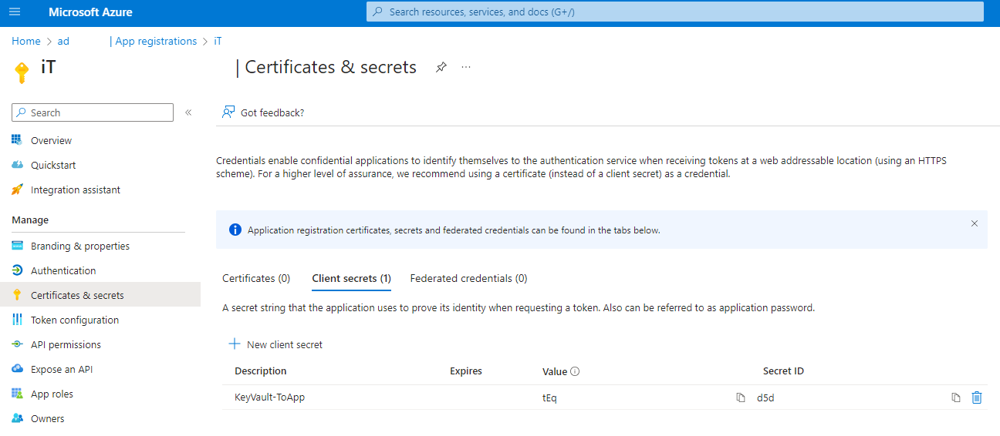
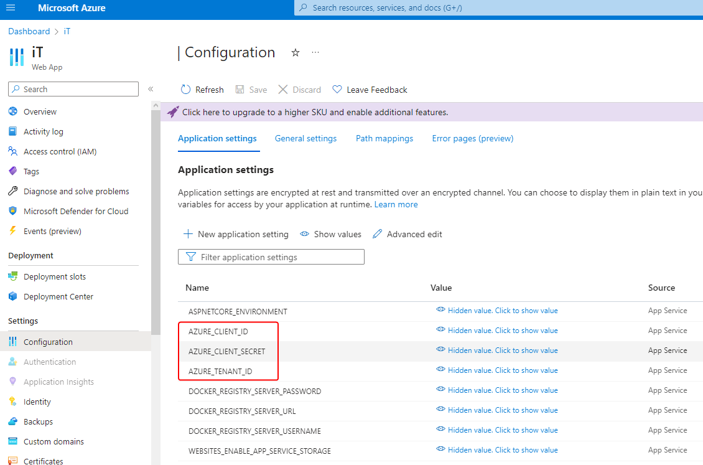
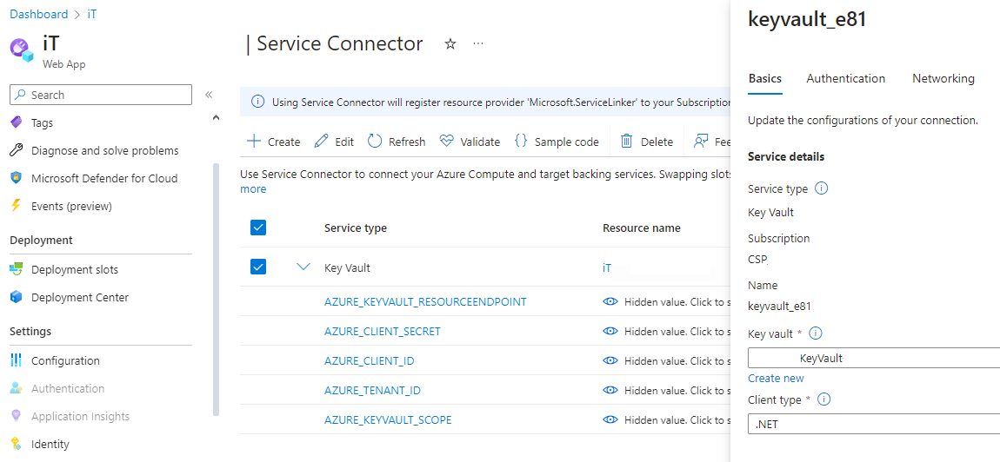
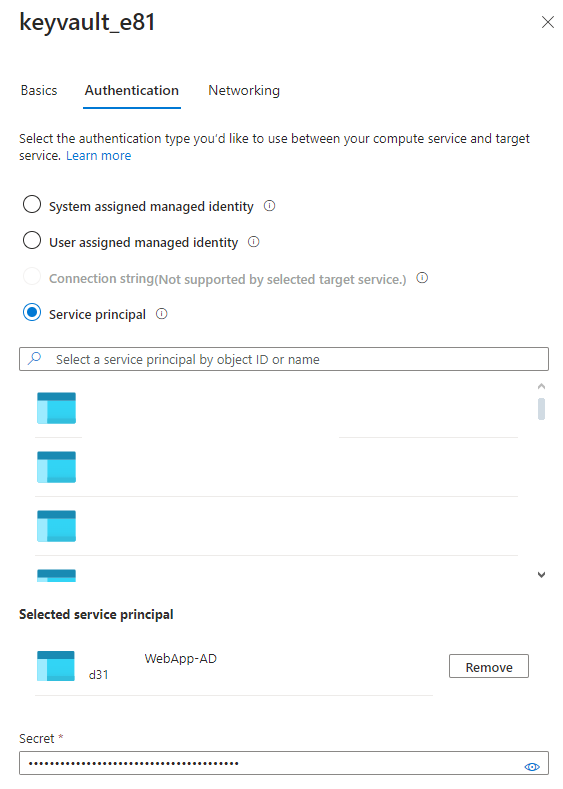
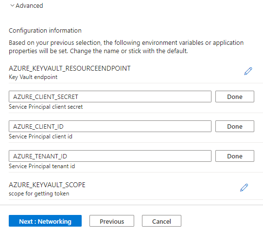
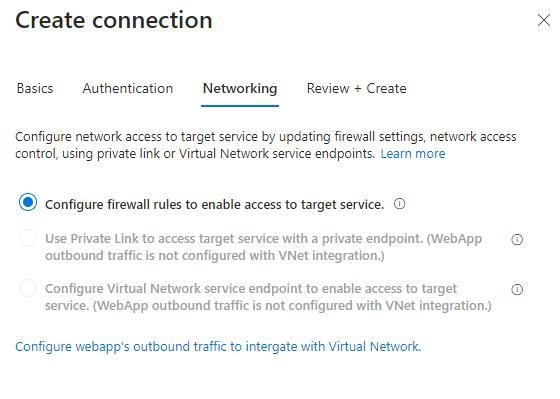
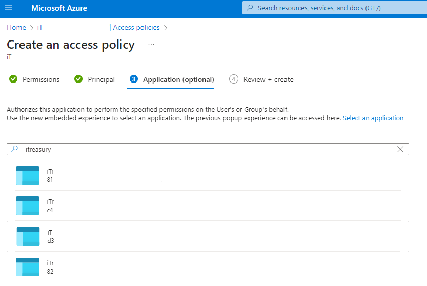

# Azure Key Vault

## Soft Delete

刪除Key後會在一段時間保留檔案

* [Purge Protection](https://learn.microsoft.com/zh-tw/azure/key-vault/general/soft-delete-overview?WT.mc_id=Portal-Microsoft_Azure_KeyVault#permitted-purge)

    預設不開啟 (開啟後不可重設)，強制不能刪除Soft delete的Key，直到到期後才會自動刪除，適合資料加密等保護情境

## [Access model](https://learn.microsoft.com/en-us/azure/key-vault/general/security-features?WT.mc_id=Portal-Microsoft_Azure_KeyVault#access-model-overview)

### **Vault access policy**
  
  每個User各自設定Key, Secret, Certificate權限
  * 優點: 簡便、權限彈性、可針對group設定、不須resource owner權限
  * 缺點: 較多user的情況會較難控管、沒有統一的Role權責

### **Azure role-based access control (RBAC)**

  與AD的IAM整合，有Role的概念，方便批次調整
  * 優點: 微軟官方推薦、完善的預設Roles設置、其他Resource整合預設的控管方式
  * 缺點: 必須要有resource owner權限(無權限會很麻煩)、就算有預設AD權限仍然要額外綁定Key Vault相關的Role、較難根據個別User設定客製化權限、無法綁定Group

## Resource Access

允許下方資源直接取得Key Vault資源

* Azure VM
* Azure Resource Manager
* Azure Disk Encryption

## Network

可限制存取IP、網段等</br>

* `XXX.XXX.XXX.XXX/32` 為網段

## Secret

* 可儲存密碼文字
* 可上傳Certificate檔案
* 可設定Enabled, 起始 & 失效時間
* 巢狀結構：使用`--`分隔，如`ConnectionStrings--LocalDb` (相當於appsettings.json的`{"ConnectionStrings": {"LocalDb" : "..."}}`)

### 讀取方法

```C#
using Azure.Identity;
using Microsoft.Extensions.Configuration;

var kvUri = $"https://{keyVaultName}.vault.azure.net";

var configuration = new ConfigurationBuilder()
                .AddAzureKeyVault(new Uri(kvUri), new DefaultAzureCredential())
                .Build();

var config = configuration
                .GetSection(nameof(AppConfig))
                .Get<AppConfig>();
```

※ 務必先安裝套件`Azure.Extensions.AspNetCore.Configuration.Secrets` </br>
※ 強型別IConfigurationSection.Get方法須安裝套件`Microsoft.Extensions.Configuration.Binder`</br>
※ DefaltAzureCredential需安裝套件`Azure.Identity`，其屬於複合型權限驗證，可自動驗證如Azure CLI、Managed Identity、Environment (Client ID & Secret)、Visual studio等 </br>

  * **Azure CLI**: 使用az login在該電腦登入帳密，90天內有使用azure功能的話會自動延展期限
  * **Managed Identity**: 於azure上設定identity，可直接與支援的azure resource互相綁定 (web app只支援windows系統?)，算是最易於設定的方法，缺點是無法在開發機上做測試
    * **System assigned** - 特定Azure resource產生的identity，屬於一對一綁定 (如web app <-> key vault)，最為簡便自動的方法
    * **User assigned** - 手動建立的identity，屬於多對多綁定 (如web app <-> identity <-> key vault)，彈性很高，不過code的部分需手動指定identity client id
  * **Environment**: 註冊Azure AD App Registration，其產生的App當中可取得Tenant ID, Client ID, 製作Client Secret (注意有期限)，可直接於Key Vault綁定，給非Azure的Host系統做使用，不過須特別注意Secret期限與儲存方式 (放在Environment Variable而不是在Code當中)
    1. AAD app registration，並取得client參數
       
       
    2. 以Linux container web app為例，當中的configuration輸入 (code會自動取得參數驗證)
       
    3. 第二步驟也可以用Service Connector取代，會更自動化 (包含設定環境變數、在Key Vault裡面設定Access Role、防火牆新增這個Web App的IP等)
       
       
       ※ 需要注意在Authentication頁籤要開啟Advanced設定將部分Environment name改為制定格式 (AZURE_CLIENT_ID, AZURE_CLIENT_SECRET, AZURE_TENANT_ID)
       
       

    4. Visual studio的launchsettings.json可在裡面設定環境變數模擬app service
    5. 最後記得要在access policies當中給予這個app權限
       

## Key

## Certificate

* Import
    1. Create a certificate
    2. 上傳.pfx檔案
    3. 輸入密碼
    4. (App Service為例) 至Custom Domains當中綁定Binding → 確認Certificates/Bring your own certificates (.pfx)當中的狀態

* Generate (支援自動續約)
    1. Create a certificate
    2. (App Service為例) 至Custom Domains當中綁定Binding → 確認Certificates/Managed certificates當中的狀態


## [Best Practice](https://learn.microsoft.com/en-us/azure/key-vault/general/best-practices)

    * 不同環境使用不同Vaults
    * 開啟Logger與Warning
    * 定期備份
    * IP限制來保護


## Application

* Secret Manager

## App Configuration

* 可跟Key Vault進行整合
* 可比較不同Configure之間的差異
* 使用

```C#
using Azure.Identity;
using Microsoft.Extensions.Configuration;

var kvUri = $"https://{keyVaultName}.vault.azure.net";

var configuration = new ConfigurationBuilder()
                .AddAzureKeyVault(new Uri(kvUri), new DefaultAzureCredential())
                .Build();

var config = configuration
                .GetSection(nameof(AppConfig))
                .Get<AppConfig>();
```

## Resource

* [官方文件-Getting Started with Azure Key Vault with .NET Core](https://learn.microsoft.com/en-us/samples/azure-samples/key-vault-dotnet-core-quickstart/get-started-keyvault-net/)
* [官方文件-Azure App Configuration FAQ](https://learn.microsoft.com/en-us/azure/azure-app-configuration/faq)
* [黑大文章-https://blog.darkthread.net/blog/azure-key-vault/](https://blog.darkthread.net/blog/azure-key-vault/)