## Front door

### Custom domain

1. 新增Azure Front Door And CDN Profiles

    ※ 可選擇原廠服務、或第三方CDN供應商
    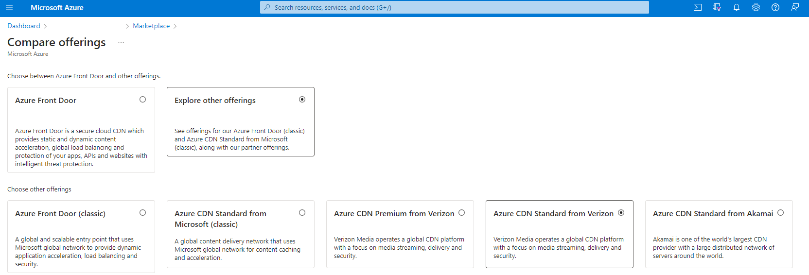

2. Add CDN Endpoint (此例指定Blob Origin Domain)
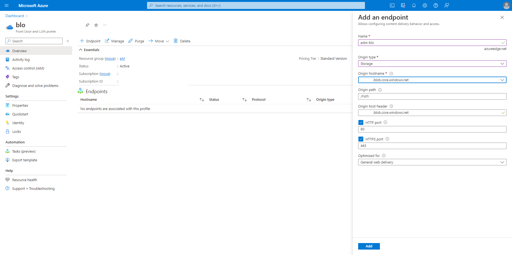

    ※ 選擇原廠CDN的話，在Front Door and CDN profile當中"Add an endpoint"
    

3. 指定的自有Domain，需要先在DNS供應商後台設定CNAME Record，Value為這個Endpoint的Hostname
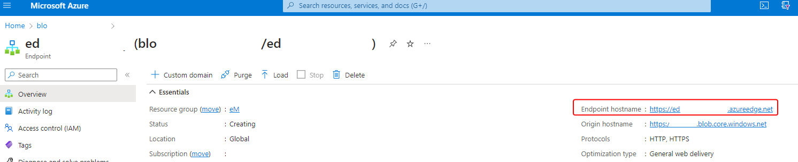

4. 在Endpoint當中新增這個已經設定好DNS CNAME的Custom Domain


### Route & Origin

* Origin: 可與特定資源(如web app、IP)的Domain作綁定，並可在Group當中設定順序
  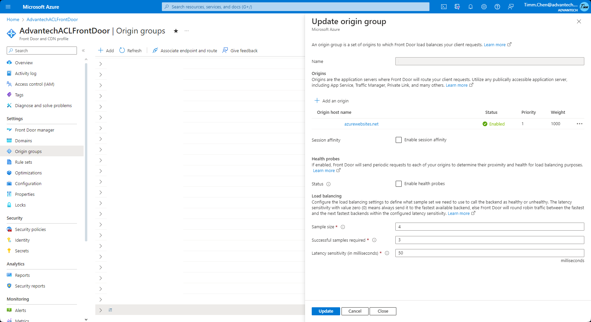
  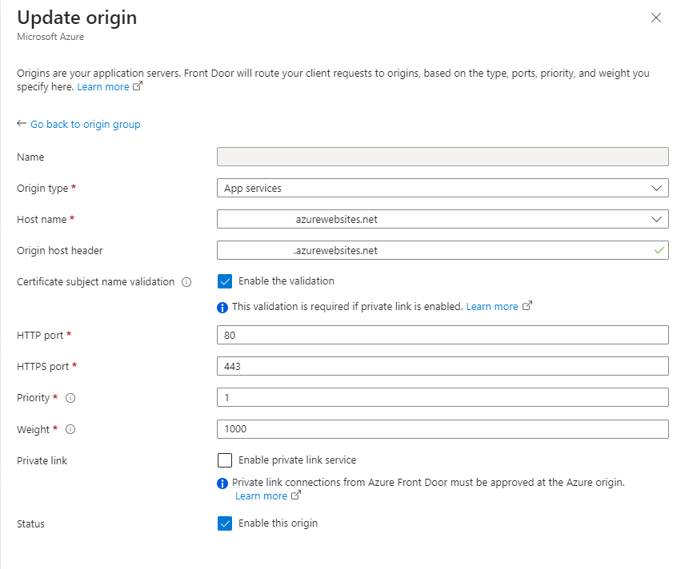
  * 如果背後站台已有Health check機制 (如Web App)，則建議關閉Health Prob
    

* Route: 設定Url特定格式，轉到特定Origin，也可以搭配Rule sets做一些更細緻的URL操作
  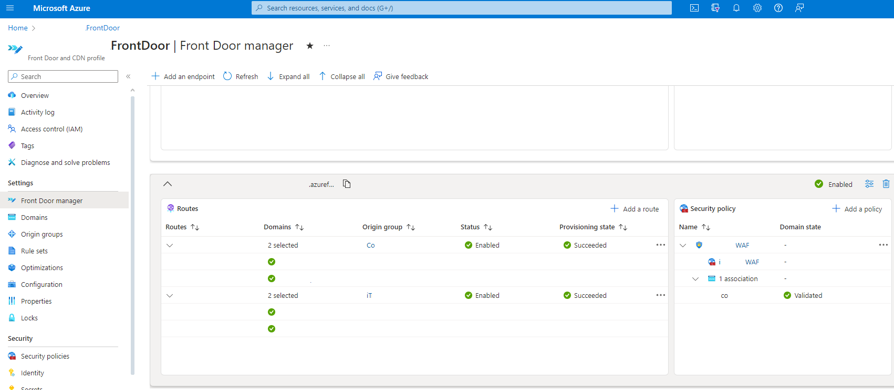
  
* Rule: 可設定更細緻的URL Route規則、覆寫Origin、Url rewrite/redirect等 (覆寫origin後面的動作經測試應該是無效)
  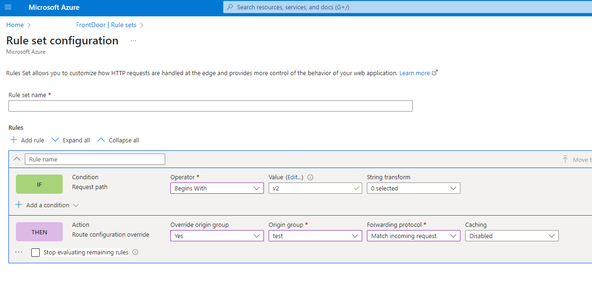

※ 如有多個站台需要共用domain、但藉由Route分別，可設定在同一個front door endpoint下多個route(url規則不能衝突)，搭配各自origin導到各自web app (route prefix需要在.net core上面設定，如下程式碼)

```C#
// .Net 6 Program.cs
app.UsePathBase("/v2");

// ...
app.UseRouting();
app.MapControllerRoute(
    name: "default",
    pattern: "{controller=Home}/{action=Index}/{id?}");
```

### WAF

1. 新增Security Policy (選定現有的Azure domain)
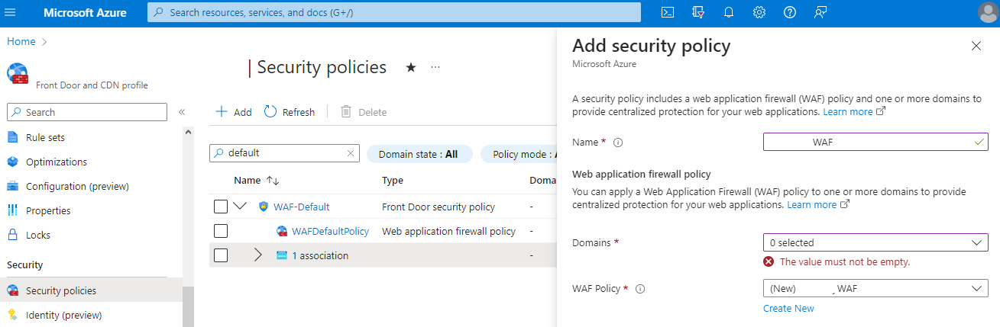

2. 進入WAF，開啟Prevention Mode
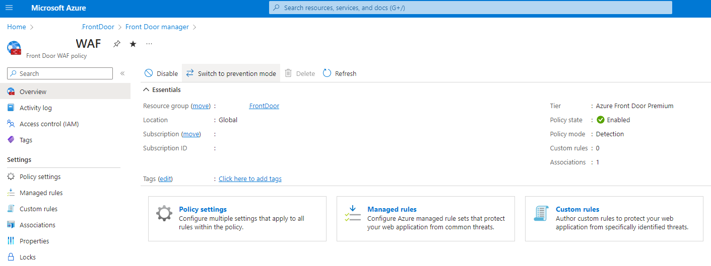

3. Managed Rules可選擇Policy開啟
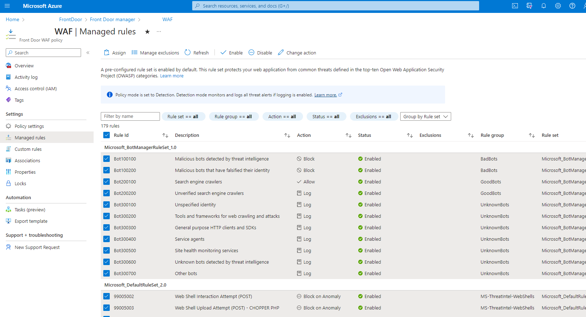

4. Monitor透過Azure Front Door → Logs → 輸入以下KQL查詢 ([官方文件](https://learn.microsoft.com/en-us/azure/web-application-firewall/afds/waf-front-door-tuning?pivots=front-door-standard-premium#resolving-false-positives))

* 透過Tracking Reference查詢

```KQL
AzureDiagnostics
| where Category == 'FrontDoorWebApplicationFirewallLog'
| where TimeGenerated > ago(1d)
| where action_s == 'Block'
| where requestUri_s contains "YOUR_DOMAIN_NAME"
```

* 透過Url查詢，並列出所有Log (包含扣分這塊)

```KQL
AzureDiagnostics
| where Category == 'FrontDoorWebApplicationFirewallLog'
| where TimeGenerated > ago(2h)
| where requestUri_s contains "YOUR_DOMAIN_NAME"
```

由block頁面提供的id輸入trackingReference_s追蹤，可查看Rule name尋找錯誤</br>
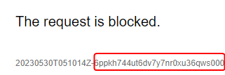</br>
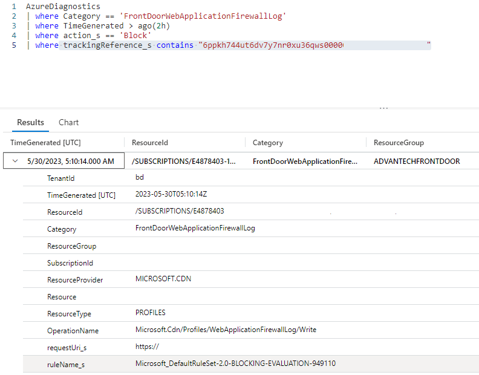
