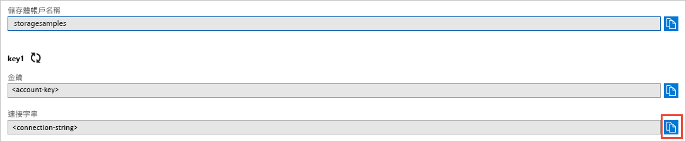

#Azure Storage Account

## Blob


```cmd
dotnet add package Azure.Storage.Blobs
```





```C#
BlobServiceClient blobServiceClient = new BlobServiceClient(_connectionString);
BlobContainerClient containerClient = _blobServiceClient.GetBlobContainerClient(containerName);
BlobClient blobClient = containerClient.GetBlobClient(fileName);
await blobClient.UploadAsync(localFilePath, overwrite: true);
return blobClient.Uri;
```