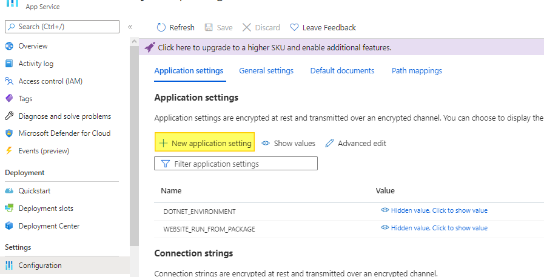
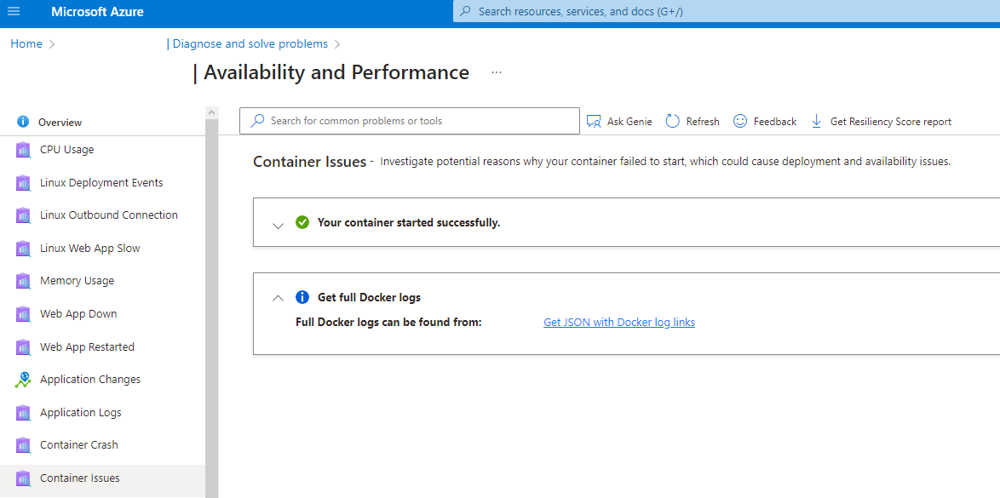
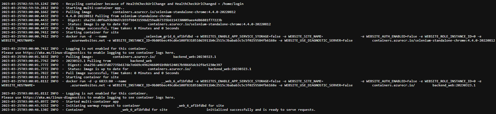
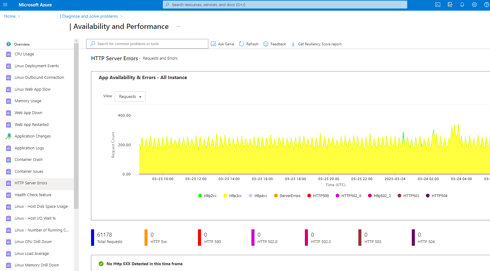
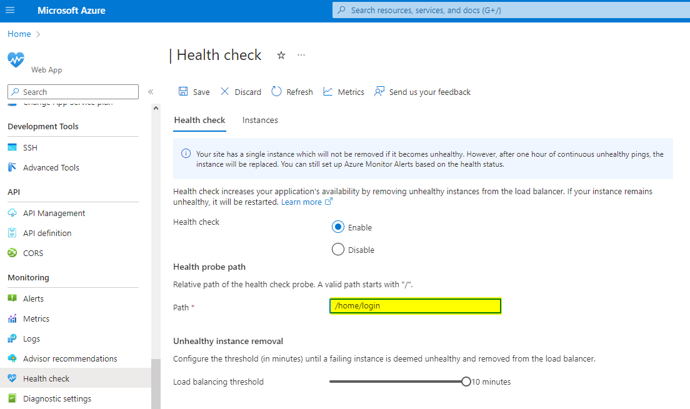

# Azure Web App

### [Environment Variables]

### [Diagnose]

可根據Azure建議的方式變更安全性與穩定性設定

* Application Logs：提供Deployment, 執行時的Log
* Container Crash：Pipeline Debug時可用
    
    
* Http Server Error：提供Request分析，如Method, Uri, Count等等
    
* Monitoring→Health check：定期呼叫Request確認運作狀況 (如為避免App Insights過多Log，可設定Path為/home/login)
    

### [Deployment Slots]

