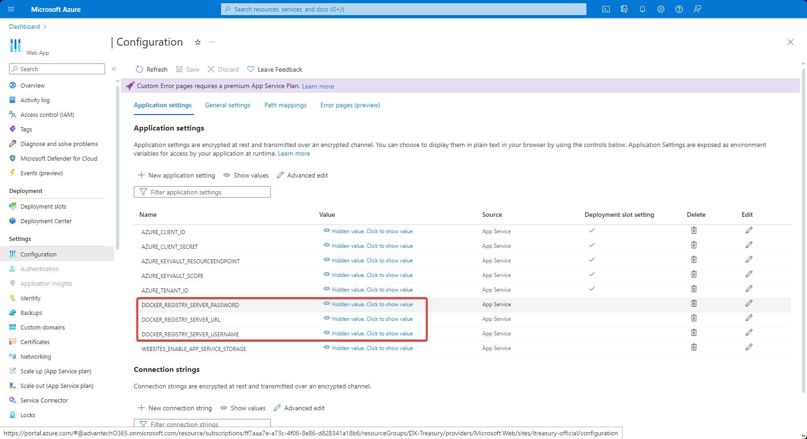
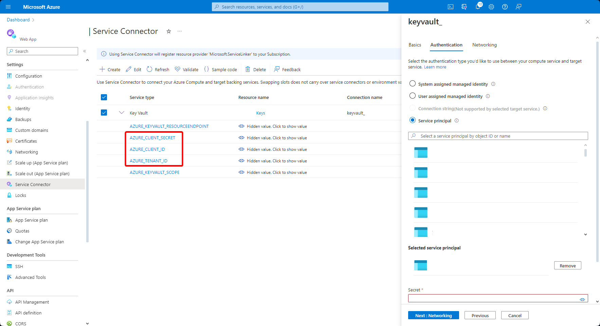
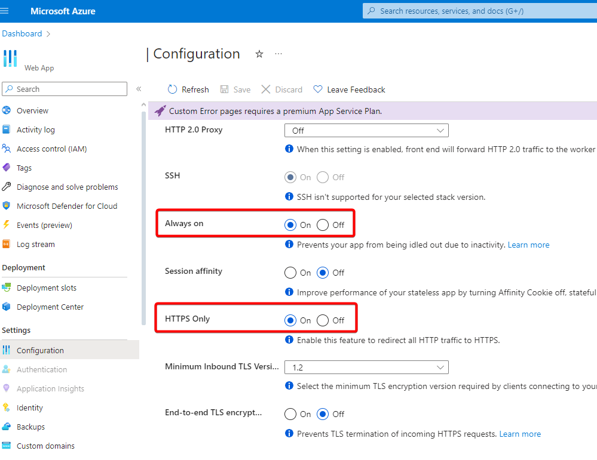
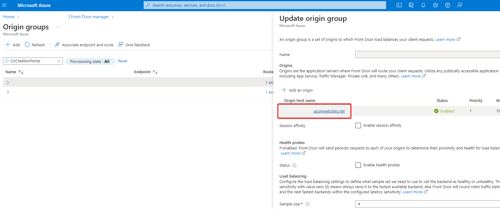
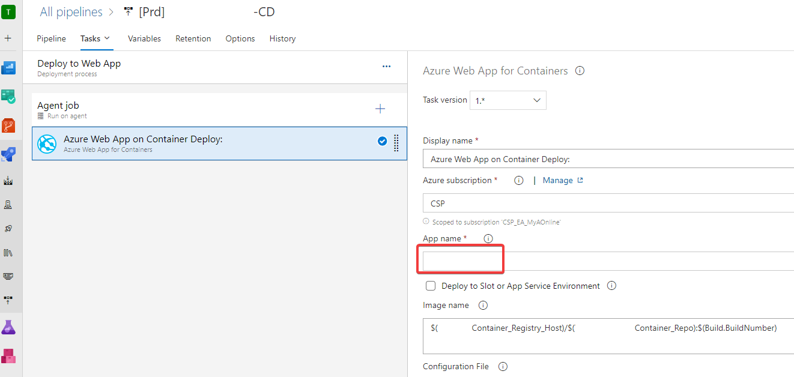

# Azure Web App

### [Environment Variables]

* 新增Resource後必填：
  * ASPNETCORE_ENVIRONMENT (Production, Staging)
  * WEBSITE_TIME_ZONE (Linux: "Asia/Taipei")
* 選填：
  * Container Registry參數 (Start web app時需要直接pull image)
    

  * Key Vault參數 (Start web app時需要取得config) → 使用Service connector可自動幫忙增改(注意Key要修改成AZURE_XXX，否則Azure.Identity套件會抓不到)
    

### General Settings

* Always on: 沒有Request時仍然開著 (適合job站台)
* HTTPS Only: 預設開啟

### [Diagnose]

可根據Azure建議的方式變更安全性與穩定性設定

* Application Logs：提供Deployment, 執行時的Log
* Container Crash：Pipeline Debug時可用
    
    
* Http Server Error：提供Request分析，如Method, Uri, Count等等
    
* Monitoring→Health check：定期呼叫Request確認運作狀況 (如為避免App Insights過多Log，可設定Path為/home/login)
    

### [Deployment Slots]

## 外部綁定
### Front Door
* Origin綁定Web App以將Request導流過來

## Azure Pipelines
* Deployment綁定Web App
