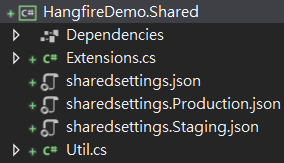

# Console Job優化管理 (Generic Host)
#### 目的
* 整合Environment，允許Job根據環境變數切換行為，並可於Debug時隨時切換
* 集中App Config，便於統一更新與佈署
* 整合Logger，便於紀錄Event
* 整合相依性注入，提升程式維護性
* 集中跨專案邏輯，便於管理

#### 方法
1. 使用與.Net Core Website相同之HostingBuilder建置

```C#
class Program
{
    static void Main(string[] args)
    {
        Host.CreateDefaultBuilder(args);
    }
}
```

2. 設定Environment <br>
  2-1. [Job] 設定launchSettings.json，可在Debug時快速切換環境 <br>
    (可使用右鍵 → Properties → Debug 當中設定) <br>
  
  ```json
  {
  "profiles": {
    "Develop": {
      "commandName": "Executable",
      "environmentVariables": {
        "DOTNET_ENVIRONMENT": "Develop"
      }
    },
    "Staging": {
      "commandName": "Executable",
      "environmentVariables": {
        "DOTNET_ENVIRONMENT": "Staging"
      }
    },
    "Production": {
      "commandName": "Executable",
      "environmentVariables": {
        "DOTNET_ENVIRONMENT": "Production"
      }
    }
  }
}
  ```
  
  
  
  2-2. [Builder] 指定Environment Variables Prefix <br>
  (.Net Core 3.1預設由NETCORE_ENVIRONMENT改為DOTNET_ENVIRONMENT)
  
  ```C#
class Program
{
    static void Main(string[] args)
    {
        Host.CreateDefaultBuilder(args)
            .ConfigureHostConfiguration(configurationBuilder =>
            {
                configurationBuilder.AddEnvironmentVariables(prefix: "DOTNET_");
            });
    }
}
  ```
  
  2-3. [Server] 設定Deploy環境變數 <br>
    (a) IIS須手動設定Environment Variables <br>
      (Configuration Editor → system.webServer/aspNetCore → Environment Variables)， <br>
      或於Pipeline中指定(參考以下語法) <br>
    
```CMD
# Add Environment Variable for This Website
Add-WebConfigurationProperty -pspath 'MACHINE/WEBROOT/APPHOST/$(SiteName)'  -filter "system.webServer/aspNetCore/environmentVariables" -name "." -value @{name='$(EnvironmentVariableKey)';value='$(EnvironmentName)'}
```

    (b) Web App則需設定Environment Variable
    
    
3. 設定Shared Config (參考[出處](https://andrewlock.net/sharing-appsettings-json-configuration-files-between-projects-in-asp-net-core/)) <br>
  3-1. [Shared Project] 建立sharedsettings.json <br>
     <br>
  3-2. [Shared Project] 設定Always Copy (將檔案複製到Job Assembly Directory) <br>
   <br>
  
  ```xml
  <Project Sdk="Microsoft.NET.Sdk">
    <!--...-->

      <ItemGroup>
        <None Update="sharedsettings.json">
          <CopyToOutputDirectory>Always</CopyToOutputDirectory>
        </None>
        <None Update="sharedsettings.Production.json">
          <CopyToOutputDirectory>Always</CopyToOutputDirectory>
        </None>
        <None Update="sharedsettings.Staging.json">
          <CopyToOutputDirectory>Always</CopyToOutputDirectory>
        </None>
      </ItemGroup>

    <!--...-->
</Project>
  ```
  3-3. [Builder] 設定config json讀取順序 (後讀覆蓋前讀) <br>
  ※ 由於保留仍可讀取appsettings.json，如有客製化設定仍可設定於job project當中的appsettings.json
  
  ```C#
class Program
{
    static void Main(string[] args)
    {
        Host.CreateDefaultBuilder(args)
            /*...*/
            .ConfigureAppConfiguration((hostContext, config) =>
            {
                var env = hostContext.HostingEnvironment;
                string assemblyDirectory = Path.GetDirectoryName(Assembly.GetExecutingAssembly().Location);
                config = config.SetBasePath(assemblyDirectory)
                                .AddJsonFile("sharedsettings.json", optional: false, reloadOnChange: true)
                                .AddJsonFile($"sharedsettings.{env.EnvironmentName}.json", optional: true, reloadOnChange: true)
                                .AddJsonFile($"appsettings.json", optional: true, reloadOnChange: true)
                                .AddJsonFile($"appsettings.{env.EnvironmentName}.json", optional: true, reloadOnChange: true);
            });
    }
}
  ```
  
4. 設定Logger <br>
  4-1 [Builder] 安裝Serilog Package <br>
  
```CMD
dotnet add package Serilog.AspNetCore
```
  
  4-2 [Builder] 設定Serilog為預設Logger <br>
  
  ```C#
 class Program
{
    static void Main(string[] args)
    {
        Host.CreateDefaultBuilder(args)
            /*...*/
            .UseSerilog((hostContext, loggerConfig) =>
            {
                string jobNamespace = MethodBase.GetCurrentMethod().DeclaringType.Namespace;
                var env = hostContext.HostingEnvironment;
                var emailSinkInfo = new EmailConnectionInfo() { /*...*/ };
    
                loggerConfig.MinimumLevel.Information()
                .Enrich.WithProperty("Application", jobNamespace)   // 可設定自定義參數
                .Enrich.WithProperty("Environment", hostContext.HostingEnvironment.EnvironmentName)
                .WriteTo.Conditional(
                    condition => !env.IsDevelopment(),  // 可設定觸發條件
                    writeTo => writeTo.Console()    // 指定Log途徑
            });
    }
}
  ```
  
  4-3 [Builder] 依個人喜好新增Sink管道 (如App Insights, Email, ...)
  
```CMD
dotnet add package Serilog.Sinks.ApplicationInsights
dotnet add package Serilog.Sinks.Email
dotnet add package Microsoft.ApplicationInsights
```
  
```C#
class Program
{
    static void Main(string[] args)
    {
        Host.CreateDefaultBuilder(args)
            /*...*/
            .UseSerilog((hostContext, loggerConfig) =>
            {
                string jobNamespace = MethodBase.GetCurrentMethod().DeclaringType.Namespace;
                var env = hostContext.HostingEnvironment;
                var emailSinkInfo = new EmailConnectionInfo() { /*Assign Properties...*/ };
    
                loggerConfig.MinimumLevel.Information()
                .Enrich.WithProperty("Application", jobNamespace)
                .Enrich.WithProperty("Environment", hostContext.HostingEnvironment.EnvironmentName)
                .WriteTo.Conditional(
                    condition => !env.IsDevelopment(),
                    writeTo => writeTo.Console()
                                // 指定各種途徑與Log Level
                               .WriteTo.ApplicationInsights(new TelemetryConfiguration("Assign AppInsights Key..."), TelemetryConverter.Traces)
                               .WriteTo.Email(emailSinkInfo, restrictedToMinimumLevel: LogEventLevel.Error));
            });
    }
}
  ```
  
  
  
5. 建立JobService，用於統一對Exception呼叫Logger <br>
※繼承IHostedService，可在待會直接Run
※務必注意IHostApplicationLifetime 與StopApplication()是必要的，讓Console App能在跑完這個service時將Host關閉，否則Console App將不會停止

```C#
public class JobSerive : IHostedService
{
    private readonly ILogger _logger;
    private readonly IHostApplicationLifetime _appLifetime;
    private readonly string _executionId;
    private readonly string _jobNamespace;
    private string _errorTitle => $"Error from job: {_jobNamespace}";

    public JobSerive(ILogger<JobSeriveBase> logger, IHostApplicationLifetime appLifetime)
    {
        _logger = logger;
        _appLifetime = appLifetime;

        _jobNamespace = GetType().Namespace;
        _executionId = Guid.NewGuid().ToString("N");
    }

    public Task StartAsync(CancellationToken cancellationToken)
    {
        try
        {
            this.ExecuteAsync();
        }
        catch (Exception ex)
        {
            _logger.LogError(ex, $"{_errorTitle} ({_executionId})");
            throw;  // 讓Hangfire顯示Job錯誤內容，因此必須拋出Exception (如無，則須注意Exit code須設為-1)
        }
        _appLifetime.StopApplication(); // Go to StopAsync

        return Task.CompletedTask;
    }

    public Task StopAsync(CancellationToken cancellationToken)
    {
        // Do something when ending the job
        Environment.ExitCode = 1;   // 如要考慮Exception狀態，須考慮有-1的狀態
        return Task.CompletedTask;
    }


    protected virtual Task ExecuteAsync()
    {
        // Job Logic...
        return Task.CompletedTask;
    }
}
```

6. 註冊JobService (相依性注入)
7. 執行: IHost.RunAsync()

```C#
class Program
{
    static void Main(string[] args)
    {
        Host.CreateDefaultBuilder(args)
            /*...*/
            .ConfigureServices((hostContext, services) =>
            {
                services.AddHostedService<JobService>();    // 註冊Job Service
            })
            .Build()
            .RunAsync();    // Run logic in job service
    }
}
```

#### 注意事項
* 有跨Framework的需求時，可使用.net standard 2.0作為Shared Library的版本 (對應.net Core 2.1 & .net Framework 4.7.2)
* 注意部分功能在.Net framework需要手動跟Shared Library安裝一樣的Nuget Package，否則會在Build or Runtime時發生錯誤
* 注意.Net Framework目前實測起來有發生Generic Host無法拋出Exception而繼續執行結束的狀況(即Console App即使有做到Log Exception，但結果上還是顯示安全地執行結束)，目前解法為僅呼叫IHost.Run()，即第7部呼叫.Run()


#### 可優化內容
* 整合Azure Application Insights，利於分析Job運作效能

#### 相關資源
[使用 .NET Generic Host 建立 Console 主控台應用程式 (保哥部落格)](https://blog.miniasp.com/post/2020/12/08/NET-Generic-Host-Build-Console-App) <br>
[How to Run Net Core Console App Using Generic Host Builder (StackOverflow)](https://stackoverflow.com/questions/68392429/how-to-run-net-core-console-app-using-generic-host-builder) <br>
[.Net Core Generic Host (MSDN)](https://docs.microsoft.com/en-us/aspnet/core/fundamentals/host/generic-host?view=aspnetcore-6.0) <br>
[launchsettings.json (MSDN)](https://docs.microsoft.com/zh-tw/aspnet/core/fundamentals/environments?view=aspnetcore-6.0)
[Sharing appsettings.json configuration files between projects in ASP.NET Core](https://andrewlock.net/sharing-appsettings-json-configuration-files-between-projects-in-asp-net-core/) <br>