# Container

## Docker

[DockerDesktop](https://www.docker.com/products/docker-desktop/) </br>
[DockerHub](https://hub.docker.com)

```PowerShell
#First, clone a repository
docker run --name repo alpine/git clone https://github.com/docker/getting-started.git
docker cp repo:/git/getting-started/ .

#Now, build the image
cd getting-started
docker build -t docker101tutorial .

#Run your first container
docker run -d -p 80:80 \ --name docker-tutorial docker101tutorial

#Now save and share your image
docker tag docker101tutorial timmchentw/docker101tutorial        
docker push timmchentw/docker101tutorial
```

## Nginx

## IIS

## SQL Server

## Dotnet Core

1. 參考[微軟官方文件](https://docs.microsoft.com/en-us/dotnet/core/docker/build-container?tabs=windows#create-the-dockerfile)說明
2. 新增DockerFile在.csproj資料夾內

    ```docker
    #See https://aka.ms/containerfastmode to understand how Visual Studio uses this Dockerfile to build your images for faster debugging.

    FROM mcr.microsoft.com/dotnet/aspnet:6.0 AS base
    WORKDIR /app
    EXPOSE 80
    EXPOSE 443

    FROM mcr.microsoft.com/dotnet/sdk:6.0 AS build
    WORKDIR /src
    COPY ["MyProject/MyProject.csproj", "MyProject/"]
    RUN dotnet restore "MyProject/MyProject.csproj"
    COPY . .
    WORKDIR "/src/MyProject"
    RUN dotnet build "MyProject.csproj" -c Release -o /app/build

    FROM build AS publish
    RUN dotnet publish "MyProject.csproj" -c Release -o /app/publish

    FROM base AS final
    WORKDIR /app
    COPY --from=publish /app/publish .
    ENTRYPOINT ["dotnet", "MyProject.dll"]
    ```

3. 在該路徑下執行Docker Build

    ```docker
    docker build -t IMAEGE_NAME -f Dockerfile .
    ```

    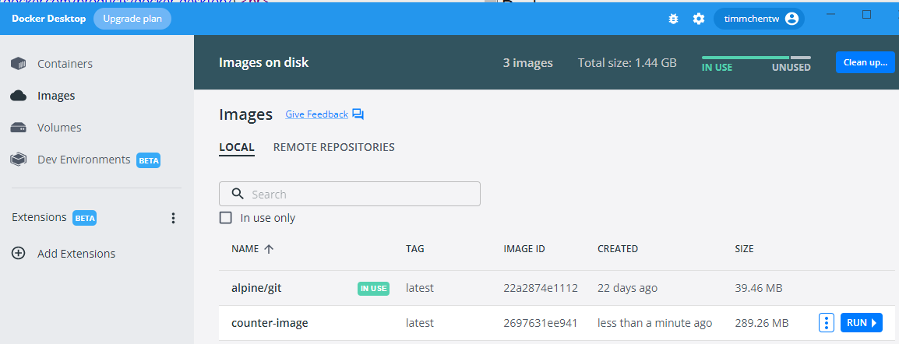

4. 建立Container

    ```docker
    docker create --name CONTAINER_NAME IMAGE_NAME
    ```

    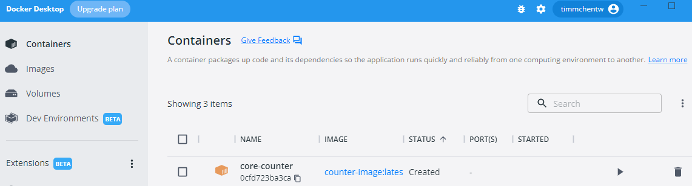

5. 如使用Azure Container Registry存放私有Image，可參考微軟官方文件進行佈署
6. 有多個Container同時執行與相依的情況，需額外新增docker-compose.yml

    Ps. 佈署到Azure參考下方方法 </br>
    Ps2. VS支援自動產生docker compose檔案 (可直接在Docker Desktop Debug)
    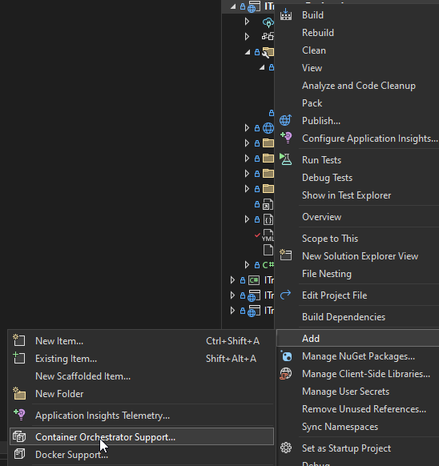
    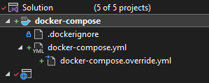

## Azure Container Registry

用於存放Private Container Images (可與Web App整合)

1. 建立Azure container Registry
2. 使用VS or Pipeline佈署到Azure container Registry
3. 建立Azure Web App or Function (Linux & Docker)
    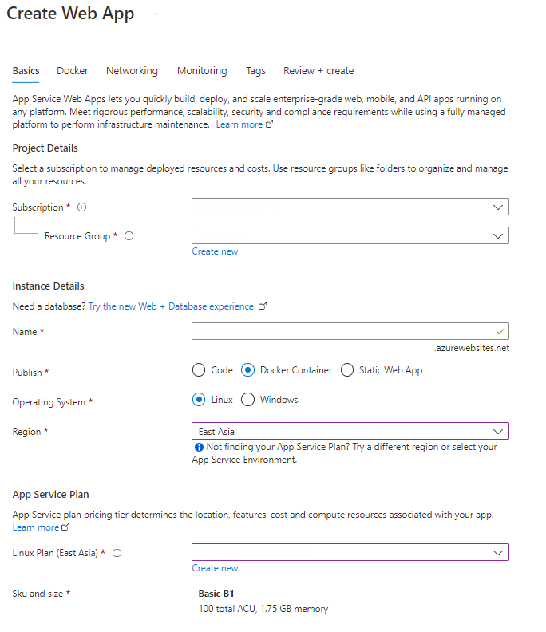
4. 建立時直接綁定Azure Container Registry中的Images & Tag
    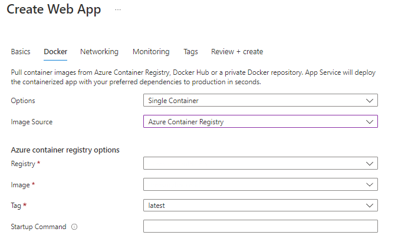
5.可直接在Deployment Center直接設定CD、或可之後用Azure pipeline覆蓋設置
    
※ Public image (e.g. DockerHub) 可使用Azure CLI匯入ACR (參考[官方文件](https://docs.microsoft.com/en-us/azure/container-registry/container-registry-import-images?tabs=azure-cli))
※ 清理Image請參考[官方文件](https://docs.microsoft.com/en-us/azure/container-registry/container-registry-auto-purge)

## Docker Compose

1. 建立docker-compose.yml檔案
    * version會影響語法
    * build & dockerfile是給專案Build所使用 (docker compose build)
    * image為實際執行container所抓下來的Repo image (docker compose push & pull)
    * ports須指定，才能讓其他service取用
    * depends_on須指定另一個service

   ```YAML
    version: '3.4'

    services:
    web:
        build:
        context: .
        dockerfile: MyProject/Dockerfile
        image: myregistry.azurecr.io/myproject_web
        ports:
        - '8080:80'
        environment:
            ASPNETCORE_ENVIRONMENT: Production
        depends_on:
        - selenium_grid

    selenium_grid:
        image: myregistry.azurecr.io/selenium-standalone-chrome:4.4.0-20220812
        ports:
        - '4444:4444'
        - '7900:7900'
        shm_size: 2gb
   ```

2. 可參考上方Visual Studio建立Docker專案，Debug後可在Docker Desktop上看到compose群組
    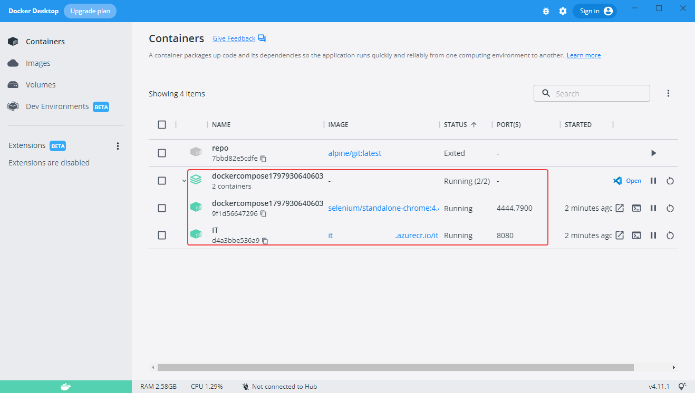

## Azure Pipeline & Web App

1. Docker compose build (Azure Container Registry)
2. Docker compose push (Azure Container Registry)
3. Azure Web App deploy</br>

    ```YAML
    # ASP.NET Core (.NET Framework)
    # Build and test ASP.NET Core projects targeting the full .NET Framework.
    # Add steps that publish symbols, save build artifacts, and more:
    # https://docs.microsoft.com/azure/devops/pipelines/languages/dotnet-core

    trigger:
    - production

    pool:
    vmImage: 'ubuntu-latest'

    variables:
    - group: MyLibrary_Variables # From Azure Library
    - name: solution
        value: '**/*.sln'
    - name: buildPlatform
        value: 'Any CPU'
    - name: buildConfiguration
        value: 'Release'
    - name: AzureSubscription
        value: 'MySubscription (...)'
    - name: AzureContainerRegistry
        value: '{"loginServer":"myproject.azurecr.io", "id" : "/subscriptions/.../resourceGroups/MyResGroup/providers/Microsoft.ContainerRegistry/registries/myregistry"}'
    - name: DockerComposeFile
        value: 'docker-compose.staging.yml'

    steps:

    - task: DockerCompose@0
    inputs:
        containerregistrytype: 'Azure Container Registry'
        dockerComposeFile: '$(DockerComposeFile)'
        action: 'Build services'
        additionalImageTags: '$(Build.BuildNumber)'

    - task: DockerCompose@0
    inputs:
        containerregistrytype: 'Azure Container Registry'
        azureSubscription: '$(AzureSubscription)'
        azureContainerRegistry: '$(AzureContainerRegistry)'
        dockerComposeFile: '$(DockerComposeFile)'
        action: 'Push services'
        additionalImageTags: '$(Build.BuildNumber)'

    # Deploy to web app (May move to release pipeline)
    - task: AzureWebAppContainer@1
      inputs:
        azureSubscription: '$(AzureSubscription)'
        appName: 'MyAzureWebApp'
        containers: 'myregistry.azurecr.io/myproject_web:$(Build.BuildNumber)'
        multicontainerConfigFile: '$(DockerComposeFile)'

    ```

    ※第一次Run會有Registry & App Service的Permission Approve
    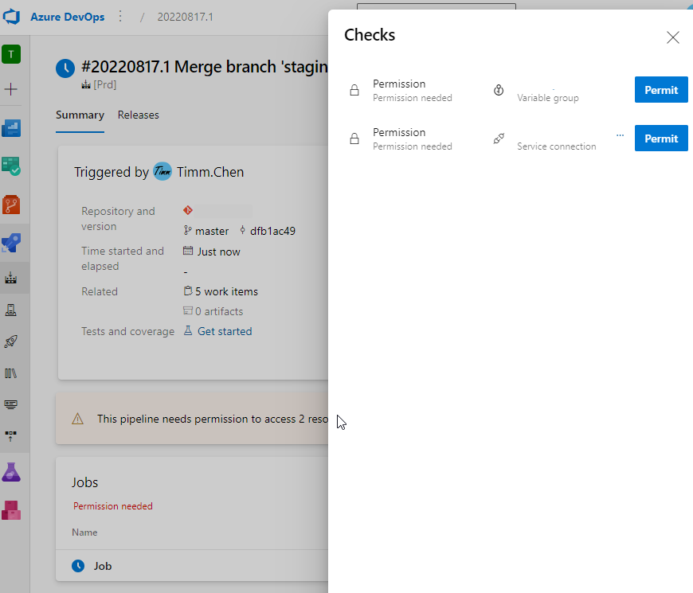

    ※ Docker Debug資訊參考Diagnose and solve problems (Application Logs→Container Issues)
        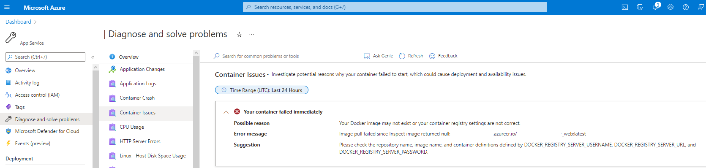
4. 如需將CD拆分成Release pipeline，須注意將docker-compose.yml push到Artifact再取出使用

    ```YAML
    # Push compose config for release pipelines 
    # (Azure Web App doesn't support "merged docker-compose.yml" file)
    - task: PowerShell@2
    inputs:
        targetType: 'inline'
        script: |
        # Source: https://mjc.si/2020/10/08/modify-yml-files-with-powershell/
        # Install and import the `powershell-yaml` module
        # Install module has a -Force -Verbose -Scope CurrentUser arguments which might be necessary in your CI/CD environment to install the module
        Install-Module -Name powershell-yaml -Force -Verbose -Scope CurrentUser
        Import-Module powershell-yaml
        
        # LoadYml function that will read YML file and deserialize it
        function LoadYml {
            param (
                $FileName
            )
            # Load file content to a string array containing all YML file lines
            [string[]]$fileContent = Get-Content $FileName
            $content = ''
            # Convert a string array to a string
            foreach ($line in $fileContent) { $content = $content + "`n" + $line }
            # Deserialize a string to the PowerShell object
            $yml = ConvertFrom-YAML $content
            # return the object
            Write-Output $yml
        }
        
        # WriteYml function that writes the YML content to a file
        function WriteYml {
            param (
                $FileName,
                $Content
            )
            #Serialize a PowerShell object to string
            $result = ConvertTo-YAML $Content
            #write to a file
            Set-Content -Path $FileName -Value $result
        }
        
        # Loading yml, setting new values and writing it back to disk
        $yml = LoadYml "$(Build.SourcesDirectory)/$(DockerComposeFile)"
        $yml.services.web.image = $yml.services.web.image + ":" + $(Build.BuildNumber)
        WriteYml "$(Build.StagingDirectory)/docker-compose.yml" $yml

    # Push to artifact (For release pipeline)
    - task: PublishPipelineArtifact@1
    inputs:
        targetPath: '$(Build.StagingDirectory)/docker-compose.yml'
        publishLocation: 'pipeline'

    ```

    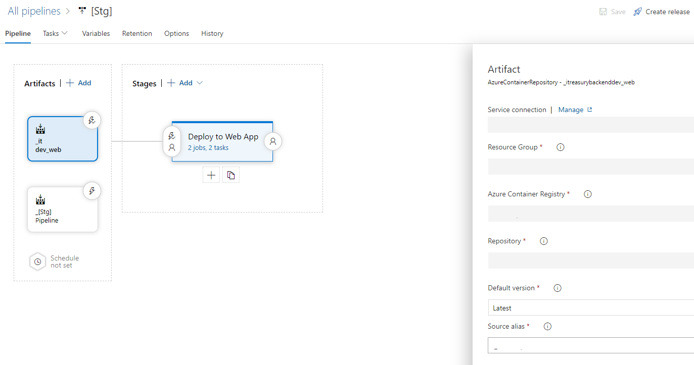
    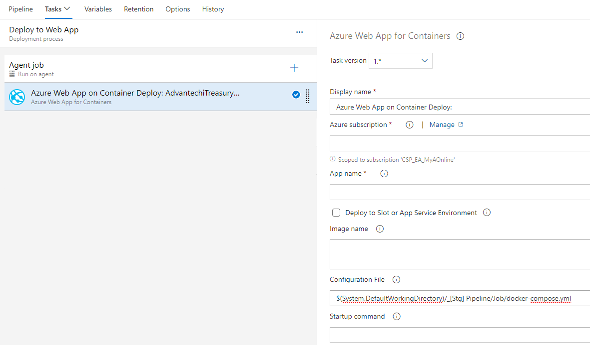
</br>
</br>
※ Azure web app對於Docker compose，有一些[未支援的限制](https://docs.microsoft.com/en-us/azure/app-service/configure-custom-container?pivots=container-linux#docker-compose-options):</br>
  (1) Port只能使用最簡單的short syntax

    ```yaml
    services:
    myservice1:
        port:
        # 支援
        '8080:80'

        # 不支援
        #- published: 8080
        #target: 80
        #protocol: tcp
        #mode: host
    ```

    (2) version要放第一行 </br>
    (3) depends_on會被忽略 </br>
    (4) 所有image只能從同一個registry取得 (如ACR, DockerHub)，不可混用 </br>
    (5) 不支援Merge docker-compose.yml </br>
    ※ 因此使用Docker compose command merge YAML檔(如下方) 的格式，會使得Web App Start失敗

    ```CMD
    docker-compose -d docker.compose.yml -d docker.compose.override.yml config
    ```

## Selenium Grid

1. 參考Selenium Docker (https://github.com/SeleniumHQ/docker-selenium)
2. 使用Docker指令安裝特定瀏覽器與版本

    ```powershell
    docker run -d -p 4444:4444 -p 7900:7900 --shm-size="2g" selenium/standalone-firefox:4.3.0-20220726
    ```

    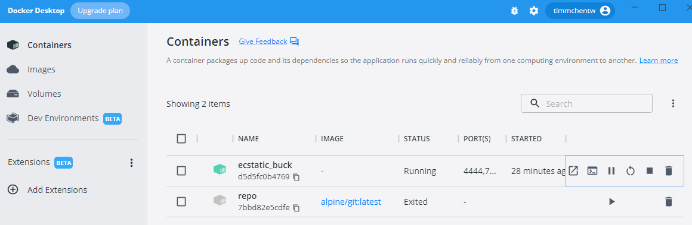

3. 進入後台(URL:`http://localhost:4444/ui`)確認Selenium Grid狀態與Session
    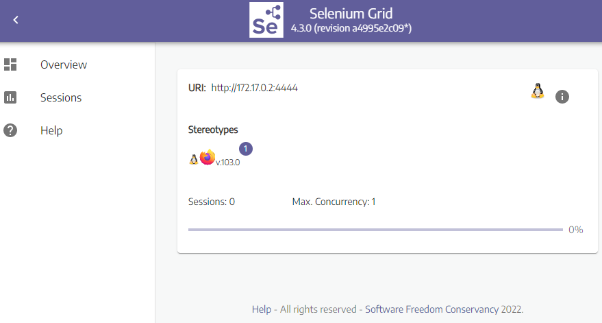
4. 程式端直接使用RemoteDriver連到losthost port 4444，即可調用

    ```C#
     var driver = new RemoteWebDriver(new Uri("http://localhost:4444/wd/hub"), new FirefoxOptions());
                driver.Navigate().GoToUrl("https://www.google.com/");
    ```

    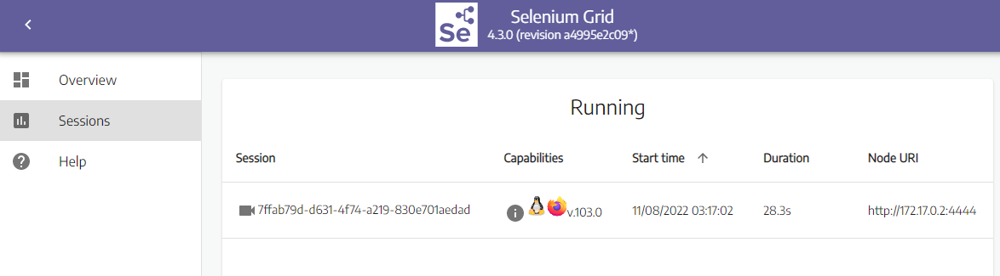

5. 關閉後Session將會釋出

    ```C#
        driver.Quit();
    ```