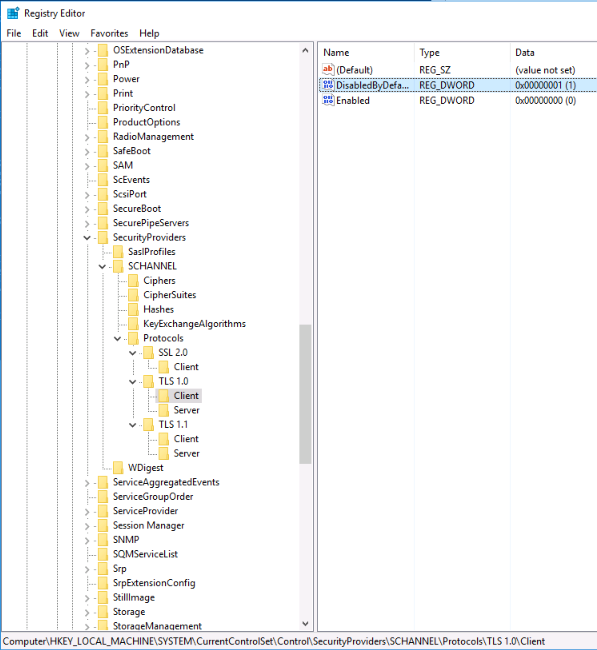

# Deployment

## Web相關

* 查詢Server IP: CMD輸入 Ping ServerName
* 建立Server網路磁碟機(直接存取server檔案系統): 我的電腦->電腦->連線網路磁碟機->輸入IP\C$ 或 D$即可連線

## Web相關程式

* [Visual Studio 2017](https://docs.microsoft.com/zh-tw/visualstudio/releasenotes/vs2017-relnotes)  </br>
* [MS SQL Server](https://www.microsoft.com/zh-tw/sql-server/sql-server-downloads)  </br>
* [SSMS](https://docs.microsoft.com/zh-tw/sql/ssms/download-sql-server-management-studio-ssms?view=sql-server-ver15) (SQL Server管理工具) </br>
* [SourceTree](https://www.sourcetreeapp.com/)  (GIT圖形化版控)  </br>
* [Azure Storage Explorer](https://azure.microsoft.com/zh-tw/features/storage-explorer/)  (Blob雲端管理)  </br>
* [TortoiseGit](https://tortoisegit.org/)  (GIT解衝突檔案)  </br>

## Publish

1. Visual Studio → Build → Publish → Target Location → configure → 指定儲存於server的Web專案路徑
2. 於Server端：Administrative Tools → Internet Information Services (IIS) Manager
3. 左側connections → start Page → 'FolderName' → sites → 'SiteName'
4. 右側Actions → Basic Settings → Physical path: → 指定Web專案路徑

## SSL憑證

* 瀏覽器網址列的"Lock"圖示可查看憑證資訊 (有效日期、適用Domain、發證單位等)
* 手動插入server憑證：

  1. 開啟Server的IIS      </br>
  2. 點選左方Connections的Server name (Start page下面一個) </br>
  3. 點選Server Certificates   </br>
  4. 點選右方Actions → import... 即可匯入憑證檔  </br>

* 自動插入server憑證：   </br>

  1. 開啟Server的IIS   </br>
  2. 點選左方Connections的Server name (Start page下面一個) </br>
  3. 點選Centralized Certificates </br>
     (如果沒出現，在Server manager → Add Roles and Features → Nextsss....  </br>
           → Roles選擇Web server(IIS)的Web server的security的Centralized SSL Certificates Support，最後儲存)   </br>
  4. 點選右方Actions → Edit Feature Setting...  </br>
  5. 輸入相對應憑證資訊   </br>

* Web啟用剛新增的server憑證</br>

  1. 開啟Server的IIS</br>
  2. 點選左方Connections的sites中的目標網站</br>
  3. 點選右方Actions → Bindings</br>
  4. 選擇Type為https(或自己創https)的Binding，</br>
     * 手動SSL者：選擇剛新增的SSL Certificates  </br>
     * 自動SSL者：對Use Centralized Certificates Store打勾  </br>
  5. 確定後即可到瀏覽器確認該網頁的憑證狀態  </br>

## IIS

### Log路徑

* C:\WINDOWS\system32\Logfiles
  * W3SVC: Requests & Responses
  * HTTPERR: Error Log
* C:\inetpub\logs
* Event Viewer: Windows Logs

## TLS

* 檢測方法：https://www.ssllabs.com/ssltest/
* Disable TLS方法 (Windows PowerShell-Admin執行)

```PowerShell
New-Item 'HKLM:\SYSTEM\CurrentControlSet\Control\SecurityProviders\SCHANNEL\Protocols\TLS 1.0\Server' -Force
New-ItemProperty -Path 'HKLM:\SYSTEM\CurrentControlSet\Control\SecurityProviders\SCHANNEL\Protocols\TLS 1.0\Server' –PropertyType 'DWORD' -Name 'Enabled' -Value '0' 
New-ItemProperty -Path 'HKLM:\SYSTEM\CurrentControlSet\Control\SecurityProviders\SCHANNEL\Protocols\TLS 1.0\Server' –PropertyType 'DWORD' -Name 'DisabledByDefault' -Value '1' 

New-Item 'HKLM:\SYSTEM\CurrentControlSet\Control\SecurityProviders\SCHANNEL\Protocols\TLS 1.0\Client' -Force
New-ItemProperty -Path 'HKLM:\SYSTEM\CurrentControlSet\Control\SecurityProviders\SCHANNEL\Protocols\TLS 1.0\Client' -PropertyType 'DWORD' -Name 'Enabled' -Value '0'
New-ItemProperty -Path 'HKLM:\SYSTEM\CurrentControlSet\Control\SecurityProviders\SCHANNEL\Protocols\TLS 1.0\Client' –PropertyType 'DWORD' -Name 'DisabledByDefault' -Value '1' 


New-Item 'HKLM:\SYSTEM\CurrentControlSet\Control\SecurityProviders\SCHANNEL\Protocols\TLS 1.1\Server' -Force
New-ItemProperty -Path 'HKLM:\SYSTEM\CurrentControlSet\Control\SecurityProviders\SCHANNEL\Protocols\TLS 1.1\Server' –PropertyType 'DWORD' -Name 'Enabled' -Value '0' 
New-ItemProperty -Path 'HKLM:\SYSTEM\CurrentControlSet\Control\SecurityProviders\SCHANNEL\Protocols\TLS 1.1\Server' –PropertyType 'DWORD' -Name 'DisabledByDefault' -Value '1' 

New-Item 'HKLM:\SYSTEM\CurrentControlSet\Control\SecurityProviders\SCHANNEL\Protocols\TLS 1.1\Client' -Force
New-ItemProperty -Path 'HKLM:\SYSTEM\CurrentControlSet\Control\SecurityProviders\SCHANNEL\Protocols\TLS 1.1\Client' -PropertyType 'DWORD' -Name 'Enabled' -Value '0'
New-ItemProperty -Path 'HKLM:\SYSTEM\CurrentControlSet\Control\SecurityProviders\SCHANNEL\Protocols\TLS 1.1\Client' –PropertyType 'DWORD' -Name 'DisabledByDefault' -Value '1'
```

* 結果查看 (Windows)
  

  ※ 參考來源：
  * https://thesecmaster.com/how-to-disable-tls-1-0-and-tls-1-1-on-windows-server/
  * https://blog.darkthread.net/blog/check-tls-version/