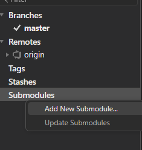
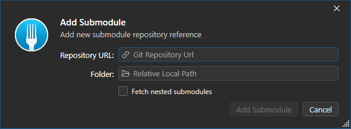
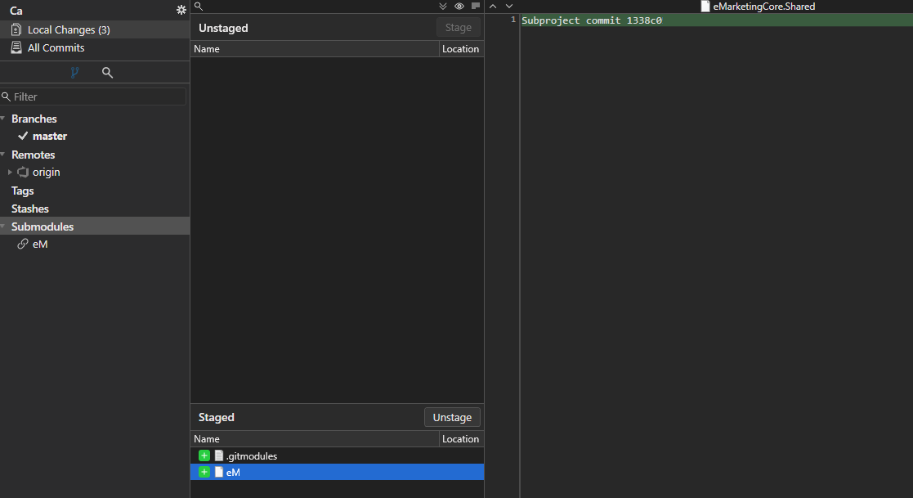
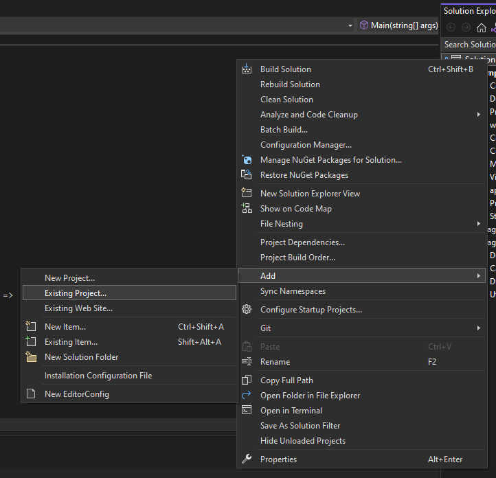
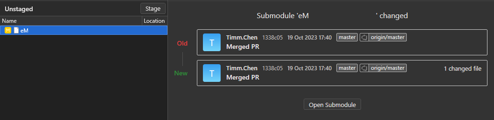
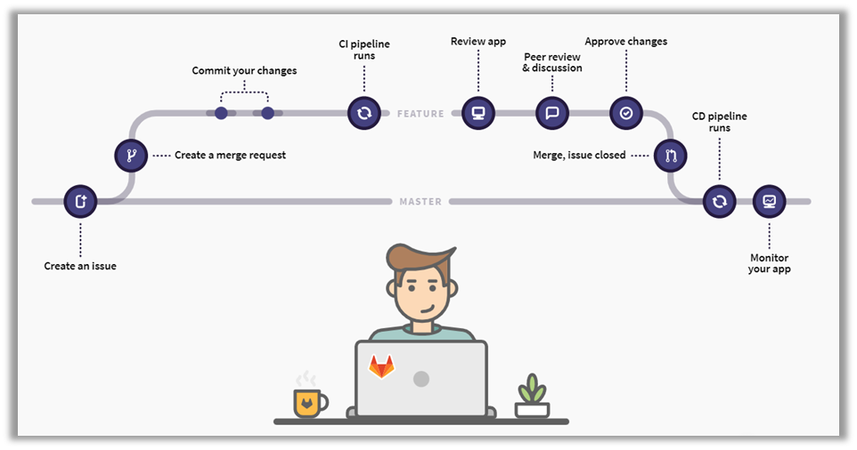

# GIT

## 使用工具

* Fork
* SourceTree
* Visual Studio

## **GIT初始化步驟：**  

1. 建立帳戶：註冊GitHub或Azure帳戶以進行雲端儲存 
2. 下載與安裝：Git、SourceTree(圖形化版本控制好用)、TortoiseGIT(解版本衝突與確認檔案狀態好用) 
3. 建立Repository：以GitHub、SourceTree其一建立Repository 
4. 連結Repository：使用SourceTree Clone，指定路徑進行資料夾同步 
5. 建立專案：以Visual Studio建立Web Project (.net framework MVC) 
6. 設定GIT忽略清單： 
   使用者操作設定、快取、log等常變動且不影響之檔案應排除同步，另外packages資料夾也應納入忽略清單(新版VS可Automatic Package Restore，應忽略Package資料夾以避免衝突)  
    METHOD 1 : 手動新增 .gitignore 檔案 (參考gitignore頁面) 以忽略不須同步之檔案  
    METHOD 2 : 以SourceTree在Stage頁面選取要忽略之檔案進行ignore (資料夾)  
    ※bin資料夾是否須忽略目前未知  
7. 提交同步：進行stage + Commit，再Push到雲端，並確認Stage Line中是否有未忽略的檔案  
!! 請注意：已經commit之檔案無法進行忽略，務必在commit前確認新增檔案(?圖標者)   

## **GIT版控注意事項：**  

**1. 還原Commit：**  
   於欲還原到的Commit節點右鍵  
   -> Reset Current branch to this commit  
   ->　(1) 完全還原(放棄重來)：Using mode "HARD"  
   　　　　-> 從"還原點"到"最新點"的所有local commit將被消除，且所有檔案變更將刪除  
   　　(2) 混和還原(重整節點)：Using mode "mixed"   
   　　　　-> 從"還原點"到"最新點"的所有local commit將被消除，但現有檔案不更動(新改變的部分會變成uncommit changes)  
  **※務必於push前還原(即local commit)，否則雲端無法修改**  
  ※僅放棄檔案變更：於 File Status 選取欲放棄之檔案 -> Discard   

**2. 同一 Branch 同時多人編輯：**  
   先commit並push者無影響，後commit者會因先commit者版本更新而需要merge branch，以下為後commit者須進行  
   -> 務必將所有變更stage並commit (commit 1)  
   -> 先pull commit (務必於push前先pull)  
   -> 選擇Branch merged...  
   -> 待自動merge branch並產生新commit (commit 2)  
   -> 直接push兩個commit  
   ※也可使用Fetch(類似Pull)，但其不包含3.4步的自動merge branch功能   

**3. 分支Branch：**

* 於BRANCHES的分支點兩下即可切換分支 (會自動更改檔案)  
* 新增Branch：  
   於欲生分支的Commit右鍵  
   1. Branch...
   2. 命名新branch並送出
   3. 在下次Commit時選擇新branch再push
       * 請先新增branch再push，反過來會吃不到新branch
       * branch需新增到remote才能在雲端儲存
       * Brancha命名可透過XXX/OOO的方式，作為簡單的資料夾分類
* 合併Branch:  
   於欲合併的"主線節點"點選Merge  
   -> 開啟合併頁面，選擇欲合併的"支線節點"
   -> Merge後，再Push合併後的節點即可
* Fast forward:  
   Merge時，如果被Target Branch僅是主Branch的更新版本(即主Branch無改動)，則會愈預設會觸發Fast forward，將主Branch更新跟Target Branch一樣，就不會新增commit (也可設定force commit不使用Fast forward)

**4. Cherry Pick:**

* CherryPick可取得另一個Commit的改動，避免Merge的影響
* 同樣要注意Conflict，適合版本較近Commit間同步

## Fork

* 非常適合不同Remote來源間的互相更新
* 設定Remote Origin為主要Repo、自定義名稱Remote為其他Repo，即可決定要從哪個Remote pull or push，非常適合追蹤或自行修改公開Repo到自己的Repo

## Submodule

* 可將共用專案至於單一Git Repo，就可以被其他Repo引用，並可保留版本，避免A專案改Submodule後B專案馬上會失效(可事後再Resolve conflicts)
* 搭配PR鎖定master branch，更可確保Submodule是可以用的狀態
* 缺點: 當改動Submodule時，整體Commit流程會變得較為麻煩；另外，Submodule要查看被相依的狀況也只能一個個到Main Repo去看

1. 以Git Fork軟體為例，於Git專案當中Add new submodule
  
  
  
2. 輸入目標Submodule repo url，並指定放到的子資料夾名稱
  
  

3. 完成後會新增.gitsubmodules檔案，並且記錄第一次的submodule commit id
  

4. 此時Pull下來的Submodule已可被Main Repo專案給Reference

  

5. Submodule的修改細項不會顯示在Main Repo，而是以Commit ID顯示，並可於Submodule Repo當中查看
   
  

6. 修改Submodule但尚未Commit的話，會使Main Repo無法Commit (dirty)，因此可確保Submodule是提交的狀態

## Pull Request

* 屬於本地電腦無法直接Push所需使用的功能，需於線上Git託管平台發出
* 藉由Pull Request Merge Target Branch，整合Approve機制，讓主管或Source code負責人Review、給予建議後，再行Merge
* 可設定Template，提醒特定事項讓開發者發PR前注意
* 可設定PR-CI 觸發Pipeline，搭配Tests可在PR時一同參考結果 (測試失敗直接不給過)
* 可設定Related work item，讓PR跟需求單做關聯 (Azure DevOps)
* 減少一次Review太多的小技巧:
  1. Sub Feature Branch: 在原有Feature Branch中新增Sub Featrue Branch，並且在撰寫告一小段落時，發出PR給Approvers
  2. Draft PR: 在撰寫告一小段落時，針對Feature Branch發出Draft PR，讓Approvers在撰寫時先行給予建議(可分批Push)，並在後續正式要Merge時，再轉為一般PR
* 建議搭配Code convention規範，並可在PR時檢查，作為Reviewer的核准參考

## Strategy

* Git flow
  * 特點: 有develop, master, feature, release, hotfix等分支，較為嚴謹
  * 缺點: 需要經常merge，且分支較多，容易混亂

* Github flow
  * 特點: 只有master, feature, hotfix等分支，適合小型專案
  * 缺點: 沒有develop分支，無法區分開發中與已完成的版本

* Gitlab flow

  * 特點: 有master, feature, hotfix, release等分支，類似Github flow的變形
  * 撇不: 搭配master branch鎖定PR，可以較好控管版本與merge的頻率、並強制要求團隊成員互相理解!
  
