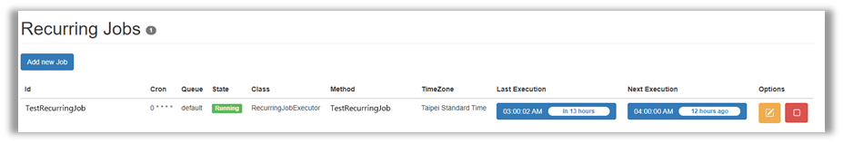

# Hangfire筆記
#### 官網: https://www.hangfire.io 

#### 簡介:
以.Net為基礎的Job管理架構，輕量化、好用的Dashboard、高擴展性，讓排程佈署與監控更簡單


#### 使用心得:
* 優點
  * 以Website為基礎，搭配UI簡化Job佈署流程、個人電腦可隨時監控 (須注意設定Always On避免背景執行中斷)
  * Dashboard簡單明瞭，易於監控；可使用UI查詢Job Exception內容
  * 資料儲存於Database，較不受Server影響、便於備份、可多伺服器執行
  * 可客製的自動Retry機制、自動刪除紀錄等，搭配Logger更便於監控
* 缺點
  * 須理解Cron排程格式 (可靠UI Extension生成)
  * 無Disable功能，僅有刪除，需安裝Extension或自行客製
  * Job與站台的相依性共用，如有Library更新將影響所有排程
  * 須注意站台須Always On，避免排程無法執行
  * 客製化較花時間，需花上更多心力建置站台

#### 安裝筆記 (.Net Core 5)
1. 安裝Nuget Packages
```
dotnet add package Hangfire.Core
dotnet add package Hangfire.SqlServer
```
2. 註冊服務與Configuration (參考官網[文件](https://docs.hangfire.io/en/latest/getting-started/aspnet-core-applications.html#registering-services))
```
public class Startup
{
    public void ConfigureServices(IServiceCollection services)
    {
        // Add Hangfire services.
        services.AddHangfire(configuration => configuration
            .SetDataCompatibilityLevel(CompatibilityLevel.Version_170)
            .UseSimpleAssemblyNameTypeSerializer()
            .UseRecommendedSerializerSettings()
            .UseSqlServerStorage(Configuration.GetConnectionString("HangfireConnection"), new SqlServerStorageOptions
            {
                CommandBatchMaxTimeout = TimeSpan.FromMinutes(5),
                SlidingInvisibilityTimeout = TimeSpan.FromMinutes(5),
                QueuePollInterval = TimeSpan.Zero,
                UseRecommendedIsolationLevel = true,
                DisableGlobalLocks = true
            }));
    
        // Add the processing server as IHostedService
        services.AddHangfireServer();
    
        // Add framework services.
        services.AddMvc();
    }
}
```
```
public class Startup
{
    public void Configure(IApplicationBuilder app, IBackgroundJobClient backgroundJobs, IHostingEnvironment env)
    {
        // ...
        app.UseHangfireDashboard();
        backgroundJobs.Enqueue(() => Console.WriteLine("Hello world from Hangfire!"));
    
        app.UseMvc(routes =>
        {
            routes.MapRoute(
                name: "default",
                template: "{controller=Home}/{action=Index}/{id?}");
        });
        // ...
    }
}
```
3. 客製化設定舉例
  * 延長Log封存期限
```
public class Startup
{
    public void Configure(IApplicationBuilder app, IWebHostEnvironment env)
    {
        // ...
        GlobalJobFilters.Filters.Add(new ProlongExpirationTimeAttribute(new TimeSpan(180, 0, 0, 0)));
        // ...
    }
}

public class ProlongExpirationTimeAttribute : JobFilterAttribute, IApplyStateFilter
{
    private readonly TimeSpan _expirationTime;

    public ProlongExpirationTimeAttribute(TimeSpan expirationTime)
    {
        _expirationTime = expirationTime;
    }

    public void OnStateApplied(ApplyStateContext context, IWriteOnlyTransaction transaction)
    {
        context.JobExpirationTimeout = _expirationTime; // Set to custom expiration timeout
    }

    public void OnStateUnapplied(ApplyStateContext context, IWriteOnlyTransaction transaction)
    {
        context.JobExpirationTimeout = _expirationTime; // Set to custom expiration timeout
    }
}
```
  * 更改Retry次數與間隔
```
public class Startup
{
    public void Configure(IApplicationBuilder app, IWebHostEnvironment env)
    {
        // ...
        GlobalJobFilters.Filters.Add(new AutomaticRetryAttribute()
        {
             Attempts = 3,  // Default is 10
             DelaysInSeconds = new int[] {15, 30, 60}
        });
        // ...
    }
}
```
  * 安裝RecurringJobAdmin擴充套件，可使用UI添加新排程、Disable排程等
  ```
  services.AddHangfire(configuration =>
            configuration
                /*...*/
                .UseRecurringJobAdmin(typeof(Startup).Assembly));
  ```



#### 進階擴充
##### Custom State (客製化狀態)
待補充...
##### Custom Page (客製化列表)
待補充...
##### Job Parameters (客製化參數)
待補充...
##### State Filter (切換狀態動作)
待補充...
