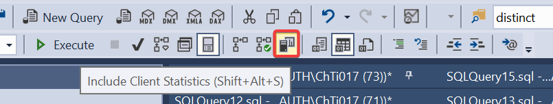

# SQL server指令
|[**行為**<br>(CRUD)](#行為)|[**來源**](#來源)|[**操作**](#操作) |[**特殊動作**](#特殊動作)|[**技巧**](#技巧)|
|:--:|:--:|:--:|:--:|:--:|
|[SELECT](#SELECT) <br> [INSERT](#INSERT) <br> [UPDATE](#UPDATE) <br> [DELETE](#DELETE) <br> |[FROM](#FROM) <br> [JOIN](#JOIN) <br> [PIVOT](#PIVOT) <br> |[WHERE](#WHERE) <br> [GROUP](#GROUP) <br> [HAVING](#HAVING) <br> [ORDER](#ORDER) <br> [UNION](#UNION) <br> |[CREATE 新增表格](#CREATE-TABLE) <br> [ALTER 修改表格](#ALTER-TABLE) <br> [DROP 刪除表格](#DROP-TABLE) <br> [TRUNCATE 重置表格](#TRUNCATE-TABLE) <br> | [WITH 子查詢(多層簡化)](#WITH) <br> [OVER 分組處理](#OVER) <br> [DATETIME 時間操作](#DATETIME-時間操作) <br> [Identity 自動流水號](#Identity-自動流水號) <br> [Primary KEY 主索引鍵](#Primary-Key-設定主索引鍵) <br> [取得欄位重複row數量](#取得欄位重複row數量) <br> [取得DB資訊](#取得DB資訊) <br> [DECLARE 臨時變數](#宣告臨時變數) <br>  [其他](#其他) <br> |

- [SQL server指令](#sql-server指令)
  - [行為 (CRUD)](#行為-crud)
    - [SELECT](#select)
    - [INSERT](#insert)
    - [UPDATE](#update)
    - [DELETE](#delete)
    - [MERGE](#merge)
  - [來源](#來源)
    - [FROM](#from)
    - [JOIN](#join)
    - [PIVOT](#pivot)
    - [UNPIVOT](#unpivot)
  - [操作](#操作)
    - [WHERE](#where)
    - [GROUP](#group)
    - [HAVING](#having)
    - [ORDER](#order)
    - [UNION](#union)
  - [特殊動作](#特殊動作)
    - [CREATE TABLE](#create-table)
    - [ALTER TABLE](#alter-table)
      - [\* 新增欄(Col) ](#-新增欄col-)
      - [\* 刪除欄(Col)](#-刪除欄col)
      - [\* 新增PK](#-新增pk)
      - [\*](#)
    - [DROP TABLE](#drop-table)
    - [TRUNCATE TABLE](#truncate-table)
    - [Stored Procedure](#stored-procedure)
    - [View](#view)
  - [技巧](#技巧)
    - [WITH](#with)
    - [OVER](#over)
    - [DATETIME 時間操作](#datetime-時間操作)
      - [相關函式](#相關函式)
      - [切換最小單位](#切換最小單位)
        - [(EX: YYYY/MM/DD 12:34 → YYYY/MM/DD 00:00)](#ex-yyyymmdd-1234--yyyymmdd-0000)
    - [SCOPE\_IDENTITY](#scope_identity)
  - [Constraint](#constraint)
    - [Identity 自動流水號欄](#identity-自動流水號欄)
    - [Primary Key 設定主索引鍵](#primary-key-設定主索引鍵)
    - [Foreign Key 設定外鍵](#foreign-key-設定外鍵)
    - [UNIQUE 不重複欄位](#unique-不重複欄位)
    - [INDEX 索引](#index-索引)
    - [FILTERED INDEX 過濾索引](#filtered-index-過濾索引)
    - [CHECK 約束](#check-約束)
  - [常用語法彙整](#常用語法彙整)
    - [取得欄位重複row數量](#取得欄位重複row數量)
    - [取得DB資訊](#取得db資訊)
    - [宣告臨時變數](#宣告臨時變數)
    - [轉置合併多欄為單格(FOR XML PATH)](#轉置合併多欄為單格for-xml-path)
    - [查詢特定Talbe.Column的所有Reference狀況](#查詢特定talbecolumn的所有reference狀況)
    - [編碼](#編碼)
      - [查詢編碼](#查詢編碼)
      - [變更編碼](#變更編碼)
      - [跨編碼Join](#跨編碼join)
  - [Monitor](#monitor)
  - [效能](#效能)
  - [其他](#其他)
    - [函數：](#函數)
    - [運算：](#運算)
    - [注意事項:](#注意事項)
    - [陷阱:](#陷阱)
    - [規範:](#規範)
  - [筆記](#筆記)
    - [Tables](#tables)
    - [Collation 資料庫定序](#collation-資料庫定序)


## 行為 (CRUD)
### SELECT

```SQL
SELECT *                          /* 全選 */
SELECT [Col1], [Col2], ...        /* 多選 */
SELECT DISTINCT [Col1]                    /* Col1中只取不重複項 */
SELECT DISTINCT [Col1], [Col2]            /* Col1不重複取，Col2不變 */
SELECT CASE WHEN () THEN () ELSE () END   /* IF條件式判斷 */
SELECT CASE a.Country WHEN ('TW') THEN ('Taiwan') WHEN ('JP') THEN ('Japan') ... END   /* IF條件式判斷(取代值) */
SELECT REPLACE( [Col1], '原字串', '新字串' ) AS 'MyCol1'  /* 取代字串並定義新Col */
/* 取代字串可為：CHAR(9)->Tab、CHAR(10)->換行、CHAR(9)->ENTER */
SELECT ISNULL(a.Col2, b.Col2) AS 'MyCol2' FROM (...) b   /* 可在AS時也用From去多抓資料 */
SELECT * INTO [NewTable] FROM [OldTable]    /* 創新表並匯入資料 */
```

- TOP
  - 選取頭幾筆資料

```SQL
SELECT TOP 3 *
FROM MyTable
ORDER BY MyDate
```

- WITH TIES
  - 搭配TOP使用，將有重複的資料連同顯示 (可有限度超越TOP的限制)

```SQL
SELECT TOP 3 *
  WITH TIES
FROM MyTable
ORDER BY MyDate
```


### INSERT

```SQL
INSERT INTO [DataBase]
             ( [Col1], [Col2], ... )
       VALUES( '001', '002', ... ),
             ( '001-2', '002-2', ... )
           
INSERT INTO [Destination]
SELECT colA, colB, colC
FROM   [SourceDbTable]
```

### UPDATE 
* 一般用法

    ```SQL
    /* Update的目標一定要存在，不可null */
    UPDATE [DataBase]
    SET [Col1]='001', [Col2]='002', ...
    WHERE ...
    ```
    
* 搭配SELECT & WHERE使用

    ```SQL
    UPDATE TestTable1
    SET Row2 = t.Row2
    FROM (
        SELECT '1' AS Row1, 'Timmy' As Row2
        UNION
        SELECT '1' AS Row1, 'Tim' As Row2
    ) t
    WHERE TestTable1.Row1 = t.Row1
    ```
    
    ※多筆符合則會update select的最後一筆資料


### DELETE 

```SQL
DELETE FROM [DataBase] 
WHERE ...
```

### MERGE

## 來源
### FROM

```SQL
/* 命名此來源為a (AS可略) */
FROM [DataBase] AS a
    
/* nolock防止SQL表鎖住(WITH可略) */
-- 僅限SELECT使用，可提升讀取速度、防止其他寫入行為失敗，但可能讀取到transaction即時更新的未完整資料
FROM [DataBase] AS a WITH (nolock)

/* Text作為來源 */
FROM (VALUES (1, 'John'), (2, 'Mary')) AS a (Id, Name)
```

### JOIN

```SQL
INNER JOIN [DataBase2] AS b       /* 被JOIN的表為b */
        ON a.[Col1] = b.[Col2]    /* 當a表Col1等於b表Col2時，取聯集 */
```

* JOIN類別：

    ```SQL
    INNER JOIN                /* 兩表皆不可JOIN有null之列 */
    ```
    
    ```SQL
    LEFT JOIN                 /* a表不變，b表可允許JOIN有null之列 */
    
    LEFT JOIN                 /* a表去除含b表之列 */
        WHERE b.[Col2] IS NULL
    ```
    
    ```SQL
    RIGHT JOIN                /* b表不變，a表可允許JOIN有null之列 */
    
    RIGHT JOIN                /* b表去除含a表之列 */
         WHERE a.[Col1] IS NULL   
    ```
    
    ```SQL
    FULL OUTER JOIN           /* 兩表皆不變，皆可允許JOIN有null之列 */
    
    FULL OUTER JOIN           /* 兩表只取互不包含之列 */
              WHERE a.[Col1] IS NULL     /* a或b皆可 */
    ```

 <br>
[Reference](https://dsin.wordpress.com/2013/03/16/sql-join-cheat-sheet/)

### PIVOT
轉置資料(PIVOT/UNPIVOT)

```SQL
SELECT ID, AVG(Score) AS Average_Score   
FROM DBTable
GROUP BY ID
```

|ID|Average_Score|
|--|--|
|1|60|
|3|100|

```SQL
SELECT 'Average_Score' AS ID, [1], [2], [3]
FROM  
(SELECT ID, Score   
    FROM DBTable) AS SourceTable  
PIVOT   --/UNPIVOT
(
AVG(Score)          // 目標值
FOR ID              // GROUP BY對象
IN ([0], [1], [2])  // 轉置後指定資料，值可直接抓
) AS PivotTable;  
```

|ID|1|2|3|
|--|--|--|--|
|Average_Score|60|NULL|100|

### UNPIVOT

* 可透過反轉置，將多個Column轉為Rows資料 (適合做複雜join多個Column時使用)

```SQL
SELECT StudentId, Subject, Score
FROM
(
    SELECT *
    FROM ClassScores
) AS t
UNPIVOT
(
    Score For Subject in (Math, Science, English, Chinese, Society)
) AS unpvt
Where StudentId = @StudentId
```


## 操作
### WHERE

```SQL
/* 括號內可優先處理邏輯 */
WHERE (Col1 = 123 OR Col1 like '%123_')   /* like可搜尋字串contains、%代表任何可有可無字元、_代表指定字元數量 */
      AND Col1 is not null                /* is null */
      
WHERE Col1 in ('con1', 'con2')            /* 過濾多條件 */
WHERE Col1 in (SELECT...)                 /* 也可以用SELECT後的rows直接套進去多條件 */
WHERE EXISTS (SELECT * FROM ... b WHERE a.Col1 = b.Id) /* EXISTS效能較In Select好 */
WHERE Col2 BETWEEN 0 AND 100              /* between兩值之間 */
WHERE Col3 like N'%某非英文條件%'           /* 尋找相似字詞，N代表unicode(可存取非英文字元)、%代表任意值 */
WHERE LEFT(Col3, 3) <> '123'              /* 字串左3個"不等於"123 */ 
WHERE DateCol BETWEEN '2020-07-10 00:00:00' AND '2020-07-11 00:00:00' /* 在某個時間區間內 */
```

目標函式：`LEFT(*, n)` `RIGHT(*, n)` `ISNULL(*, '')`(取代null為'')    <br>
判斷符： `<>` `like '%XXX_'` `is not null` `BETWEEN * AND *`  <br>

### GROUP

```SQL
/* 以Goods為組別，進行同組別計算 */
SELECT [Goods], SUM([Count])
FROM [DB]
GROUP BY Goods

-- 如果要細分更多層組別，可GROUP BY多個類別
SELECT [Goods], [Season], SUM([Count])
FROM [DB]
GROUP BY Goods, Seaso
-- 此例即可列出各Goods在各Season的總和
```

### HAVING

```SQL
SELECT [Goods], SUM([Count]) as CountSum
FROM [DB]
GROUP BY Goods
HAVING CountSum > 100      /* 當函數結果需要篩選時，使用HAVING並置底 */
```

### ORDER

```SQL
ORDER BY Col1 DESC        /* ASC為升冪 */
```

### UNION

```SQL
/* 合併同格式表(rbind)，並合併重複資料 */
(SELECT...)
UNION
(SELECT...)

/* 合併同格式表(rbind)，不管有無重複資料 */
(SELECT...)
UNION ALL
(SELECT...)
```

<br>

## 特殊動作

### CREATE TABLE
**新增表格**

```SQL
CREATE TABLE NewTableName
(ColName1 char(5) NULL,
 ColName2 varchar(10) NULL,
 ColName3 int IDENTITY(1,1) NOT NULL  ...)
 
 --從現有表格複製
SELECT *
INTO New_Table_Name
FROM Old_Table_Name

--創表格並可設定新欄位
CREATE TABLE NEW_TBL AS
SELECT Col1, Col2, Col3, 'Newcol' as Col4
FROM OLD_TBL;
```
 
### ALTER TABLE
**修改表格**
#### * 新增欄(Col) <br>

```SQL
ALTER [DB]
ADD NewColName nvarchar(50) NULL  /* 第二欄為欄位格式 */
ALTER COLUMN ExistingColName bit NOT NULL /* 更改現有欄位 */
RENAME COLUMN OldColumnName TO NewColumnName
```

| 資料類型(n=Int\|max) | 意義 | 占用資源 | 
| --- | --- | --- | 
|`char(n)` | 指定n字元  | byte| 
|`nchar(n)` | 指定n字元+萬國編碼| byte\*2| 
|`varchar(n)` | 可變動n字元內| +2byte| 
|`nvarchar(n)` | 可變動n字元內+萬國編碼| byte\*2+2| 

`int` `smallint` `date` `datetime` `bit` ``<br> <br>

#### * 刪除欄(Col)

```SQL
ALTER [DB]
DROP 'OldColName'
```

#### * 新增PK
```
ALTER TABLE MY_TABLE
ADD PRIMARY KEY (ROW_ID);
```

#### * 

### DROP TABLE
**刪除表格**

```SQL
DROP TABLE OldTableName
```

### TRUNCATE TABLE
**重置表格** <br>
相比delete效能較佳，能刪除該表所有資料，並重置識別編號，但會保留資料表結構及其欄位、條件約束、索引等

```SQL
TRUNCATE TABLE OldTableName
```

### Stored Procedure

可於SSMS查看與自動產生SP建立SQL


* Create/Alter SP

```SQL
CREATE PROCEDURE SP_SAMPLE
	-- Add the parameters for the stored procedure here
  @PAR1 int,
  @PAR2 nvarchar(100)
AS
BEGIN
	-- SET NOCOUNT ON added to prevent extra result sets from
	-- interfering with SELECT statements.
	SET NOCOUNT ON;

    -- Insert statements for procedure here
	SELECT @PAR1, @PAR2
END
GO

```

* Run SP
  * 參數用,分隔
  * 結束指令需加入符號;

```SQL
EXEC SP_SAMPLE 1, 'Inputs';
```

### View

建立不須建立Table的即時檢視表

```SQL
CREATE VIEW EmployeeView AS
SELECT EmployeeName, EmployeeEmail
FROM Employees;
```

- No lock

View也可以讓原表直接做no lock

```SQL
SELECT *
FROM EmployeeView WITH (NOLOCK)
```

- Update

View也可以直接更新原表columns (限制: 僅限只get單一table的view)

```SQL
UPDATE EmployeeView
SET EmployeeEmail = 'newemail@example.com'
WHERE EmployeeName = 'John Doe';
```

- Index

View也可建立Index提升查詢效能，參考Index區塊


 <br> <br>
## 技巧
### WITH
**子查詢 (多層簡化-可優先查詢)**

```SQL
/* 需置於整個SQL最前頭處 */
WITH  MyTable AS (SELECT...),
      MyTable2 AS (SELECT...)
/* 供以下使用 */
SELECT a.[Col1] b.[Col2] c.[Col3]
FROM [DataBase] a
LEFT JOIN MyTable b ON ...
LEFT JOIN MyTable2 c ON ...
```

相當於多層語法

```SQL
SELECT a.[Col1] b.[Col2] c.[Col3]
FROM [DataBase] a
LEFT JOIN (SELECT...) b ON ...
LEFT JOIN (SELECT...) c ON ...
```


### OVER
**分組處理 (可用於pick組別中最新者、組別加總或計數等)**
* 分組新增序號

```SQL
SELECT [Goods], [Count], [Date],

       ROW_NUMBER() OVER (PARTITION BY [Goods]      /* [Goods]中分割成各群組；ROW_NUMBER() 為新增序號 */
                              ORDER BY [Date] DESC) /* 各群組中再依據[Date]進行排序 */
                      AS ROW_NUM
```

結果如下： 

| Goods | Count | Date | ROW_NUM |
| --- | --- | --- | --- |
| 1 | 666 | 20190101 | 1 |
| 1 | 300 | 20180101 | 2 |
| 1 | 123 | 20170101 | 3 |
| 2 | 1 | 20190101 | 1 |
| 2 | 0 | 20180101 | 2 |

(最後加入`HAVING ROW_NUM=1`即可得各分組最新資料) <br>

* 分組加總

```SQL
SELECT [Goods],

       SUM(Count) OVER (PARTITION BY [Goods])      /* [Goods]中分割成各群組，並進行[Count]的SUM加總 */
                      AS SUM_Count                 /* SUM COUNT AVG  MAX MIN 等函數皆可以使用 */
```

結果如下： 

| Goods | SUM_Count |
| --- | --- |
| 1 |1089 |
| 2 | 1 |

### DATETIME 時間操作
#### 相關函式
取得日期參數 <br>
`YEAR()` `MONTH()` `DAY()` <br>
指定日期格式 <br>
`'2020-01-01 00:00:00'`

#### 切換最小單位
##### (EX: YYYY/MM/DD 12:34 → YYYY/MM/DD 00:00)
適用於計算單日/單月/單年的COUNT、SUM等

```SQL
dateadd(day,0,datediff(day,0, myDate))  
-- datediff計算julian date到myDate之間的"天數"
-- dateadd將這些"天數"從julian date加回來 (即取到00:00)
```

### SCOPE_IDENTITY

取得目前scope中最後一筆insert的identity column value (比如guid, identity)

```SQL
INSERT INTO Employee (Name, Phone) VALUES ('John', 0000)
// ...
SELECT @NewEmployeeId = SCOPE_IDENTITY()
```

## Constraint 

### Identity 自動流水號欄
`資料表右鍵` → `設計` → `點選目標欄` → `識別規格` → `(為識別) 是` → `種子、增量設為1` → `儲存`  <br>
此欄之後新增皆會+1，成為流水號 <br>

```SQL
CREATE TABLE NewTableName
(ColName int IDENTITY(1,1) NOT NULL)
```

* 對此欄位強制寫入資料時，須開啟Identity insert

```SQL
SET IDENTITY_INSERT dbo.MyTable ON;
INSERT INTO dbo.MyTable (IdentityCol) VALUES (3)
...
SET IDENTITY_INSERT dbo.MyTable OFF;
```

### Primary Key 設定主索引鍵
`資料表右鍵` → `設計` → `點選目標欄` → `(右鍵) 設定主索引鍵`  <br>
此欄會成為主索引(primary key)，為非null且不重複 <br>

```SQL
ALTER TABLE MyTable
ADD PRIMARY KEY (TargetColumn);
```


### Foreign Key 設定外鍵
限定該欄位只能為其他表的Primary Key，
適合用於指定Join其他表的情境

```SQL
USE MY_DATABASE;   
GO  
ALTER TABLE MY_TABLE
ADD CONSTRAINT FK_MYTABLE_MYCOLUMN_TABLE2_COL2
FOREIGN KEY (MY_COLUMN) REFERENCES TABLE2(COL2)
ON UPDATE CASCADE;    --連動更新
ON DELETE CASCADE;    --連動刪除
GO
```

※ 設定Update/Delete "cascade"可連動更新關聯的表! (須從源頭表更新，注意reference衝突時會無法設定)</br>


### UNIQUE 不重複欄位
限制該欄位不可寫入重複資料

```SQL
USE MY_DATABASE;   
GO  
ALTER TABLE MY_TABLE   
ADD CONSTRAINT UC_MYTABLE_MYCOLUMN UNIQUE (MY_COLUMN);   
GO  
```

### INDEX 索引

* Clusterd: Index順序與資料順序相同，不須額外儲存索引資料 (Query效能較佳)，一張表只能有一個(適合如Sequence序列資料)
* Non-Clustered: Index順序與資料順序不相關，需額外儲存索引資料、但不須重新排序(寫入效能較佳)，一張表可多個
* 延伸閱讀: Index原理與Page split - [GUID 叢集索引測試 2：索引碎片化分析與資料表虛胖問題](https://blog.darkthread.net/blog/guid-clust-idx-frag-n-space/)


```SQL
CREATE NONCLUSTERED INDEX IX__MY_TABLE__MY_COL ON MY_TABLE(MY_COL)

-- 查找MY_COL2 LIST時，可提升效能與避免來回查找
CREATE NONCLUSTERED INDEX IX__MY_TABLE__MY_COL ON MY_TABLE(MY_COL) INCLUDE (MY_COL_2)
```

* Index View
  * 必有`WITH SCHEMABINDING`
  * Reference View必須也要SchemaBinding
  * 限制
    * 同一個DB
    * view語法限制: 不能使用OUTER JOIN、UNION、TOP、COUNT、MIN、MAX、HAVING、SUBQUERY
    * 型別限制: 僅限text、ntext、image、xml

```SQL
CREATE VIEW EmployeeView WITH SCHEMABINDING AS
SELECT 
    EmployeeID, 
    EmployeeName, 
    DepartmentID, 
    HireDate
FROM 
    dbo.Employees;

CREATE UNIQUE CLUSTERED INDEX IX_EmployeeView ON dbo.EmployeeView (EmployeeID);
```

### FILTERED INDEX 過濾索引

* 同時包含UNIQUE & INDEX的功能，可以只在特定條件觸發UNIQUE

```SQL
CREATE UNIQUE INDEX UX_MyTable_ColumnA_Conditional
ON MyTable(ColumnA)
WHERE ColumnB = 0;
```

### CHECK 約束

* 檢查輸入值，限制特定範圍

```SQL
ALTER TABLE MyTable
ADD CONSTRAINT CHK_Status CHECK (Status IN ('Active', 'Inactive', 'Pending'));
```

 
## 常用語法彙整
### 取得欄位重複row數量

```SQL
SELECT Name, Grade, COUNT(*)
FROM TABLE
GROUP BY Name, Grade 
HAVING COUNT(*) > 2
```

可找出重複的ROW的資訊 <br>

### 取得DB資訊

```SQL
-- 取得TABLE列表
  SELECT *
  FROM INFORMATION_SCHEMA.TABLES
  
-- 取得Column資訊
  SELECT *
  FROM INFORMATION_SCHEMA.COLUMNS
  WHERE TABLE_NAME = 'M'
```

### 宣告臨時變數
DECLARE

```SQL
DECLARE @VAR_NAME, ...

-- 之後語法就可以直接使用@VAR_NAME
```

### 轉置合併多欄為單格(FOR XML PATH)
|Gender|Student_Name|
|--|--|
|Male|Timm|
|Female|Vivian|
|Femail|Ariel|

|Gender|Student_Count|Student_Name_List|
|--|--|--|
|Male|1|Timm|
|Female|2|Vivian,Ariel|

```SQL
WITH Student_Gender_Name AS (
	SELECT Gender, Student_Name
	FROM Student_Gender
)
SELECT t.Gender, COUNT(*) AS Student_Count,
	STUFF(  (SELECT DISTINCT ',' + b.Student_Name
	         FROM Student_Gender_Name b
           WHERE a.Gender = b.Gender
           FOR XML PATH (''))  , 1, 1, '') AS Student_Name_List
FROM (
	SELECT *
	FROM Student_Gender_Name a
) as t
group by t.Gender
```

※ STUFF(targetColumn, startCharNum, charLength, replaceChar)為中間插入/取代的用法，此處用於移除第一個字元','

### 查詢特定Talbe.Column的所有Reference狀況

```SQL
SELECT sys.objects.object_id,
       sys.schemas.name AS [Schema],
       sys.objects.name AS Object_Name,
       sys.objects.type_desc AS [Type]
FROM sys.sql_modules
INNER JOIN sys.objects ON sys.sql_modules.object_id = sys.objects.object_id
INNER JOIN sys.schemas ON sys.objects.schema_id = sys.schemas.schema_id
WHERE sys.sql_modules.definition COLLATE SQL_Latin1_General_CP1_CI_AS LIKE '%{TABLE_NAME} %'
AND  sys.sql_modules.definition COLLATE SQL_Latin1_General_CP1_CI_AS LIKE '%{COLUMN_NAME}%'
ORDER BY sys.objects.type_desc, sys.schemas.name, sys.objects.name;
```

* 巢狀查詢

  ```SQL
  CREATE TABLE #Results (object_id　INT, [Schema]　varchar(300), Object_Name varchar(300), [Type] varchar(300));

  DECLARE @PAR_NAME VARCHAR(255)
  DECLARE @SEARCH_TABLE VARCHAR(255) = 'TABLE_NAME'
  DECLARE @SEARCH_COLUMN VARCHAR(255) = 'COLUMN_NAME'

  DECLARE cursor_name CURSOR FOR
  SELECT sys.objects.name AS Object_Name
  FROM sys.sql_modules
  INNER JOIN sys.objects ON sys.sql_modules.object_id = sys.objects.object_id
  INNER JOIN sys.schemas ON sys.objects.schema_id = sys.schemas.schema_id
  WHERE sys.sql_modules.definition COLLATE SQL_Latin1_General_CP1_CI_AS LIKE '%' + @SEARCH_TABLE +' %'
  AND  sys.sql_modules.definition COLLATE SQL_Latin1_General_CP1_CI_AS LIKE '%' + @SEARCH_COLUMN + '%'

  OPEN cursor_name
  FETCH NEXT FROM cursor_name INTO @PAR_NAME

  WHILE @@FETCH_STATUS = 0
  BEGIN
    INSERT INTO #Results
      EXEC('SELECT sys.objects.object_id,
        sys.schemas.name AS [Schema],
        sys.objects.name AS Object_Name,
        sys.objects.type_desc AS [Type]
  FROM sys.sql_modules
  INNER JOIN sys.objects ON sys.sql_modules.object_id = sys.objects.object_id
  INNER JOIN sys.schemas ON sys.objects.schema_id = sys.schemas.schema_id
  WHERE sys.sql_modules.definition COLLATE SQL_Latin1_General_CP1_CI_AS LIKE ''%' + @PAR_NAME + ' %''
  AND  sys.sql_modules.definition COLLATE SQL_Latin1_General_CP1_CI_AS LIKE ''%' + @SEARCH_COLUMN + '%''')
      
    FETCH NEXT FROM cursor_name INTO @PAR_NAME
  END

  CLOSE cursor_name

  DEALLOCATE cursor_name

  SELECT DISTINCT * FROM #Results ORDER BY Object_Name
  DROP TABLE #Results 
  ```

  ### 編碼

  #### 查詢編碼

  除了Table編碼外，每個Column都可以查詢編碼為何

  ```SQL
  -- method 1
  SELECT TABLE_CATALOG, TABLE_SCHEMA, TABLE_NAME, COLUMN_NAME, COLLATION_NAME
  FROM INFORMATION_SCHEMA.COLUMNS
  WHERE COLUMN_NAME in ('')

  -- method 2
  SELECT SCHEMA_NAME(schema_id) AS SCHEMA_NAME,
	   t.name AS TABLE_NAME,
	   c.name AS COLUMN_NAME,
	   c.collation_name
  FROM SYS.COLUMNS c
  JOIN SYS.TABLES t ON t.object_id = c.object_id
  WHERE c.collation_name is not null
    AND t.name in ('')
  ```

  #### 變更編碼

  分成整個DB跟各自Column，可同時存在如不區分大小寫、語系相容等問題

  ```SQL
  -- Entire database
  ALTER DATABASE MyDataBase COLLATE [NewCollation]

  -- Specific table column
  ALTER TABLE MyTable ALTER COLUMN Column1 [TYPE] COLLATE [NewCollation]
  ```

  #### 跨編碼Join

  不同編碼的Table join會出錯(如大小寫)，可使用以下方法轉換
    * 大小寫要自行選擇case sensitive (CI轉成CS)
    * 或是insensitive (CS轉成CI)

  ```SQL
  SELECT TABLE_1.COLUMN1 COLLATE SQL_Latin1_General_CP1_CI_AS, TABLE_2.COLUMN2
  FROM TABLE_1
  INNER JOIN TABLE_2
      ON (TABLE_1.COLUMN1 COLLATE SQL_Latin1_General_CP1_CI_AS = TABLE_2.COLUMN2)
  ```


## Monitor
* Block關係 (必須有Sa帳戶權限)

    ```SQL
    spwho2
    ```

* Activity Monitor: 資料庫SA帳號，右鍵伺服器選擇Activity Monitor可監控目前的進程
* 即時顯示部分結果: Include live query statistics
* 比較每次跑的時間與主客端的傳輸統計: Include client statistics
  * 
  * 要看SQL的執行效能比較，主要看: Wait Time on Server Replies (前提是網路要穩)
  
* sys.dm_exec_sessions
* sys.dm_exec_session_wait_stats
  * [[SQL SERVER]SQL2016-取得個別session等待統計資料](https://dotblogs.com.tw/ricochen/2016/12/03/085106)

  ```SQL
  SELECT  sql_handle, *
  FROM    sys.dm_exec_session_wait_stats a
  LEFT JOIN sys.dm_exec_sessions b on a.session_id = b.session_id
  LEFT JOIN sys.dm_exec_requests c on a.session_id = c.session_id
  CROSS APPLY sys.dm_exec_sql_text (c.plan_handle) d 
  --CROSS APPLY sys.dm_exec_sql_text (c.sql_handle) d 
  WHERE b.login_name like '%...%'
  ORDER BY wait_time_ms DESC
  ```
  
* Execution Plan
  * 開啟方式: 上方Tools點選"Display estimate/Include actual execution plan"
  * [深入 SQL Parameter Sniffing 與執行計劃效能問題](https://blog.darkthread.net/blog/inside-param-sniffing-n-exec-plan/)
  * 注意Estimate與Action的筆數差異落差大須注意

* 容量查詢 (用於查詢DB容量塞爆問題)
  * 整個DB容量 `sp_spaceused`
  * 每張表使用量
  
  ```SQL
  WITH CAL AS (
    SELECT 
        s.Name AS SchemaName,
        t.NAME AS TableName,
        p.rows AS RowCounts,
        SUM(a.total_pages) * 8 AS TotalSpaceKB, 
        SUM(a.used_pages) * 8 AS UsedSpaceKB, 
        (SUM(a.total_pages) - SUM(a.used_pages)) * 8 AS UnusedSpaceKB
    FROM 
        sys.tables t
    INNER JOIN 
        sys.schemas s ON s.schema_id = t.schema_id
    INNER JOIN      
        sys.indexes i ON t.OBJECT_ID = i.object_id
    INNER JOIN 
        sys.partitions p ON i.object_id = p.OBJECT_ID AND i.index_id = p.index_id
    INNER JOIN 
        sys.allocation_units a ON p.partition_id = a.container_id
    WHERE 
        t.NAME NOT LIKE 'dt%'    -- filter out system tables for diagramming
        AND t.is_ms_shipped = 0
        AND i.OBJECT_ID > 255 
    GROUP BY 
        t.Name, s.Name, p.Rows
    )
    SELECT *, CASE WHEN TotalSpaceKB = 0 THEN 0 ELSE (CAST(UsedSpaceKB AS decimal(20, 2))/TotalSpaceKB*100.0) END AS UsedPercent
    FROM CAL
    ORDER BY UsedSpaceKB DESC
  ```


## 效能

* Index
  * 參考順序性與建立要訣: [黑大文章](https://blog.darkthread.net/blog/index-key-for-or-condition/)

* EXPLAIN
  * 幫助了解Index是否有Hit到

* OPTION (RECOMPILE)
  * 強制查詢時不使用Cache，可用於SSMS Query效能分析，避免受Cache影響而低估運行時間
  * 放在每一個Query的最後面

## 其他
### 函數：
`AVG` `COUNT` `MAX` `MIN` `SUM` <br>
`ISNULL(ColumnName, 'nullToNewString')` `LEFT(ColumnName, n)取得字串左邊n個字` `RIGHT(ColumnName, n)取得字串右邊n個字` <br>
`CHARINDEX('_', Column)取得指定字串位置` `SUBSTRING(ColumnName, start, n)切取start字串後n個字` `LEN(ColumnName)取得字串長度`

### 運算：
`ROUND(ColumnName, n)` 四捨五入n位數 <br>
`CAST(ColumnName AS NewFormat)` 切換變數型態為其他型態 (ex: int → float)

### 注意事項:
1. 使用NOT IN、<>條件，需考慮該欄位是否為NULL，如果為NULL則不會被比較到，注意必須加入ISNULL(XXX, '')來Include進來
2. JOIN ON & JOIN WHERE務必注意使用情境，JOIN ON可以在JOIN前先行篩選好資料(效能較佳)且較能維持原始ROW的數量、JOIN WHERE的資料較為全面(但效能差很多)
3. WHERE中篩選DECLARE參數再去JOIN，對於某些的欄位會出現跑不出來的情況
(e.g. SELECT * FROM TABLE_A a LEFT JOIN TABLE_B b on a.ROW_ID = b.ROW_ID WHERE a.STRANGE_COL = @PAR)

### 陷阱:
* [深入 SQL Parameter Sniffing 與執行計劃效能問題](https://blog.darkthread.net/blog/inside-param-sniffing-n-exec-plan/): SSMS比Web快很多、不同環境執行速度不一樣、換Parameter時又突然變很慢
  * Solution: 縮小簡化SP
  * Debug
    * EXEC sp_recompile SP_XXX
    * `SET ARITHABORT ON`，跑一次SP，再執行`SET ARITHABORT OFF`，再跑一次SP觀察差異
* EXEC SQL string，注意"'"單引號escape問題，要記得`REPLACE(@PARM, '''', '''''')`

### 規範:
1. `SELECT name, type, type_desc FROM sys.objects` 可搜尋DB物件縮寫進行命名規範
2. 排版可使用工具如`PoorMan's TSql Formatter`進行正規化

## 筆記

### Tables

* 列出View Reference Tables

參考[來源](https://stackoverflow.com/questions/7166034/list-of-views-referencing-a-table)

```SQL
SELECT 
referencing_object_name = o.name, 
referencing_object_type_desc = o.type_desc, 
referenced_object_name = referenced_entity_name, 
referenced_object_type_desc = o1.type_desc 
FROM sys.sql_expression_dependencies sed 
INNER JOIN sys.objects o 
ON sed.referencing_id = o.[object_id] 
LEFT OUTER JOIN sys.objects o1 
ON sed.referenced_id = o1.[object_id] 
WHERE o.name like '%YOUR_TABLE_NAME%'
```

* 列出所有Table

```SQL
Use DATABASE_NAME
SELECT TABLE_NAME, TABLE_TYPE FROM INFORMATION_SCHEMA.TABLES a -- WHERE TABLE_TYPE = 'BASE TABLE'
ORDER BY TABLE_TYPE, TABLE_NAME
```

### Collation 資料庫定序

* 列出所有DB的Collation

```SQL
SELECT name, collation_name FROM sys.databases

```

* 列出所有Table & Column的Collation

```SQL
SELECT 'ALTER TABLE' AS 'Alter Table',
  t.Name 'Table Name', 
  'ALTER COLUMN' AS 'Alter Column',
  c.name 'Column Name',
  i.DATA_TYPE + CASE WHEN (i.CHARACTER_MAXIMUM_LENGTH is null) THEN ('')　
	  WHEN (i.CHARACTER_MAXIMUM_LENGTH = -1) THEN ('(MAX)')
	  ELSE ('(' + CAST(i.CHARACTER_MAXIMUM_LENGTH as nvarchar) + ')') END 'Data Type',
  'COLLATE DATABASE_DEFAULT' AS 'Alter to default collation',
  CASE WHEN (i.IS_NULLABLE = 'YES') THEN ('NULL') ELSE ('NOT NULL') END AS 'Nullable',
  c.collation_name 'Original Column Collation'
FROM sys.columns c
INNER JOIN sys.tables t ON c.object_id = t.object_id
LEFT JOIN INFORMATION_SCHEMA.COLUMNS i ON t.name = i.TABLE_NAME AND c.name = i.COLUMN_NAME
WHERE t.is_ms_shipped = 0
ORDER BY c.collation_name
```

* 更改特定Table Column的Collation

```SQL
-- 更改回DB預設
ALTER TABLE [dbo].[TABLE_NAME] ALTER COLUMN <COLUMN_NAME> <COL_TYPE> COLLATE DATABASE_DEFAULT

--更改至任意Collation
ALTER TABLE [dbo].[TABLE_NAME] ALTER COLUMN <COLUMN_NAME> <COL_TYPE> COLLATE <TARGET_COLLATION>
```
