# SonarQube
## 來源碼分析 (漏洞檢查、語法建議)
### 安裝
#### A.	安裝本體
1. 下載[SonarQube](https://www.sonarqube.org/downloads/)專案 (Community)<br>

2. 設定：解壓縮Zip，並更改..\conf\sonar.properties，把sonar.search.port設為0 (預設9001 port可能會被占用)，並把該行的#拿掉
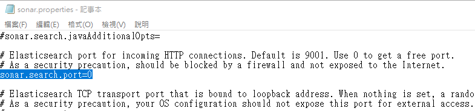<br>

3. 執行..\bin\windows-x86-64\StartSonar.bat (以Windows為例)<br>
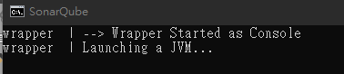<br>

#### B. 設定分析Project
1. 開啟Chrome，輸入http://localhost:9000/ ，輸入預設帳密admin，即可進入到SonarQube網頁<br>
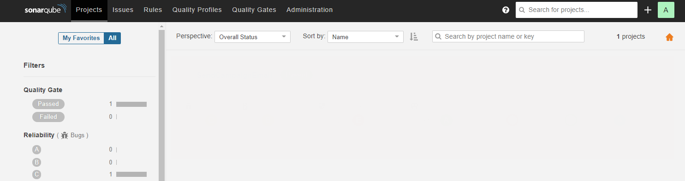<br>

2. 建立分析專案：到Administrator頁籤 → Prjects → Management → Create project<br>
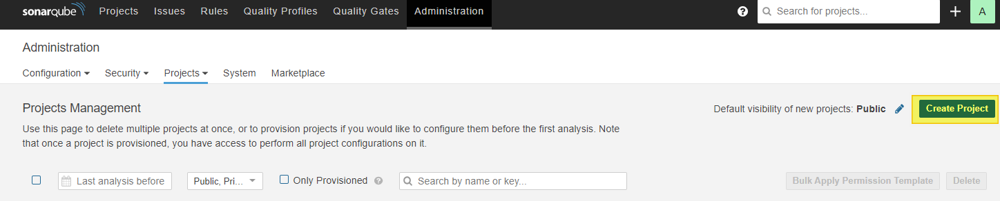<br>

3. 輸入token name名稱，取得實際token <br>
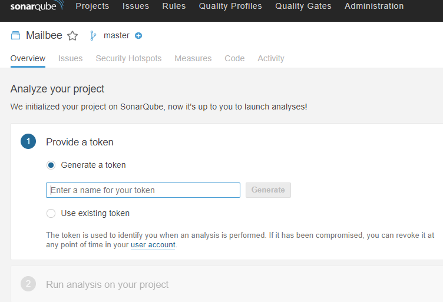<br>

4. 根據要分析的專案類別，選擇相對應的analysis scanner跟著步驟進行安裝 <br>
<br>

#### C.	安裝Sonar scanner (以[.net專案安裝](https://docs.sonarqube.org/latest/analysis/scan/sonarscanner-for-msbuild/)為例)
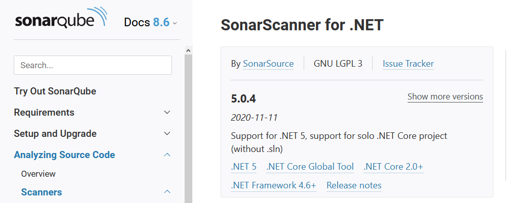<br>

1. Sonar scanner必要環境：[Build tools for Visual Studio](https://visualstudio.microsoft.com/zh-hant/downloads/) (從VS安裝程式安裝)<br>

2. 根據自己的專案版本(.net framework, .net core…)下載Sonar scanner的Zip檔，解壓縮後，把主要資料夾路徑加入system環境變數<br>
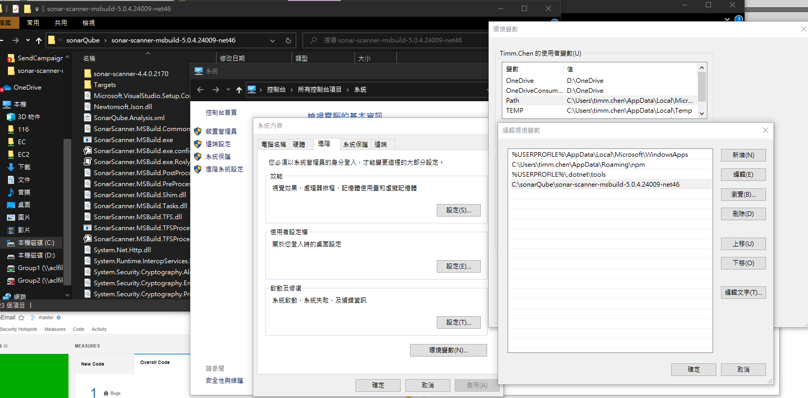<br>

3. 設定sonar scanner folder檔案： ../SonarQube.Analysis.xml，把裡面的sonar.login property更改為剛才取得的token，並把該區塊的<!-- -->註解拿掉
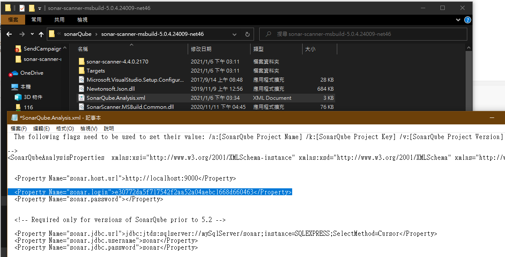<br>

4. 跟著SonarQube本體的最後步驟，在欲分析的.sln專案目錄下，在url列輸入cmd，並輸入從SonarQube取得的以下指令：
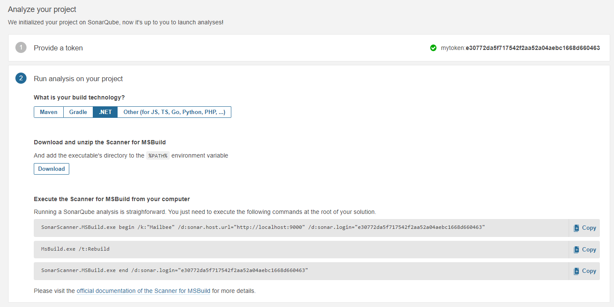<br>
```
SonarScanner.MSBuild.exe begin /k:"??????" /d:sonar.host.url="http://localhost:9000" /d:sonar.login="!!!!!!!!!!!!!!!!!!!!"
"C:\Program Files (x86)\Microsoft Visual Studio\2019\BuildTools\MSBuild\Current\Bin\"MsBuild.exe /t:Rebuild
SonarScanner.MSBuild.exe end /d:sonar.login="!!!!!!!!!!!!!!!!!!!!"
```
(????會根據專案名稱而變、!!!!!是你自己的token、MsBuild.exe前面要加上實際路徑才能找到該exe)<br>
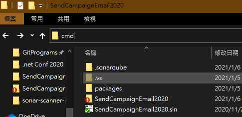<br>
<br>
※	這邊需要注意，要能執行第二行的MsBuild.exe，一定要先安裝Build tools for Visual Studio才能build成功<br>
※	我這邊安裝以後還是抓不到該exe，而是把第二行改成直接導到該tools的路徑<br>


5. 完成! SonarQube會顯示分析結果!
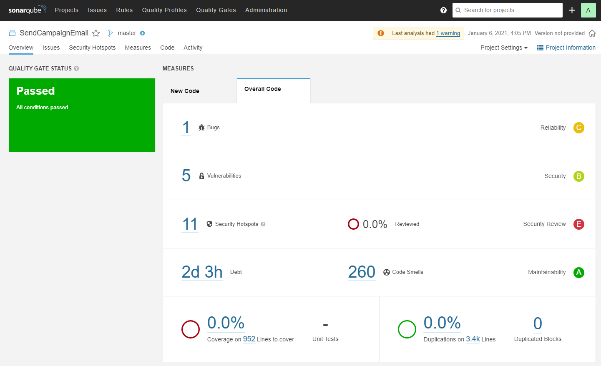<br>

