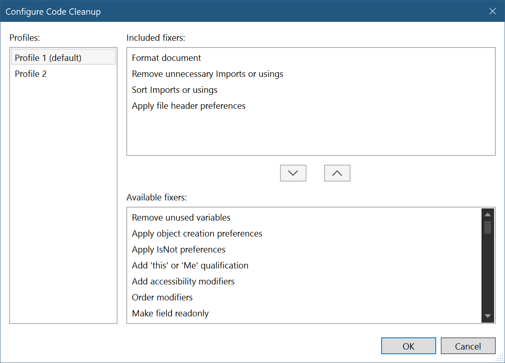
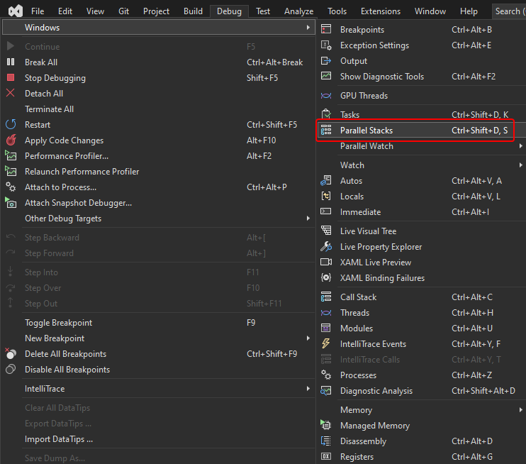
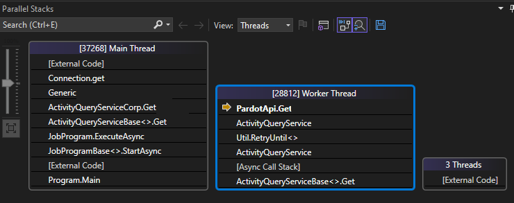
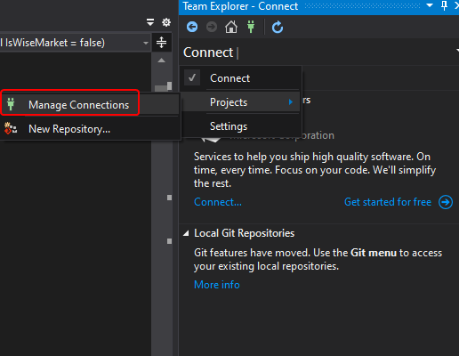

# Visual Studio

## Code snippet

* `ctor` Constructor of class
* `prop` Property of class
* `///` Description for function & parameters
* `try` `swtich` `while` `for` `foreach`  `enum`
* 

## Shortcuts

### Display related

* `ctrl + -` `ctrl + shift + -` 上/下一個檢視紀錄
* `ctrl + f` `ctrl + shift + t` 搜尋/全域搜尋
* `ctrl + ,` `ctrl + t` Function & Property搜尋
* `ctrl + shift + space` 顯示Input Description
* `alt+2` 顯示Reference
* `ctrl + alt + pageup` `ctrl + alt + pagedown` 上/下一個Tab
* `ctrl + F12` 直接跳到繼承鍊Implement (介面隔離情況好用)
* `alt + F12` 同畫面預覽內容(Peek definition，不用跳檔案很讚!)
* `ctrl + k, ctrl + t` 檢視Call階層 (查找Reference極好用)
* `alt + home` 顯示所有繼承鍊Base

### Edit related

* `ctrl+w` 選取單字
* `ctrl+shift+l` 刪除單行
* `ctrl+x` 剪下單行
* `ctrl+c` 複製單行
* `ctrl+v` 貼上單行

## Power Tools

* 自動排序usings、刪除不必要空格、大括號換行等
* Visual Studio 2019版本直接在Settings當中設定Code Cleanup即可

## Test Explorer

## Task Runner Explorer

## Parrellel Stacks

## Exception Settings

* 可設定當Exception出現時要不要停住

# Visual Studio Code

## Markdown extensions

### Markdown All in One

### Marketing Preview Github Styling

### markdownlint in One

### Live Share (Collabaration)
* 可像Google doc一樣即時協作Code & Build