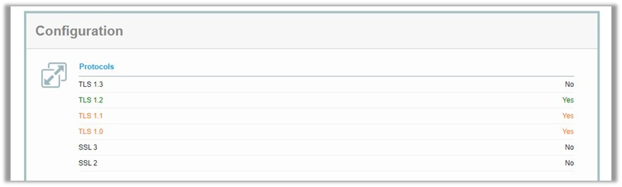
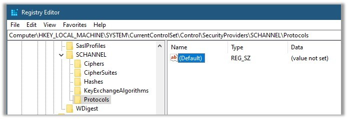
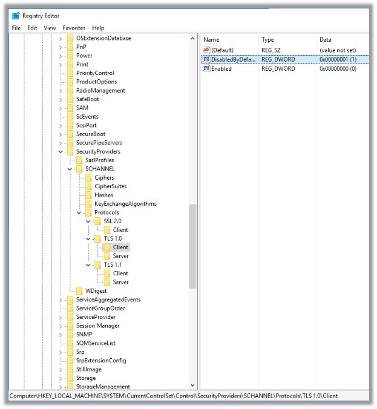
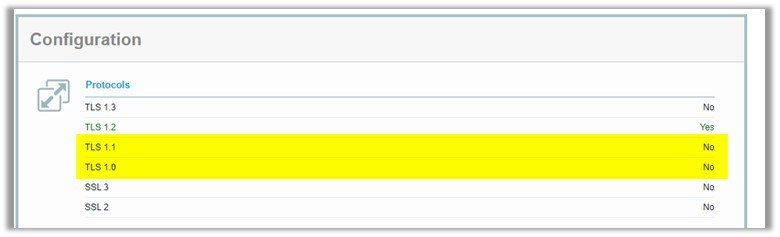

# Windows Server

## Monitor

### Event Viewer

### Task Manager

## Functions

### Server Manager

### 防火牆

### SQLServerManager

### IIS

* [IISLog分析工具](https://dotblogs.com.tw/AceLee/2018/09/14/160817)

### Task Scheduler

## 實用語法

* 解析DNS

```CMD
nslookup your.domain
```

* 確認連線狀態

```CMD
telnet your.domain port
```

```PowerShell
Test-NetConnection -ComputerName “domain.name” -Port 443
```

## TLS

1. 如有對外網開放，可於此網站監測：https://www.ssllabs.com/ssltest/
    
 
2. 於regedit，以下路徑可確認TLS設定的狀況 (沒有項目的話預設為開啟)
    
 
3. 於PowerShell以Admin權限輸入以下語法(強制關閉1.0, 1.1 & 開啟2.0)，可將regedit中新增相關設定

    ```powershell
    New-Item 'HKLM:\SYSTEM\CurrentControlSet\Control\SecurityProviders\SCHANNEL\Protocols\TLS 1.0\Server' -Force
    New-ItemProperty -Path 'HKLM:\SYSTEM\CurrentControlSet\Control\SecurityProviders\SCHANNEL\Protocols\TLS 1.0\Server' –PropertyType 'DWORD' -Name 'Enabled' -Value '0' 
    New-ItemProperty -Path 'HKLM:\SYSTEM\CurrentControlSet\Control\SecurityProviders\SCHANNEL\Protocols\TLS 1.0\Server' –PropertyType 'DWORD' -Name 'DisabledByDefault' -Value '1' 

    New-Item 'HKLM:\SYSTEM\CurrentControlSet\Control\SecurityProviders\SCHANNEL\Protocols\TLS 1.0\Client' -Force
    New-ItemProperty -Path 'HKLM:\SYSTEM\CurrentControlSet\Control\SecurityProviders\SCHANNEL\Protocols\TLS 1.0\Client' -PropertyType 'DWORD' -Name 'Enabled' -Value '0'
    New-ItemProperty -Path 'HKLM:\SYSTEM\CurrentControlSet\Control\SecurityProviders\SCHANNEL\Protocols\TLS 1.0\Client' –PropertyType 'DWORD' -Name 'DisabledByDefault' -Value '1' 


    New-Item 'HKLM:\SYSTEM\CurrentControlSet\Control\SecurityProviders\SCHANNEL\Protocols\TLS 1.1\Server' -Force
    New-ItemProperty -Path 'HKLM:\SYSTEM\CurrentControlSet\Control\SecurityProviders\SCHANNEL\Protocols\TLS 1.1\Server' –PropertyType 'DWORD' -Name 'Enabled' -Value '0' 
    New-ItemProperty -Path 'HKLM:\SYSTEM\CurrentControlSet\Control\SecurityProviders\SCHANNEL\Protocols\TLS 1.1\Server' –PropertyType 'DWORD' -Name 'DisabledByDefault' -Value '1' 

    New-Item 'HKLM:\SYSTEM\CurrentControlSet\Control\SecurityProviders\SCHANNEL\Protocols\TLS 1.1\Client' -Force
    New-ItemProperty -Path 'HKLM:\SYSTEM\CurrentControlSet\Control\SecurityProviders\SCHANNEL\Protocols\TLS 1.1\Client' -PropertyType 'DWORD' -Name 'Enabled' -Value '0'
    New-ItemProperty -Path 'HKLM:\SYSTEM\CurrentControlSet\Control\SecurityProviders\SCHANNEL\Protocols\TLS 1.1\Client' –PropertyType 'DWORD' -Name 'DisabledByDefault' -Value '1'


    New-Item 'HKLM:\SYSTEM\CurrentControlSet\Control\SecurityProviders\SCHANNEL\Protocols\TLS 1.2\Server' -Force
    New-ItemProperty -Path 'HKLM:\SYSTEM\CurrentControlSet\Control\SecurityProviders\SCHANNEL\Protocols\TLS 1.2\Server' –PropertyType 'DWORD' -Name 'Enabled' -Value '1' 
    New-ItemProperty -Path 'HKLM:\SYSTEM\CurrentControlSet\Control\SecurityProviders\SCHANNEL\Protocols\TLS 1.2\Server' –PropertyType 'DWORD' -Name 'DisabledByDefault' -Value '0' 

    New-Item 'HKLM:\SYSTEM\CurrentControlSet\Control\SecurityProviders\SCHANNEL\Protocols\TLS 1.2\Client' -Force
    New-ItemProperty -Path 'HKLM:\SYSTEM\CurrentControlSet\Control\SecurityProviders\SCHANNEL\Protocols\TLS 1.2\Client' -PropertyType 'DWORD' -Name 'Enabled' -Value '1'
    New-ItemProperty -Path 'HKLM:\SYSTEM\CurrentControlSet\Control\SecurityProviders\SCHANNEL\Protocols\TLS 1.2\Client' –PropertyType 'DWORD' -Name 'DisabledByDefault' -Value '0'
    ```

4. Refresh後，出現TLS 1.0, 1.1 & 2.0項目
    
 
5. 重開機後，可於監測網站再次確認
    
 

解法來源：
https://blog.darkthread.net/blog/check-tls-version/
https://thesecmaster.com/how-to-disable-tls-1-0-and-tls-1-1-on-windows-server/

