# 系統文件管理

## Code to API Document

* DocFx的Markdown extension自動轉換Code為文件，再搭配Azure DevOps Wiki作為版控
  * [DocFx](https://dotnet.github.io/docfx/docs/markdown.html?tabs=linux%2Cdotnet)
  * [Git to DevOps Wiki](https://learn.microsoft.com/en-us/azure/devops/project/wiki/publish-repo-to-wiki?view=azure-devops&tabs=browser)

## Draw.io
最近在整理系統文件時，</br>
發現draw.io這個流程圖編輯網頁有提供google的外掛程式，</br>
讓google docs實現同步編輯flowchart的功能，</br>
就操作流程簡單介紹一下：</br>
</br>

1. 插入flowchart：在google docs中選擇外掛程式 → diagrams.net → New Diagram…</br>
    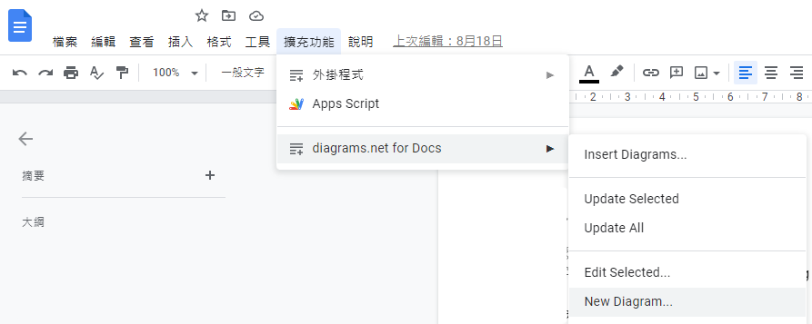
2. 導轉到draw.io創立圖片並存到google drive → Create New Diagram → Pick a folder (Google drive) → Select</br>

    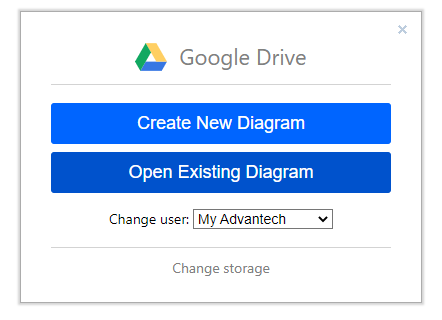 </br>
    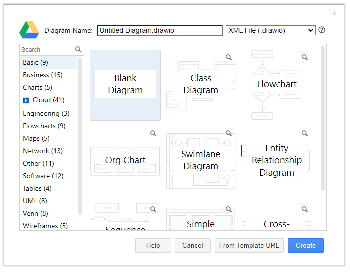 </br>
    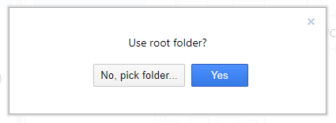
    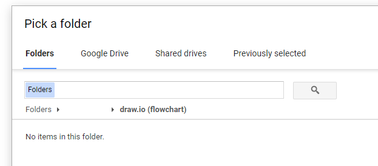 </br>
3. 在Draw.io中即可編輯Flowchart → File… Save即可同步到google drive上</br>
    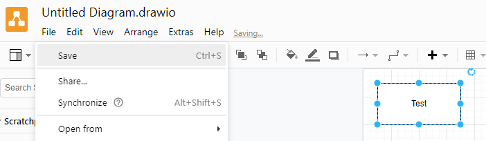
    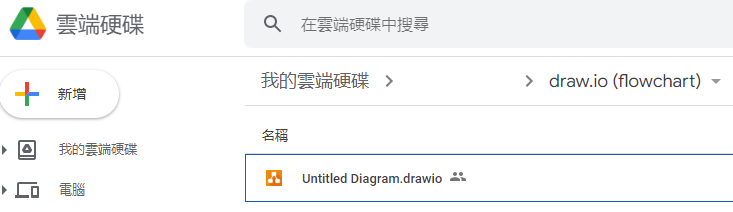 </br>
4. 從google docs中引入flowchart：選擇剛才存到google drive的檔案</br>
    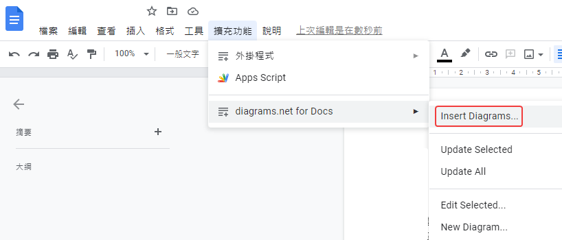
    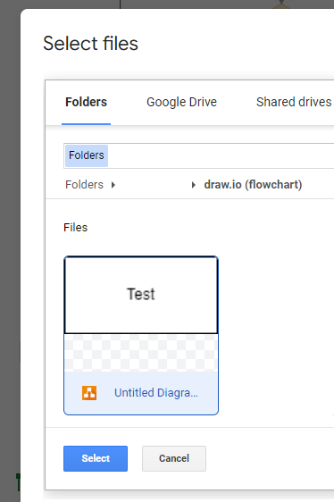</br>
5. 成功匯入flowchart! 點擊圖片會出現編輯頁面的連結 → 修改後一樣按File… Save</br>
    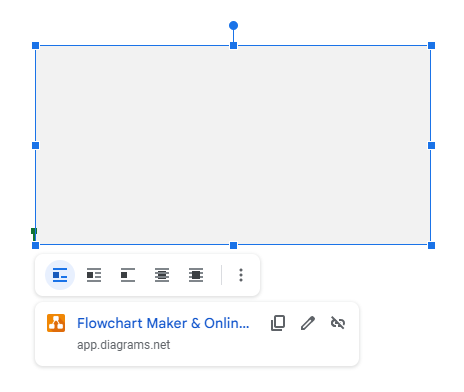</br>
6. 在google docs更新圖片修改：點擊flowchart → 外掛程式 → Update selected 或 Update all，圖片即可同步更新!</br>
    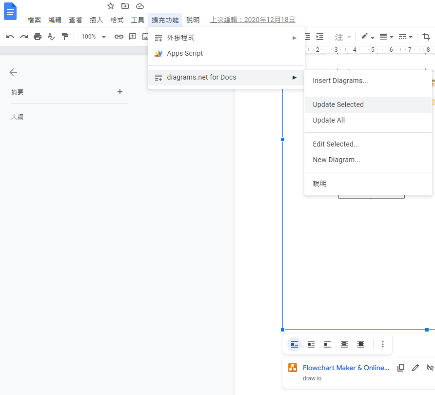</br>

</br>
以下兩個外掛程式都安裝後，就可以在docs中出現套件的選項了</br>

* [Google drive 外掛下載連結](https://gsuite.google.com/u/2/marketplace/app/diagramsnet/671128082532?hl=zh-TW&pann=drive_app_widget)</br>
* [Google docs 外掛下載連結](https://gsuite.google.com/u/2/marketplace/app/diagramsnet_for_docs/224440279306?hl=zh&pann=docs_addon_widget)

## Word

### 標題

* 右鍵可以設定樣式
* 內文調整字形可以調整所有的格式
* 右鍵按更新可以套用到整個文件


### 多層次清單

* 將階層連結至樣式：必選! 可以讓階層跟標題連動，兩邊樣式同步
* 位置:對齊可以調整編號起始位置、文字縮排於可以調整文字跟編號的距離
</br>
</br>
</br>
* 如果標題字元的位置怎麼調整都無效，可試看看後置字元改為"間距"
</br>

### 頁首頁尾

* 將標題嵌到頁首
  1. 插入→頁首</br>
    </br>
  2. 插入→快速組件→功能變數</br>
    </br>
  3. 選取StyleRef，選要顯示的標題名稱，右側可設定要顯示編號或位置</br>
    </br>
  4. 重複上述步驟可加入多個標題在頁首裡面


```C#
var builder = WebApplication.CreateBuilder(args);

var configurationBuilder = new ConfigurationManager();
configurationBuilder.AddAzureKeyVault(new Uri(keyVaultUrl), new DefaultAzureCredential());

string azureAppConfigConnectionString = configurationBuilder[AppConfigResource.AzureAppConfigConnectionString];
configurationBuilder.AddAzureAppConfiguration(azureAppConfigConnectionString);

string keyVaultUrl = builder.Environment.IsProduction() ? 
    "https://mykeyvault.vault.azure.net/" : 
    "https://mykeyvault-staging.vault.azure.net/";

builder.Configuration.AddAzureKeyVault(new Uri(keyVaultUrl), new DefaultAzureCredential());

public class Program
{
    public static void Main(string[] args)
    {
        CreateHostBuilder(args).Build().Run();
    }

    public static IHostBuilder CreateHostBuilder(string[] args) =>
        Host.CreateDefaultBuilder(args)
            .ConfigureAppConfiguration((context, builder) =>
            {
                var env = context.HostingEnvironment;
                string keyVaultUrl = env.EnvironmentName == Environments.Production ?
                    "https://eMarketingKeys.vault.azure.net/" :
                    "https://eMarketingKeysStaging.vault.azure.net/";
                builder.AddAzureKeyVault(new Uri(keyVaultUrl), new DefaultAzureCredential());
            })
            //.ConfigureSharedAppSettings()   // Override config settings by custom json file
            .ConfigureSerilog(JobUtil.GetLoggerInfoDelegate(MethodBase.GetCurrentMethod().DeclaringType.Namespace), (logEvent) => CustomTelemetryProcessor.IsOkToLog(logEvent)) // Config log package
            .ConfigureWebHostDefaults(webBuilder =>
            {
                webBuilder.UseStartup<Startup>();
            });
}

var appConfig = builder.Configuration
  .GetSection("AppConfig")
  .Get<AppConfig>();
var connectionStrings = builder.Configuration
  .GetSection("ConnectionStrings")
  .Get<ConnectionStrings>();

using Microsoft.Extensions.Configuration;
public class Startup
{
    private readonly IWebHostEnvironment _env;
    public Startup(IConfiguration configuration, IWebHostEnvironment env)
    {
        Configuration = configuration;
        _env = env;
    }

    public IConfiguration Configuration { get; }

    public void ConfigureServices(IServiceCollection services)
    {
        var appConfig = Configuration.GetSection("AppConfig")
  						                      .Get<AppConfig>();
        var connectionStrings = Configuration.GetSection("ConnectionStrings")
                                    .Get<ConnectionStrings>();

        //...
    }
    //...
}

using Azure.Identity;
using eMarketingCore.Utils.Resources;
using Microsoft.Extensions.Configuration;
using Microsoft.Extensions.Hosting;
using System;

namespace eMarketingCore.Utils.Config
{
    public class CloudConfigManager
    {
        public static IConfiguration Configuration { get; private set; }
        public static AppConfig AppConfig { get; private set; }
        public static ConnectionStrings ConnectionStrings { get; private set; }

        public static void Initialize(string environmentName)
        {
            string keyVaultUrl = environmentName == Environments.Production || environmentName.ToLower() == "release" ?
                AppConfigResource.KeyVaultRegisterUrl :
                AppConfigResource.KeyVaultRegisterStagingUrl;

            var configurationBuilder = new ConfigurationManager();
            configurationBuilder.AddAzureKeyVault(new Uri(keyVaultUrl), new DefaultAzureCredential());

            string azureAppConfigConnectionString = configurationBuilder[AppConfigResource.AzureAppConfigConnectionString];
            configurationBuilder.AddAzureAppConfiguration(azureAppConfigConnectionString);

            Configuration = configurationBuilder;
            AppConfig = configurationBuilder.GetSection("AppConfig").Get<AppConfig>();
            ConnectionStrings = configurationBuilder.GetSection("ConnectionStrings").Get<ConnectionStrings>();
        }
    }

using MyProject.Config;
public class MvcApplication : System.Web.HttpApplication
{
    protected void Application_Start()
    {
        AreaRegistration.RegisterAllAreas();
        //GlobalFilters.Filters.Add(new ProjectClass.OfflineActionFilter());
        FilterConfig.RegisterGlobalFilters(GlobalFilters.Filters);
        GlobalConfiguration.Configure(WebApiConfig.Register);
        RouteConfig.RegisterRoutes(RouteTable.Routes);
        BundleConfig.RegisterBundles(BundleTable.Bundles);

        ServicePointManager.SecurityProtocol = SecurityProtocolType.Tls12;    // Prevent from calling source error
        Microsoft.AspNet.SignalR.GlobalHost.HubPipeline.AddModule(new Hubs.HubExceptionModule());   // Error handler for SignalR
        TelemetryConfiguration.Active.TelemetryInitializers.Add(new AppInsightsTelemetryInitializer());

        // Init cloud config
        string execMode = System.Configuration.ConfigurationManager.AppSettings["ExecMode"];
        CloudConfigManager.Initialize(execMode);
    }
}
}

[TestClass()]
public class CampaignBasicServiceTests
{
    [TestInitialize]
    public void Initialize()
    {
      string envName = Environment.GetEnvironmentVariable("ASPNETCORE_ENVIRONMENT") ?? EnvironmentName.Development;
      CloudConfigManager.Initialize(envName);
      //...
    }
  //...
}

var configurationBuilder = new ConfigurationManager();
configurationBuilder.AddAzureKeyVault(new Uri(keyVaultUrl), new DefaultAzureCredential());

string azureAppConfigConnectionString = configurationBuilder[AppConfigResource.AzureAppConfigConnectionString];
configurationBuilder.AddAzureAppConfiguration(azureAppConfigConnectionString);

var cloudConfigBuilder = new ConfigurationManager();
cloudConfigBuilder.AddAzureKeyVault(new Uri(keyVaultUrl), new DefaultAzureCredential());

string azureAppConfigConnectionString =
    cloudConfigBuilder[AppConfigResource.AzureAppConfigConnectionString];
cloudConfigBuilder.AddAzureAppConfiguration(azureAppConfigConnectionString);

builder.AddConfiguration(cloudConfigBuilder);

public static ConfigurationManager GetConfigManager(string environmentName)
{
    string keyVaultUrl = (environmentName == Environments.Production || environmentName.ToLower() == "release") ?
        AppConfigResource.KeyVaultRegisterUrl : AppConfigResource.KeyVaultRegisterUrl;

    var configManager = new ConfigurationManager();
    configManager.AddAzureKeyVault(new Uri(keyVaultUrl), new DefaultAzureCredential());

    string azureAppConfigConnectionString = configManager[AppConfigResource.AzureAppConfigConnectionString];
    configManager.AddAzureAppConfiguration(azureAppConfigConnectionString);

    return configManager;
}

public static void Initialize(string environmentName)
{
    var configManager = GetConfigManager(environmentName);

    Configuration = configManager;
    AppConfig = configManager.GetSection(nameof(AppConfig)).Get<AppConfig>();
    ConnectionStrings = configManager.GetSection(nameof(ConnectionStrings)).Get<ConnectionStrings>();
}
```

```shell
dotnet add package Azure.Extensions.AspNetCore.Configuration.Secrets;
dotnet add package Azure.Identity;
```